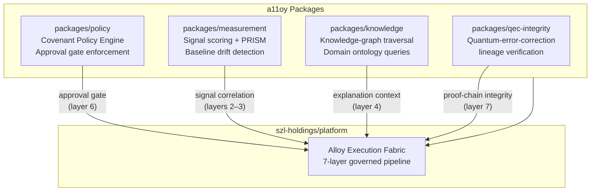

# a11oy
[](./LICENSE)
[](https://doi.org/10.5281/zenodo.20434276)
[](https://github.com/szl-holdings/a11oy/actions/workflows/ci.yml)
[](https://github.com/szl-holdings/a11oy/actions/workflows/tests.yml)
[](https://github.com/szl-holdings/a11oy/actions/workflows/codeql.yml)
[](https://github.com/szl-holdings/a11oy/actions/workflows/sbom.yml)
[](https://github.com/szl-holdings/a11oy/actions/workflows/slsa.yml)
[](https://modelcontextprotocol.io)
[](https://github.com/szl-holdings/a11oy/actions/workflows/dco.yml)
[](https://orcid.org/0009-0001-0110-4173)

> Vertical alignment substrate — policy, measurement, knowledge, and QEC-integrity packages for governed AI execution


> **Frontier Capability:** Governed execution fabric aligned to the Ouroboros Thesis v18.0 DOI and Lean proof substrate. Runtime claims are tracked through the A11oy Doctrine Build, deploy payload manifests, and the public-claim contract in [`docs/PROVENANCE.md`](docs/PROVENANCE.md).

`a11oy` (Alloy) is the governed agentic execution fabric of SZL Holdings — the seven-layer substrate that connects live enterprise signals to human-confirmed decisions with cryptographic proof at every transition. It provides TypeScript packages for policy enforcement, signal measurement, knowledge-graph traversal, and QEC-integrity verification across all SZL domain verticals.

> [!NOTE]
> This repository ships the core fabric packages consumed by [`szl-holdings/platform`](https://github.com/szl-holdings/platform). The deployment surface for Alloy is the platform monorepo; this repo contains the standalone alignment substrate packages.

Operational map: [`docs/ECOSYSTEM.md`](docs/ECOSYSTEM.md) · Provenance contract: [`docs/PROVENANCE.md`](docs/PROVENANCE.md) · Series-A packet: [`docs/SERIES_A_DILIGENCE.md`](docs/SERIES_A_DILIGENCE.md)

---

## Architecture



---

## Packages

| Package | Purpose | Key Types |
|---------|---------|-----------|
| `packages/policy` | Covenant Policy Engine — evaluates all actions against governance rules before execution | `CovenantPolicy`, `ApprovalGate`, `PolicyDecision` |
| `packages/measurement` | Signal scoring, PRISM correlation, baseline drift detection | `SignalScore`, `PRISMFrame`, `DriftReport` |
| `packages/knowledge` | Knowledge-graph traversal and domain ontology queries | `KnowledgeGraph`, `OntologyQuery`, `DomainNode` |
| `packages/qec-integrity` | Quantum-error-correction lineage verification (CSS-QEC backed by `lutar-lean`) | `QECLineage`, `IntegrityProof`, `CSSVector` |
| `packages/receipt-substrate` | Operational MCP-style tool-envelope receipts with hash-chain verification and JSONL append flow | `ToolEnvelope`, `OperationalReceipt`, `verifyChain` |

---

## Quick Start

```bash
# Install via npm
npm install @szl-holdings/a11oy-policy
npm install @szl-holdings/a11oy-measurement

# Or with pnpm
pnpm add @szl-holdings/a11oy-policy

# Development (clone + workspace)
git clone https://github.com/szl-holdings/a11oy.git
cd a11oy
pnpm install
pnpm run build
pnpm run test
```

---

## Operational artifacts

| Artifact | Purpose | Validation |
|----------|---------|------------|
| `packages/receipt-substrate` | MCP/Cursor/Claude-style operational receipts and JSONL chain verification | `npm test --prefix packages/receipt-substrate` |
| `artifacts/a11oy-uds` | UDS/Zarf payload tree with manifest and attestation generation | `A11OY_UDS_ALLOW_SOURCE_FALLBACK=1 bash artifacts/a11oy-uds/scripts/build.sh` |

The UDS build preserves release-grade behavior when `tsc`, `zarf`, `zstd`, and
`cosign` are installed. In minimal cloud environments, explicit source fallback
emits a non-Zarf deterministic tar plus manifest and attestation checks so the
operator flow remains testable without pretending to produce a deployable Zarf
package.

---

## How It Works

Every action in the SZL platform must pass through the policy engine before execution:

1. **Signal ingress** — `measurement` scores incoming events against PRISM baselines
2. **Knowledge context** — `knowledge` retrieves relevant domain ontology for explanation
3. **Policy evaluation** — `policy` checks the action against Covenant Policy rules
4. **Approval gate** — if policy requires human approval, `policy` creates an `ApprovalGate`
5. **Execution unlock** — only after gate resolution does the action proceed
6. **Operational receipts** — `receipt-substrate` emits and verifies tool-call receipts for MCP/Cursor/Claude-style operations
7. **QEC verification** — `qec-integrity` verifies proof-chain cryptographic lineage

The Λ-invariant (lambda axis) constrains the policy evaluation: no recommendation with confidence below the configured threshold proceeds to the approval gate without escalation.

---

## Security and Governance

- OpenSSF Scorecard: **7.0** (as of 2026-05-28) — see [scorecard report](https://securityscorecards.dev/viewer/?uri=github.com/szl-holdings/a11oy)
- CodeQL security scanning on every push to main
- All packages are consumed exclusively via the platform governance layer; no direct external API surface
- QEC-integrity lineage is formally verified in [`szl-holdings/lutar-lean`](https://github.com/szl-holdings/lutar-lean)

---

## How to Cite

```bibtex
@software{szl_holdings_a11oy_2026,
  title  = {a11oy — Governed Agentic Execution Fabric},
  author = {{SZL Holdings}},
  year   = {2026},
  doi    = {10.5281/zenodo.20434276},
  url    = {https://github.com/szl-holdings/a11oy}
}
```

[](https://doi.org/10.5281/zenodo.20434276)
[](https://orcid.org/0009-0001-0110-4173)

---

## Contributing

See [CONTRIBUTING.md](CONTRIBUTING.md) for the engineering workflow. Operational receipt-chain usage is documented in [`docs/operational-receipt-substrate.md`](docs/operational-receipt-substrate.md). All contributions require CI green on all required checks and one reviewer approval. Doctrine v6 tone required in PR descriptions.

Related: [`szl-holdings/platform`](https://github.com/szl-holdings/platform) · [`szl-holdings/sentra`](https://github.com/szl-holdings/sentra) · [`szl-holdings/rosie`](https://github.com/szl-holdings/rosie) · [`szl-holdings/lutar-lean`](https://github.com/szl-holdings/lutar-lean)

---

## License

BSL-1.1 — See [LICENSE](./LICENSE) for terms. Copyright (c) 2024-2026 SZL Holdings.

---

## Related repositories in the SZL substrate

The SZL Holdings org repos are organized in
[`docs/org-repo-map.md`](docs/org-repo-map.md). Use
`bash scripts/clone-org-repos.sh` to discover and clone sibling checkouts under
ignored `.repos/szl-holdings/`.

- [`a11oy`](https://github.com/szl-holdings/a11oy) — vertical alignment substrate (policy · measurement · knowledge · QEC-integrity)
- [`amaru`](https://github.com/szl-holdings/amaru) — Shor-encoded receipt minting (Cardano-anchored)
- [`rosie`](https://github.com/szl-holdings/rosie) — CSS-ingress receipt orchestration
- [`sentra`](https://github.com/szl-holdings/sentra) — Kitaev-surface drift detection on audit fibers
- [`uds-mesh`](https://github.com/szl-holdings/uds-mesh) — UDS span schemas + governance receipts
- [`lutar-lean`](https://github.com/szl-holdings/lutar-lean) — Lean 4 + Mathlib v4.13.0 kernel proofs (30 GREEN modules)
- [`ouroboros`](https://github.com/szl-holdings/ouroboros) — bounded-recursion runtime
- [`ouroboros-thesis`](https://github.com/szl-holdings/ouroboros-thesis) — DOI-pinned thesis substrate (v3 → v18)
- [`platform`](https://github.com/szl-holdings/platform) — composing monorepo (76 packages, 1,220 tests)
- [`szl-brand`](https://github.com/szl-holdings/szl-brand) — anatomy + visual doctrine (PDFs hosted in-repo)
- [`szl-cookbook`](https://github.com/szl-holdings/szl-cookbook) — governed-AI recipes
- [`agi-forecast`](https://github.com/szl-holdings/agi-forecast) — PAC-Bayes + Bekenstein governance-trajectory forecasts
- [`vsp-otel`](https://github.com/szl-holdings/vsp-otel) — OpenTelemetry exporter for Λ-axis spans
- [`vessels`](https://github.com/szl-holdings/vessels) — maritime fleet intelligence
- [`counsel`](https://github.com/szl-holdings/counsel) — legal matter command scaffold
- [`terra`](https://github.com/szl-holdings/terra) — real estate intelligence scaffold
- [`carlota-jo`](https://github.com/szl-holdings/carlota-jo) — private advisory operations scaffold
- [`szl-trust`](https://github.com/szl-holdings/szl-trust) — Public Trust Portal artifacts
- [`.github`](https://github.com/szl-holdings/.github) — organization profile and community files

Org page: [github.com/szl-holdings](https://github.com/szl-holdings) · Doctrine v6 · 11 axioms · 30 GREEN modules · v18.0 DOI [`10.5281/zenodo.20434276`](https://doi.org/10.5281/zenodo.20434276)

---

## On Hugging Face

This repository is mirrored and published on the [SZLHOLDINGS](https://huggingface.co/SZLHOLDINGS) Hugging Face organization:

- [huggingface.co/SZLHOLDINGS/a11oy-v19-substrate](https://huggingface.co/SZLHOLDINGS/a11oy-v19-substrate) — a11oy-v19-substrate (DOI 10.5281/zenodo.20434308)

> **Test count (honest breakdown):** 24 real test files in this repo (jest `__tests__/` + vitest `web/packages/a11oy-core/` + QEC + knowledge packages). The "248" figure cited on the HF model card referred to combined doctrine + unit tests across the full payload; the grep-able count from this repo alone is **24 test files** (run: `find . -path ./node_modules -prune -o -name "*.test.ts" -print | wc -l`). Updated CI via `tests.yml` now runs and surface all of them.

The operational Hugging Face payload can be generated with `pnpm payload:huggingface`
and published through the manual `Publish Hugging Face Payload` workflow once
`HF_TOKEN` is configured; see [`docs/huggingface.md`](docs/huggingface.md).
