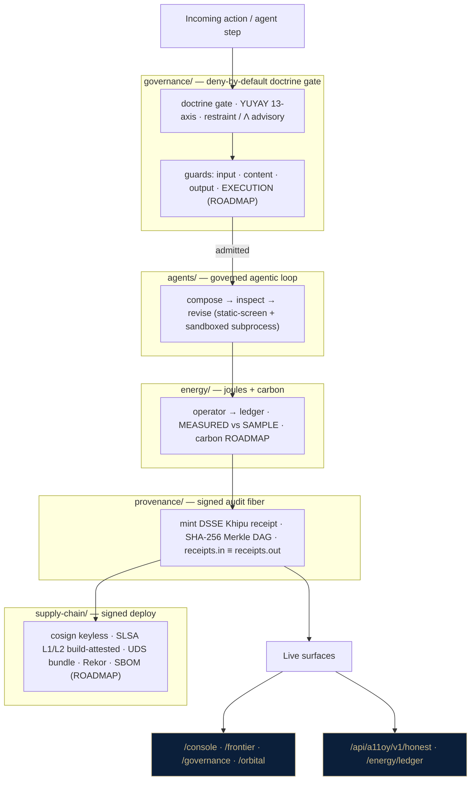

# a11oy 🔬

> **Governed autonomy with a checkable receipt for every decision.**
> The signed-receipt substrate: every AI action leaves a DSSE Khipu receipt. `receipts.in ≡ receipts.out`.

[](.compliance/SLSA_LEVEL.md)
[](https://search.sigstore.dev/?logIndex=1710578865)
[](https://github.com/szl-holdings/.github/tree/main/doctrine)
[](https://github.com/szl-holdings/a11oy/actions)
[](LICENSE)
[-B79BD6?style=flat-square)](https://github.com/szl-holdings/lutar-lean/blob/main/BOUNTY.md)

**LOCKED kernel `c7c0ba17` · 749 declarations · 14 axioms · 163 sorries · Doctrine v11**
**Proof posture (two-tier):** 8 locked-proven `{F1, F4, F7, F11, F12, F18, F19, F22}` (the no-axiom theorem `locked_count_eight`) + an **EXPERIMENTAL · CI-green** tier (Lean v4.18.0 · ~1323 decls / 22 unique axioms — NOT folded into the locked count). Λ-uniqueness is **Conjecture 1** (axiom-free CUT-2 conditional proven; unconditional uniqueness machine-checked false). Full map → [lutar-lean](https://github.com/szl-holdings/lutar-lean).

[Live in one click](#live-in-one-click) · [The substrate at a glance](#the-substrate-at-a-glance) · [The four moat layers](#the-four-moat-layers) · [Governed code-as-action](#governed-code-as-action) · [Verify](#verify-it-yourself) · [Repo map](#repo-map) · [Parity vs. leaders](#parity-vs-leaders) · [Honest status](#honest-status)

---

## What a11oy is, in one sentence

a11oy is a **governed agentic substrate**: every action is **doctrine-gated** before it runs, executed against a **governed agent loop**, **metered in joules**, and **sealed as a signed Khipu receipt** — and the whole thing ships through a **signed supply chain**. Four cross-cutting moat layers (provenance · governance · energy · supply-chain) wrap the agentic loop. You can click any node in the diagram below and watch it live.

---

## Live in one click

**HF Space (one-click, no login):** [](https://huggingface.co/spaces/SZLHOLDINGS/a11oy)

Lead with *it's live*, not theory. Each surface below returns HTTP 200 right now:

| Surface | Link | What you see |
|---|---|---|
| **Console** (primary face) | <https://a-11-oy.com/console> | The full left-nav command platform |
| **Frontier** | <https://a-11-oy.com/frontier> | Unified showcase — the moat roll-up |
| **Governance** | <https://a-11-oy.com/governance> | Doctrine gate + restraint surface |
| **Orbital** | <https://a-11-oy.com/orbital> | MODELED orbital-tier projection (no hardware) |
| **Honest API** | <https://a-11-oy.com/api/a11oy/v1/honest> | Live doctrine posture (749/14/163, Λ = Conjecture 1) |
| **Energy ledger** | <https://a-11-oy.com/api/a11oy/v1/energy/ledger> | Append-only joule JobRecord chain |

```bash
curl -s https://a-11-oy.com/api/a11oy/v1/honest | jq .doctrine_lock.lambda
# => "Conjecture 1"   ← the substrate tells the truth about itself
```

---

## The substrate at a glance

One diagram tells the whole story: every action is doctrine-gated → run on a governed
agent loop → metered in joules → sealed as a signed receipt → deployed through a signed
supply chain. Click any live node to watch it.



**The one-line reading:** *every action is doctrine-gated → executed on a governed agent loop → metered in joules → sealed as a signed receipt → deployed through a signed supply chain — and you can click any node and watch it live.* The honest boundary is drawn on the diagram itself: the EXECUTION guard, carbon feed, and SBOM are labelled **ROADMAP**, because they are.

---

## The four moat layers

These are the four cross-cutting concerns that wrap the agentic loop. Each one is built
from **modules that already exist and run live** — they are *named*, not invented. Each
paragraph ends with the live endpoint that proves it and an honest label.

### 1 · Provenance — the audit fiber `[EXISTS]`
Every action emits a DSSE-enveloped, ECDSA-P256-SHA256-signed Khipu receipt on a
SHA-256 hash-linked Merkle DAG. Invariant: **`receipts.in ≡ receipts.out`**.
Modules: `szl_provenance.py`, `szl_dsse.py`, `szl_khipu.py`, `szl_khipu_consensus.py`,
`szl_receipt_substrate.py`, `szl_ietf_receipt.py`, `szl_functor_receipt.py`,
`szl_trajectory_sign.py`, `pq_signing.py`, `a11oy_signing_key.py`, `szl_khipu_verify.py`.
**Proves it:** `POST /khipu/verify` recomputes the chain and re-verifies; chain integrity
is SHA3-256 hash-chain verified. Real ECDSA-P256 cosign signatures when
`SZL_COSIGN_PRIVATE_PEM` is present; **UNSIGNED and clearly labelled** when absent — never faked.

### 2 · Governance — deny-by-default doctrine gate `[EXISTS]`
The constitutional + doctrine gate every action clears *before* execution. Deny-by-default.
Modules: `a11oy_constitution.py`, `szl_governance_gateway.py`, `szl_restraint.py` /
`szl_restraint_energy.py` (a 6-rung frugality ladder, Λ-scored), `szl_lambda_tripwire.py`,
`a11oy_grc*.py`, `szl_colang_policy.py`, `szl_codename_gate.py`, `forge_governance.py`.
**Proves it:** <https://a-11-oy.com/governance>. Gate soundness is proven over the locked
F-set; **Λ-uniqueness is Conjecture 1**, never claimed as a theorem. The restraint ladder's
**Ponytail lineage is cited, not claimed as ours** (see `szl_restraint.py` header).

### 3 · Energy — joules + carbon `[EXISTS, with an env gap]`
The energy operator → ledger loop. Real GPU joules (NVML exporter delta) become billable;
unmeasurable work is **SAMPLE/DEGRADED, never fabricated**. Modules: `szl_energy_operator.py`,
`szl_energy_ledger.py`, `szl_energy_projection.py`, `szl_energy_provenance.py`,
`szl_energy_budget.py`, `joule_billing.py`, `szl_joules_truth.py`.
**Proves it:** <https://a-11-oy.com/api/a11oy/v1/energy/ledger>. Joules are **MEASURED only when
a GPU lung is reachable; otherwise honestly SAMPLE**. The ledger is ephemeral unless
`SZL_ENERGY_LEDGER_PATH` is on a persistent volume. **Carbon (joules × grid intensity) is ROADMAP** —
there is no live grid-intensity feed today.

### 4 · Supply-chain — signed deploy `[EXISTS, with an explicit ceiling]`
The signed software supply chain. Container images are cosign keyless-signed (Fulcio + Rekor)
and build-provenance-attested, shipped as a UDS mesh bundle for air-gapped deploy.
Modules: `szl_uds_fleet.py`, `szl_uds_portability.py`, `runtime_attestation.py`, `szl_dsse.py`,
`sign_cert_dsse.py`; configs `.gitleaks.toml`, `.doctrine-allowlist`,
`physical_bounds_certificate.dsse.json`.
**Proves it:** `cosign verify` against Rekor index 1710578865; UDS bundle `uds-v0.2.0`
deployable. **SLSA L3, FedRAMP, CMMC, Iron Bank, ATO are ROADMAP — never claimed achieved.**
**SBOM generation is ROADMAP** (the one genuinely-new supply-chain piece).

---

## Governed code-as-action

The synthesis thesis: an agent that **composes → inspects → revises** code, where every
code action is **doctrine-gated before it runs** and **emits a signed Khipu receipt** with
MEASURED joules. This is the moat neither a clean RAG-app layout nor a code-as-action kernel
on its own can draw: governance + cognition fused.

**What EXISTS today (`a11oy_code_engine.py`):** `governed_turn(...)` runs a deny-by-default
`_static_screen` (forbidden imports `socket`/`urllib`/`requests`/`http`/…, forbidden calls
`open(`/`eval(`/`exec(`/`__import__`/…) **before** `_sandbox_exec` runs the code in a separate
subprocess with `RLIMIT_CPU`, `RLIMIT_AS`, `RLIMIT_CORE`, `RLIMIT_FSIZE=0` (no file writes),
and `RLIMIT_NPROC=0` (no forks → no network helper). Each turn signs a hash-chained receipt.

**What is ROADMAP (honest boundary):**
- a **persistent** sandboxed kernel where variables live across steps (today's `_sandbox_exec`
  is single-shot — vars don't persist between cells). This is the genuine novelty still to build.
- a named **`governance/guards/execution_guard.py`** that composes the existing gates into an
  explicit input → content → output → EXECUTION chain. The *guards exist* (`szl_codename_gate`,
  `szl_colang_policy`, `a11oy_constitution`, `_static_screen`); the **named 4th-layer wrapper does not yet**.
- **container / microVM isolation** (today is subprocess + rlimit tier).

See [`docs/architecture.md`](docs/architecture.md) for the full HAVE / PARTIAL / MISSING map
and the honest novelty boundary vs. the references we learned from.

---

## Verify it yourself

```bash
# 1. Confirm live doctrine posture
curl -s https://a-11-oy.com/api/a11oy/v1/honest | jq .doctrine_lock
# => doctrine v11 LOCKED, lambda "Conjecture 1", locked_formula_count 8

# 2. Verify the cosign keyless signature + build-provenance attestation on the image.
#    SLSA L1 honest · L2 build-attested: container provenance via
#    attest-build-provenance (Sigstore keyless, Fulcio + Rekor). Verify with
#    `cosign verify-attestation`. SLSA L3 is roadmap — see .compliance/SLSA_LEVEL.md.
cosign verify ghcr.io/szl-holdings/a11oy:uds-v0.2.0 \
  --certificate-identity-regexp="^https://github.com/szl-holdings/" \
  --certificate-oidc-issuer="https://token.actions.githubusercontent.com"
# Public Rekor entry for the image signature: log index 1710578865

# 3. Deploy as part of the signed mesh bundle
uds-cli bundle deploy oci://ghcr.io/szl-holdings/szl-uds-bundle:uds-v0.2.0 --confirm
```

**Full guide:** [developers/VERIFY.md](https://github.com/szl-holdings/developers/blob/main/VERIFY.md)

---

## Repo map

a11oy is **flat-rooted today** — ~222 `a11oy_*.py` / `szl_*.py` modules plus `serve.py`
(the boot entry + route assembly). The taxonomy below is a **logical** map (a "where things
live" guide), not a physical move; the modules listed already exist and run live. Full
table in [`docs/architecture.md`](docs/architecture.md).

| Layer | Role | Representative modules |
|---|---|---|
| **agents/** | the brain — agentic loop, react core, code engine | `a11oy_agent_loop`, `a11oy_react_core`, `szl_agentic_loop`, `a11oy_code_engine`, `a11oy_code_orchestrator`, `a11oy_v4_agent` |
| **tools/** | pluggable levers the agent composes | `a11oy_mcp_client`, `szl_connector_mcp`, `szl_sovereign_search`, `szl_rag`, `a11oy_org_rag` |
| **services/** | business logic + plumbing | `serve` (entry), `szl_backend_hardening`, `szl_budget_router`, `szl_llm_registry`, `*_router` |
| **provenance/** | signed receipts (audit fiber) | `szl_provenance`, `szl_dsse`, `szl_khipu*`, `szl_receipt_substrate`, `szl_khipu_verify` |
| **governance/** | doctrine gate + restraint / Λ + guards | `a11oy_constitution`, `szl_governance_gateway`, `szl_restraint*`, `szl_lambda_tripwire`, `szl_codename_gate`, `szl_colang_policy` |
| **energy/** | joule accounting + carbon (ROADMAP) | `szl_energy_operator`, `szl_energy_ledger`, `szl_energy_projection`, `joule_billing`, `szl_joules_truth` |
| **supply-chain/** | cosign · SLSA · UDS · SBOM (ROADMAP) | `szl_uds_fleet`, `szl_uds_portability`, `runtime_attestation`, `sign_cert_dsse` |

---

## Parity vs. leaders

| Capability | Palantir AIP | a11oy | Differentiator |
|---|---|---|---|
| Policy enforcement | ✅ | ✅ `/v1/policy/evaluate` | — |
| Audit trail | ✅ logs | ✅ **signed receipts** | Palantir logs are not individually verifiable cryptographic artifacts |
| Supply-chain provenance | — | ✅ **cosign keyless-signed + build-attested (SLSA L1 honest · L2 build-attested)** | `cosign verify-attestation` on every image; container provenance via attest-build-provenance, Rekor-anchored. SLSA L3 is roadmap. |
| Energy metering per decision | — | ✅ **joules per job (MEASURED vs SAMPLE)** | Nobody else meters joules per governed decision; cost is measured in joules, not just tokens |
| Formal math substrate | — | ✅ Lean 4 / 749 decl | Open, machine-checkable |
| Air-gap deployment | ✅ (proprietary) | ✅ **one UDS command** | Open-source, reproducible |
| Receipt multi-party witness | — | ✅ BFT quorum-capable | — |

---

## Quickstart

```bash
docker run --rm -p 7860:7860 ghcr.io/szl-holdings/a11oy:uds-v0.2.0
```

---

## Honest status

The honesty section is a feature for a defense buyer, not a liability.

| Claim | Status |
|---|---|
| Live HF Space (HTTP 200) | ✅ |
| Live surfaces `/console /frontier /governance /orbital /api/a11oy/v1/honest` | ✅ HTTP 200 |
| SLSA **L1 honest · L2 build-attested** | ✅ — cosign keyless-signed image + container build-provenance attestation (attest-build-provenance, Sigstore keyless), verifiable via `cosign verify-attestation`; Rekor [1710578865](https://search.sigstore.dev/?logIndex=1710578865). See [.compliance/SLSA_LEVEL.md](.compliance/SLSA_LEVEL.md). |
| SLSA **L3** | 🛣️ **Roadmap** — hardened/isolated builder + non-falsifiable provenance. **Not claimed as achieved today.** |
| cosign keyless signed | ✅ |
| UDS bundle (`szl-uds-bundle:uds-v0.2.0`) | ✅ Real, deployable mesh bundle (cosign-signed, Rekor-anchored). |
| SBOM (CycloneDX/SPDX) per build | 🛣️ **Roadmap** — generation not yet wired. |
| DSSE Khipu receipts | ✅ — ECDSA P-256-SHA256 |
| Energy joules | ✅ **MEASURED** when a GPU lung is reachable; otherwise honest **SAMPLE/DEGRADED** — never fabricated |
| Carbon (joules × grid intensity) | 🛣️ **Roadmap** — no live grid-intensity feed |
| Governed code-as-action engine (`a11oy_code_engine.governed_turn`) | ✅ static-screen + sandboxed subprocess (rlimit) + signed receipt |
| Persistent code-as-action kernel (vars across steps) | 🛣️ **Roadmap** — today's sandbox is single-shot |
| Named `execution_guard` 4th-layer wrapper | 🛣️ **Roadmap** — underlying guards exist; named wrapper does not |
| Container / microVM isolation | 🛣️ **Roadmap** — subprocess + rlimit tier today |
| Lean 749/14/163 @ `c7c0ba17` | ✅ |
| Locked-proven PURIQ formulas | ✅ **8** — F1, F4, F7, F11, F12, F18, F19, F22 (Lean 4, depend on **no** axioms; machine-enforced `locked_count_eight`). |
| Λ-uniqueness | ⚠️ **Conjecture 1** (F23 open bounty) — never a theorem |
| Khipu BFT safety | ⚠️ **Conjecture 2** (open) |
| FedRAMP / CMMC / Iron Bank / ATO | ❌ Not claimed |

---

> Not affiliated with Defense Unicorns. SZL mark USPTO Serial 99831122. No production ATO claimed.
> References learned from (not copied): the public "production-ai-app" clean-repo layout and the
> SpatialClaw code-as-action idea. SZL copies neither — see [`docs/architecture.md`](docs/architecture.md)
> for the honest novelty boundary. External prior art (e.g. Ponytail restraint) is cited, never claimed as ours.

<sub>Doctrine v11 LOCKED · 749/14/163 · kernel `c7c0ba17` · SLSA L1 honest · L2 build-attested (container provenance, Sigstore keyless) · L3 / FedRAMP / Iron Bank / CMMC / ATO roadmap · 8 locked-proven + experimental CI-green tier · Λ = Conjecture 1 · Khipu Conjecture 2 open · Apache-2.0 · DOI [10.5281/zenodo.20434276](https://doi.org/10.5281/zenodo.20434276)</sub>

Signed-off-by: Stephen P. Lutar Jr. <stephenlutar2@gmail.com>
</content>
</invoke>
