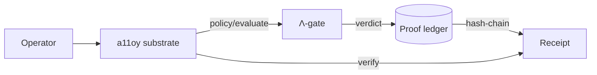

# a11oy 🔬
> Governed agentic execution fabric — policy substrate with HMAC-signed receipts for every gated decision.

     

**749 declarations · 14 axioms · 163 sorries · Doctrine v11 LOCKED · kernel `c7c0ba17`**

[Quickstart](#quickstart) · [Docs](https://docs.szlholdings.com/flagships/a11oy) · [Cookbook](https://github.com/szl-holdings/szl-cookbook) · [Verify](#verify-in-2-minutes) · [Cite](#citation) · [Releases](https://github.com/szl-holdings/a11oy/releases)

## Live
- **Space:** https://szlholdings-a11oy.hf.space
- **Docs:** https://docs.szlholdings.com/flagships/a11oy
- **Release:** [v1.0.0](https://github.com/szl-holdings/a11oy/releases/tag/v1.0.0)

## What it does
- **Policy + receipt substrate** — `/v1/policy/evaluate`, `/v1/verify`, `/v1/ledger`: one hash-chained substrate, deny by default.
- **Honest disclosure endpoint** — `/v1/honest` reports the live doctrine posture (749/14/163, Λ = Conjecture 1, SLSA L1 + L2).
- **Brand-orchestration gates** — governed-loop primitive with deterministic replay and hard-stop validators.

## Quickstart

```bash
pip install "szl-a11oy"                     # PyPI
# or run the live, signed container:
docker run --rm -p 7860:7860 ghcr.io/szl-holdings/a11oy:uds-v0.2.0
```
```python
from szl_a11oy import Gate                  # one-liner to first signed verdict
gate = Gate.from_doctrine("v11")             # loads the LOCKED 749/14/163 posture
verdict = gate.evaluate(receipt)             # -> signed verdict + receipt id
```

> Prefer zero-install? Hit the **[live Space](https://szlholdings-a11oy.hf.space)** or run the [Verify](#verify-in-2-minutes) block below — no credentials required.

## Verify (in 2 minutes)

```bash
# 1. Confirm the live doctrine posture on the running Space.
#    (Live-verified: this field is present in /v1/honest for a11oy.)
curl -s https://szlholdings-a11oy.hf.space/api/a11oy/v1/honest | jq .kernel_commit
# => "c7c0ba17"

# 2. Verify the signed UDS container artifact (cosign keyless OIDC).
#    Match the tag to the latest release asset; signing is keyless via the
#    GitHub Actions OIDC issuer.
cosign verify ghcr.io/szl-holdings/a11oy:uds-v0.2.0 \
  --certificate-identity-regexp="^https://github.com/szl-holdings/" \
  --certificate-oidc-issuer="https://token.actions.githubusercontent.com"

# 3. Inspect the public transparency-log entry for this image (Sigstore Rekor).
#    Image digest: sha256:7301a4…ab88
#    Rekor log index: 1710355173
rekor-cli get --log-index 1710355173
# Or open in a browser: https://search.sigstore.dev/?logIndex=1710355173
```

> Honest note: DSSE/Sigstore CI signing is being wired (receipt signatures are
> labelled `PLACEHOLDER` until CI signing lands). The `/v1/honest` check above is
> the authoritative live doctrine probe.

**Public proof:** cosign keyless cert (Fulcio) + Rekor transparency log entry
[`#1710355173`](https://search.sigstore.dev/?logIndex=1710355173) for image `ghcr.io/szl-holdings/a11oy:uds-v0.2.0` (`sha256:7301a4…ab88`).

## Try the cookbook

New here? The **[SZL Cookbook](https://github.com/szl-holdings/szl-cookbook)** has runnable recipes for your use case:

- **[Recipe 01 — Verify a receipt end-to-end](https://github.com/szl-holdings/szl-cookbook/blob/main/recipes/01-verify-a-receipt-end-to-end.md)**
- **[Recipe 06 — Verify cosign + Rekor for SLSA L1](https://github.com/szl-holdings/szl-cookbook/blob/main/recipes/06-cosign-rekor-slsa-l1.md)**
- **[Recipe 09 — PAC-Bayes confidence margin](https://github.com/szl-holdings/szl-cookbook/blob/main/recipes/09-pac-bayes-confidence-margin.md)**

Full index: [szl-cookbook/recipes](https://github.com/szl-holdings/szl-cookbook/tree/main/recipes).

## Architecture



## API surface

| Endpoint | Method | Description |
|---|---|---|
| `/api/a11oy/healthz` | GET | Liveness probe |
| `/api/a11oy/readyz` | GET | Readiness probe |
| `/api/a11oy/v1/honest` | GET | Doctrine disclosure (JSON) |
| `/api/a11oy/v1/version` | GET | Build + version metadata |
| `/api/a11oy/v1/ledger` | GET | Proof ledger |
| `/api/a11oy/v1/verify` | POST | Chain verification |
| `/api/a11oy/v1/policy/evaluate` | POST | Policy gate |

The full, canonical endpoint list is on the [docs site](https://docs.szlholdings.com/flagships/a11oy) and the [API reference](https://docs.szlholdings.com/api/).

## Doctrine
- **Doctrine v11 LOCKED** — 749/14/163 · kernel `c7c0ba17` (never bumped)
- **Λ = Conjecture 1** (NOT a theorem) — depends on the open CAUCHY_ND sorry + a missing symmetry axiom
- **SLSA L1 + L2 build provenance attested** · **Section 889 = exactly 5 vendors** (Huawei, ZTE, Hytera, Hikvision, Dahua)
- No Iron Bank / FedRAMP / CMMC / SWFT / Mission Owner claims

## License + DOI

- **License:** Apache-2.0 (OSS across all SZL Holdings repos).
- **Concept DOI:** [`10.5281/zenodo.20434276`](https://doi.org/10.5281/zenodo.20434276) — cite the archived release on Zenodo.

## Built with / learned from

This repository's structure and documentation conventions were learned from open-source
publication leaders — we adapted their *patterns*, not their words. Inspired by patterns from
**Polymathic AI** ([the_well](https://github.com/PolymathicAI/the_well), [walrus](https://github.com/PolymathicAI/walrus)),
**Anthropic**, **OpenAI** ([whisper](https://github.com/openai/whisper)), **Stripe** (docs craft),
Google DeepMind ([alphafold3](https://github.com/google-deepmind/alphafold3)),
Meta FAIR ([segment-anything](https://github.com/facebookresearch/segment-anything)),
EleutherAI ([lm-evaluation-harness](https://github.com/EleutherAI/lm-evaluation-harness)),
and Hugging Face ([transformers](https://github.com/huggingface/transformers)).
We are a precision substrate, not a vibes company.

## Citation

```bibtex
@software{szl_a11oy_2026,
  author    = {Lutar, Stephen P.},
  title     = {a11oy: Governed agentic execution fabric},
  year      = {2026},
  publisher = {SZL Holdings},
  version   = {v1.0.0},
  url       = {https://github.com/szl-holdings/a11oy},
  doi       = {10.5281/zenodo.20434276},
  note      = {Doctrine v11 LOCKED 749/14/163, kernel c7c0ba17}
}
```

## SLSA L2 build provenance (verify)

Every `ghcr.io/szl-holdings/a11oy` image ships a signed in-toto **SLSA provenance v1**
attestation (`actions/attest-build-provenance@v2`), discoverable on the public Sigstore
Rekor transparency log and pushed to the registry alongside the image.

```bash
# Resolve the image digest, then verify provenance against the source repo:
slsa-verifier verify-image \
  ghcr.io/szl-holdings/a11oy:uds-v0.2.0 \
  --source-uri github.com/szl-holdings/a11oy \
  --source-tag main

# Or with GitHub's native tooling:
gh attestation verify oci://ghcr.io/szl-holdings/a11oy:uds-v0.2.0 --owner szl-holdings
```

SLSA L2 = hosted build platform (GitHub Actions) + signed provenance available to consumers.
L3 is **not** claimed (requires a hardened, isolated build environment).

---
*Doctrine v11 LOCKED · 749/14/163 · kernel c7c0ba17 · Λ = Conjecture 1 · SLSA L1 + L2 build provenance attested (verifiable via slsa-verifier)*
