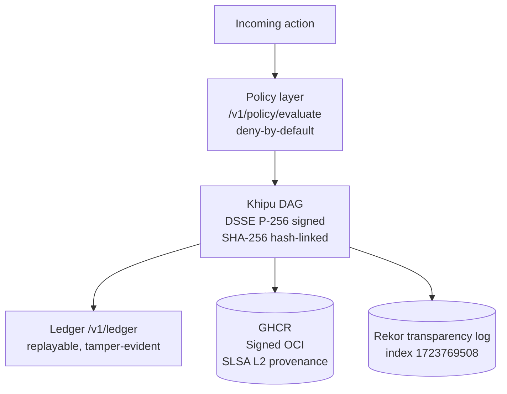

# a11oy 🔬

> **The signed-receipt substrate. Every AI decision leaves a DSSE Khipu receipt. `receipts.in ≡ receipts.out`.**

[](https://github.com/szl-holdings/a11oy/attestations/29916789)
[](https://search.sigstore.dev/?logIndex=1723769508)
[](https://github.com/szl-holdings/.github/tree/main/doctrine)
[](https://github.com/szl-holdings/a11oy/actions)
[](LICENSE)

**749 declarations · 14 axioms · 163 sorries · Doctrine v11 LOCKED · kernel `c7c0ba17`**

[Live demo](#live) · [What it does](#what-it-does) · [Verify](#verify-it-yourself) · [Architecture](#architecture) · [Parity vs. leaders](#parity-vs-leaders) · [Honest status](#honest-status)

---

## Live

**HF Space (one-click, no login):** [](https://huggingface.co/spaces/SZLHOLDINGS/a11oy)

- Space URL: https://szlholdings-a11oy.hf.space
- Health: `curl -s https://szlholdings-a11oy.hf.space/api/a11oy/v1/honest | jq .kernel_commit` → `"c7c0ba17"`
- Docs: https://docs.szlholdings.com/flagships/a11oy
- Release: [v1.0.0](https://github.com/szl-holdings/a11oy/releases/tag/v1.0.0)

---

## What it does

**a11oy is the audit-fiber continuity layer for the SZL mesh.** Every AI action routes through a11oy and leaves a DSSE-enveloped Khipu receipt on a SHA-256 hash-linked Merkle DAG. The invariant is `receipts.in ≡ receipts.out`: nothing is lost between the decision and the proof.

Key capabilities:
- **Policy + receipt substrate** — `/v1/policy/evaluate`, `/v1/verify`, `/v1/ledger`: deny-by-default; every action signed
- **Honest disclosure** — `/v1/honest` reports live doctrine posture (749/14/163, Λ = Conjecture 1)
- **8 TS workspace libs** — `@szl-holdings/a11oy-knowledge`, `a11oy-policy`, `a11oy-qec-integrity`, `a11oy-receipt-substrate`, `perception-loop`, `rae1`, `sequence-pipeline`, `sparse-attention-kit`
- **DSSE Khipu receipts** — ECDSA P-256-SHA256; multi-party-witnessed; BFT quorum-capable

---

## Verify it yourself

```bash
# 1. Confirm live doctrine posture
curl -s https://szlholdings-a11oy.hf.space/api/a11oy/v1/honest | jq .kernel_commit
# => "c7c0ba17"

# 2. Verify SLSA Build L2 provenance (GitHub-hosted runner, Sigstore-signed)
gh attestation verify \
  oci://ghcr.io/szl-holdings/a11oy@sha256:1cfd28e03e6f1fb4b0827f2281f5016ebde8122d8c9ecb00d73145c77dd02cd7 \
  --repo szl-holdings/a11oy
# => Verification succeeded
# Attestation: https://github.com/szl-holdings/a11oy/attestations/29916789

# 3. Verify cosign keyless signature (Rekor index 1723769508)
cosign verify ghcr.io/szl-holdings/a11oy:uds-v0.2.0 \
  --certificate-identity-regexp="^https://github.com/szl-holdings/" \
  --certificate-oidc-issuer="https://token.actions.githubusercontent.com"

# 4. Deploy as part of the signed mesh bundle
uds deploy oci://ghcr.io/szl-holdings/szl-mesh:v0.4.0 --confirm
```

**Full guide:** [developers/VERIFY.md](https://github.com/szl-holdings/developers/blob/main/VERIFY.md)

---

## Architecture



---

## Parity vs. leaders

| Capability | Palantir AIP | a11oy | Differentiator |
|---|---|---|---|
| Policy enforcement | ✅ | ✅ `/v1/policy/evaluate` | — |
| Audit trail | ✅ logs | ✅ **signed receipts** | Palantir logs are not individually verifiable cryptographic artifacts |
| Supply-chain provenance | — | ✅ **SLSA L2 verified** | `gh attestation verify` — they don't offer this |
| Formal math substrate | — | ✅ Lean 4 / 749 decl | Open, machine-checkable |
| Air-gap deployment | ✅ (proprietary) | ✅ **one UDS command** | Open-source, reproducible |
| Receipt multi-party witness | — | ✅ BFT quorum-capable | — |

---

## Quickstart

```bash
docker run --rm -p 7860:7860 ghcr.io/szl-holdings/a11oy:uds-v0.2.0
```

---

## Honest status

| Claim | Status |
|---|---|
| Live HF Space (HTTP 200) | ✅ |
| SLSA Build L2 verified | ✅ — attestation [29916789](https://github.com/szl-holdings/a11oy/attestations/29916789); Rekor [1723769508](https://search.sigstore.dev/?logIndex=1723769508) |
| cosign keyless signed | ✅ |
| UDS bundle (`szl-mesh:v0.4.0`) | ✅ — real baked image |
| DSSE Khipu receipts | ✅ — ECDSA P-256-SHA256 |
| Lean 749/14/163 @ `c7c0ba17` | ✅ |
| Λ-uniqueness | ⚠️ Conjecture 1 (F23 open bounty) — not a theorem |
| SLSA L3 | ❌ Not claimed |
| FedRAMP / CMMC | ❌ Not claimed |

---

<sub>Doctrine v11 LOCKED · 749/14/163 · kernel `c7c0ba17` · SLSA L2 verified · Λ = Conjecture 1 · Apache-2.0 · DOI [10.5281/zenodo.20434276](https://doi.org/10.5281/zenodo.20434276)</sub>

Signed-off-by: stephenlutar2-hash <stephenlutar2@gmail.com>
