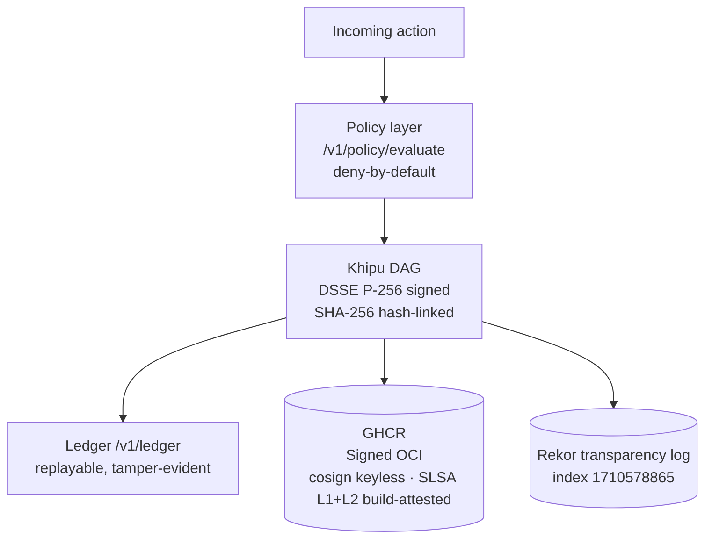

# a11oy 🔬

> **Governed autonomy with a checkable receipt for every decision.**
> The signed-receipt substrate: every AI action leaves a DSSE Khipu receipt. `receipts.in ≡ receipts.out`.

[](.compliance/SLSA_LEVEL.md)
[](https://search.sigstore.dev/?logIndex=1710578865)
[](https://github.com/szl-holdings/.github/tree/main/doctrine)
[](https://github.com/szl-holdings/a11oy/actions)
[](LICENSE)
[-B79BD6?style=flat-square)](https://github.com/szl-holdings/lutar-lean/blob/main/BOUNTY.md)

**LOCKED kernel `c7c0ba17` · 749 declarations · 14 axioms · 163 sorries · Doctrine v11**
**Proof posture (two-tier):** 5 locked-proven `{F1, F11, F12, F18, F19}` + an **EXPERIMENTAL · CI-green** tier (Lean v4.18.0 · ~1323 decls / 22 unique axioms — NOT folded into the locked count). Λ-uniqueness is **Conjecture 1** (axiom-free CUT-2 conditional proven; unconditional uniqueness machine-checked false). Full map → [lutar-lean](https://github.com/szl-holdings/lutar-lean).

[Live demo](#live) · [What it does](#what-it-does) · [Verify](#verify-it-yourself) · [Architecture](#architecture) · [Parity vs. leaders](#parity-vs-leaders) · [Honest status](#honest-status) · [Service status](https://szl-holdings.github.io/a11oy/)

---

## Live

**HF Space (one-click, no login):** [](https://huggingface.co/spaces/SZLHOLDINGS/a11oy)

- **Primary face — the full application:** https://szlholdings-a11oy.hf.space/ (also at `/console`)
- Space URL: https://szlholdings-a11oy.hf.space
- Health: `curl -s https://szlholdings-a11oy.hf.space/api/a11oy/v1/honest | jq .kernel_commit` → `"c7c0ba17"`
- Docs: https://szl-holdings.github.io/docs-site/flagships/a11oy
- Release: [v1.0.0](https://github.com/szl-holdings/a11oy/releases/tag/v1.0.0)
- **Service status:** https://szl-holdings.github.io/a11oy/ — continuously published live service-status board

---

## The application

a11oy is a **full left-nav application** — not a landing page or a single console panel. It opens directly to the Command Center and carries the unified SZL house style (dark ground, gold `#c9b787` + teal `#5fb3a3` accents, Space Grotesk + JetBrains Mono) with a **product switcher** in the top ribbon that jumps between the two live SZL products — a11oy (command platform) and killinchu (drones & vessels) — in one click.

**Primary app file:** [`pages/console.html`](pages/console.html) · **served at** `/` and `/console`.

**43 unique tabs** in the left navigation (plus **7 Warhacker live demos**). Representative views:

| View | What it does |
|---|---|
| **Command Center** | Live operational overview — service health, recent verdicts, receipt stream |
| **Five Superpowers** | The five orchestrated capabilities a11oy coordinates internally |
| **Warhacker** | Maps the five Warhacker problems to the a11oy capability that solves each, with a live signed receipt |
| **Observability** | MELT + distributed tracing where every span is a signed Khipu receipt (vs New Relic / Datadog / OTel) |
| **Capabilities** | The built-in a11oy capability fabric — reasoning, policy, and operator paths wired into the receipt substrate |
| **Services** | Live service reachability — real probes, honest when a service is unreachable |
| **Formulas** | The PURIQ formula set — **5 locked-proven in Lean 4 {F1, F11, F12, F18, F19}** (this count never moves) + a larger **experimental** tier, kernel-clean & CI-green on main `@b910c276` through **Wave 14** (Wave 11 CF-1/2/3/5; Wave 12 CUT-2 + CF-13 DEQ input-Lipschitz + CF-17 fp-summation stability; Wave 13 replay-root + non-Byzantine quorum + HM-bottleneck; Wave 14 CF-18 Madhava remainder, CF-19 Reed–Solomon MDS lower bound, CF-20 VCG, CF-21 log-sum/Gibbs). Λ-uniqueness is proven only **conditionally** (CUT-2, separability, axiom-free); remaining formulas are Roadmap |
| **Evidence** | Body-of-evidence export — DSSE Khipu receipts, replayable and tamper-evident |
| **LLM Router** | The governed LLM routing surface |

---

## What it does

**a11oy is the audit-fiber continuity layer of the SZL command platform.** Every AI action routes through a11oy and leaves a DSSE-enveloped Khipu receipt on a SHA-256 hash-linked Merkle DAG. The invariant is `receipts.in ≡ receipts.out`: nothing is lost between the decision and the proof.

Key capabilities:
- **Policy + receipt substrate** — `/v1/policy/evaluate`, `/v1/verify`, `/v1/ledger`: deny-by-default; every action signed
- **Built-in capability fabric** — reasoning, policy, and operator paths are internal to a11oy (not external services); each emits signed receipts
- **Honest disclosure** — `/v1/honest` reports live doctrine posture (749/14/163, Λ = Conjecture 1)
- **8 TS workspace libs** — `@szl-holdings/a11oy-knowledge`, `a11oy-policy`, `a11oy-qec-integrity`, `a11oy-receipt-substrate`, `perception-loop`, `rae1`, `sequence-pipeline`, `sparse-attention-kit`
- **DSSE Khipu receipts** — ECDSA P-256-SHA256; multi-party-witnessed; BFT quorum-capable

---

## Governed Post-Determinism (GPD)

**Governed Post-Determinism (GPD)** is SZL's own framework. Classical systems demand that every correct node produce the *same bytes*; autonomous agents produce *different but still-correct* reasoning paths — so the unit of agreement shifts from "identical output" to **certified semantic admissibility**, and SZL proves that certification with a signed, Lean-anchored receipt.

Five pillars, each mapped to a component SZL runs in production with an honest proof artifact:

- **Protocol-Bounded Execution** — governed-decision loop + YUYAY 13-axis conjunctive gate (deny-by-default). *Gate soundness proven over the locked F-set.*
- **Verifiable Intent-to-Execution** — DSSE-signed receipt chain + Lean-theorem trace. *ECDSA-P256 signed, SHA-256 hash-chained, tamper-evident.*
- **Bounded-Recursion Control Plane** — Ouroboros bounded-recursion loop (P1–P6). *Loop invariants proven.*
- **Semantic Quorum Assurance** — Khipu BFT quorum + Wave23 conditional safety theorem (`khipu_quorum_safety_conditional`, agreement under non-equivocation). *Conditional theorem; unconditional Byzantine safety = Conjecture 2 (open).*
- **Epistemic State Replication** — YAWAR append-only receipt bus + deterministic replay + Verifiable Semantic Rollback. *Receipts/replay live; full ESR semantics = open R&D (roadmap).*

**Honest posture:** locked-proven = exactly 5 {F1, F11, F12, F18, F19}; Λ (trust score) = **Conjecture 1** (unconditional uniqueness machine-checked false; conditional uniqueness holds); Semantic Quorum Assurance safety = Wave23 **conditional** (unconditional = Conjecture 2); full Epistemic State Replication = **open R&D**.

**Foundation — SZL's own prior art only (no external citation):** *The Loop Is the Product* v1/v2 ([Zenodo 19867281](https://doi.org/10.5281/zenodo.19867281), [19934129](https://doi.org/10.5281/zenodo.19934129)), *Lineage-Aware RAG / Prisca-GraphRAG v5* ([20020846](https://doi.org/10.5281/zenodo.20020846)), *Sealed Constitutional Guardrails v6* ([20020845](https://doi.org/10.5281/zenodo.20020845)), *The Lutar Omega Formalism v4* ([20020841](https://doi.org/10.5281/zenodo.20020841)), *SZL Doctrine v2 — 9 Canonical Axes* ([20174600](https://doi.org/10.5281/zenodo.20174600)) — all Stephen P. Lutar, ORCID 0009-0001-0110-4173.

See [`docs/GOVERNED_POST_DETERMINISM.md`](https://github.com/szl-holdings/platform/blob/main/docs/GOVERNED_POST_DETERMINISM.md) (platform repo) for the full write-up.

## Verify it yourself

```bash
# 1. Confirm live doctrine posture
curl -s https://szlholdings-a11oy.hf.space/api/a11oy/v1/honest | jq .kernel_commit
# => "c7c0ba17"

# 2. Verify the cosign keyless signature + build-provenance attestation on the image.
#    SLSA L1 honest · L2 build-attested: container provenance via
#    attest-build-provenance (Sigstore keyless, Fulcio + Rekor). Verify with
#    `cosign verify-attestation`. SLSA L3 is roadmap — see .compliance/SLSA_LEVEL.md.
cosign verify ghcr.io/szl-holdings/a11oy:uds-v0.2.0 \
  --certificate-identity-regexp="^https://github.com/szl-holdings/" \
  --certificate-oidc-issuer="https://token.actions.githubusercontent.com"
# Public Rekor entry for the image signature: log index 1710578865

# 3. Deploy as part of the signed mesh bundle
uds-cli bundle deploy oci://ghcr.io/szl-holdings/szl-uds-bundle:uds-v0.2.0 --confirm
```

**Full guide:** [developers/VERIFY.md](https://github.com/szl-holdings/developers/blob/main/VERIFY.md)

---

## Architecture



---

## Parity vs. leaders

| Capability | Palantir AIP | a11oy | Differentiator |
|---|---|---|---|
| Policy enforcement | ✅ | ✅ `/v1/policy/evaluate` | — |
| Audit trail | ✅ logs | ✅ **signed receipts** | Palantir logs are not individually verifiable cryptographic artifacts |
| Supply-chain provenance | — | ✅ **cosign keyless-signed + build-attested (SLSA L1 honest · L2 build-attested)** | `cosign verify-attestation` on every image; container provenance via attest-build-provenance, Rekor-anchored. SLSA L3 is roadmap. |
| Formal math substrate | — | ✅ Lean 4 / 749 decl | Open, machine-checkable |
| Air-gap deployment | ✅ (proprietary) | ✅ **one UDS command** | Open-source, reproducible |
| Receipt multi-party witness | — | ✅ BFT quorum-capable | — |

---

## Quickstart

```bash
docker run --rm -p 7860:7860 ghcr.io/szl-holdings/a11oy:uds-v0.2.0
```

---

## Honest status

| Claim | Status |
|---|---|
| Live HF Space (HTTP 200) | ✅ |
| SLSA **L1 honest · L2 build-attested** | ✅ — cosign keyless-signed image + container build-provenance attestation (attest-build-provenance, Sigstore keyless), verifiable via `cosign verify-attestation`; Rekor [1710578865](https://search.sigstore.dev/?logIndex=1710578865). See [.compliance/SLSA_LEVEL.md](.compliance/SLSA_LEVEL.md). |
| SLSA **L3** | 🛣️ **Roadmap** — hardened/isolated builder + non-falsifiable provenance. **Not claimed as achieved today.** |
| cosign keyless signed | ✅ |
| UDS bundle (`szl-uds-bundle:uds-v0.2.0`) | ✅ Real, deployable mesh bundle (cosign-signed, Rekor-anchored). |
| DSSE Khipu receipts | ✅ — ECDSA P-256-SHA256 |
| Lean 749/14/163 @ `c7c0ba17` | ✅ |
| Locked-proven PURIQ formulas | ✅ Exactly **5** — F1, F11, F12, F18, F19 (Lean 4, depend on **no** axioms; machine-enforced `locked_count_five`). |
| Experimental theorems (main `@b910c276`) | ✅ CI-green, kernel-verified results through **Wave 14** (waves 5–14 + agentic P1–P6 + coder; all `#print axioms ⊆ {propext, Classical.choice, Quot.sound}`). **NOT** in the locked count. Wave 11 CF-1/2/3/5 (24 thms); Wave 12 CUT-2 + CF-13 + CF-17; Wave 13 replay-root + single-valued non-Byzantine vote + HM-bottleneck; Wave 14 CF-18 Madhava remainder, CF-19 Reed–Solomon MDS **lower bound only**, CF-20 VCG, CF-21 log-sum/Gibbs. Λ-uniqueness proven CONDITIONAL on separability (CUT-2, axiom-free); unconditional = Conjecture 1. Key: M2 tamper-evidence, CP1 split-conformal coverage (not Hoeffding). |
| Λ-uniqueness | ⚠️ **Conjecture 1** (F23 open bounty) — never a theorem |
| SLSA L3 | ❌ Not claimed |
| FedRAMP / CMMC | ❌ Not claimed |

---

> Not affiliated with Defense Unicorns. SZL mark USPTO Serial 99831122. No production ATO claimed.

<sub>Doctrine v11 LOCKED · 749/14/163 · kernel `c7c0ba17` · SLSA L1 honest · L2 build-attested (container provenance, Sigstore keyless) · L3 / FedRAMP / Iron Bank / CMMC / ATO roadmap · 5 locked-proven + experimental CI-green tier · Λ = Conjecture 1 · Apache-2.0 · DOI [10.5281/zenodo.20434276](https://doi.org/10.5281/zenodo.20434276)</sub>

Signed-off-by: Stephen P. Lutar Jr. <stephenlutar2@gmail.com>

