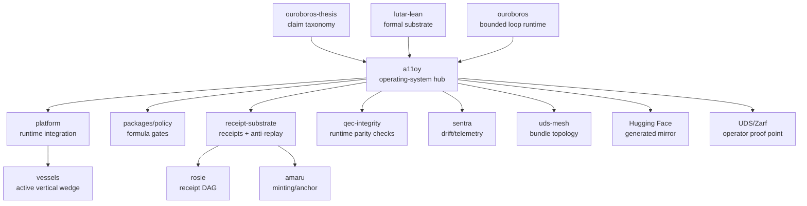

# SZL ecosystem operating system

This document is the operating manual for the public SZL ecosystem. It turns
the repositories, theses, formulas, Hugging Face mirrors, UDS proof points, and
benchmark ambitions into one evidence-first routing model.

The rule is deliberately strict: **GitHub is canonical; every public claim must
resolve to code, tests, releases, receipts, checksums, DOI records, or an
explicit staged/roadmap label.** Hugging Face is a generated diligence mirror,
not a replacement for GitHub release truth.

## Source-of-truth contract

| Surface | Role | Canonical evidence |
| --- | --- | --- |
| GitHub `a11oy` | Operational hub and payload publisher | CI, `deploy/MANIFEST.json`, payload scripts, doctrine package tests |
| `platform` | Product/runtime integration monorepo | Public repo and releases; this standalone subset does not run the full web SPA |
| `ouroboros-thesis` | DOI-pinned claim taxonomy | Thesis DOI and public thesis docs |
| `lutar-lean` | Lean proof substrate | Exact Lean module paths and current proof reports |
| `packages/policy` | Layer 6 formula gates | `npm run test:policy-gates` |
| `packages/receipt-substrate` | Hash-chained operational receipts | `npm test --prefix packages/receipt-substrate` |
| `packages/qec-integrity` | QEC lineage runtime checks | `npm run test:qec` |
| Hugging Face `SZLHOLDINGS/a11oy-v19-substrate` | Generated public diligence packet | `pnpm payload:huggingface` from tracked source |
| UDS/Zarf lane | Operator proof point and handoff | `artifacts/a11oy-uds`, `deploy/zarf.yaml`, `docs/UDS_FRONTIER_GAP_MAP.md` |

Do not present Hugging Face as canonical. Do not present UDS material as
Defense Unicorns endorsement, catalog acceptance, or universal deployability
unless separate public evidence exists.

## System topology



## Claim-status contract

Use the status vocabulary from [`docs/PROVENANCE.md`](PROVENANCE.md) everywhere:

| Status | Operating meaning |
| --- | --- |
| `verified-runtime` | Code and tests in this repo execute the claim surface. |
| `release-payload` | Claim is included in checksummed payloads or release artifacts. |
| `lean-backed-current-green` | Exact Lean module has a current green proof report. |
| `lean-backed-needs-upstream-ci` | Lean/proof substrate exists but current CI/report must be reconciled before all-green language. |
| `thesis-anchor` | DOI-pinned thesis language guides the claim, but runtime/proof evidence is separate. |
| `historical` | Lineage or prior-language context only. |
| `roadmap` | Planned, staged, or not active-demo ready. |

Forbidden without current public evidence:

- “all Lean green”
- “zero sorry”
- “cracked Putnam”
- “Defense Unicorns endorsed”
- “UDS catalog accepted”
- “HF is canonical”
- “fully autonomous production learning”
- “cannot hallucinate”

## Runtime hook matrix

| Formula / theorem surface | Status | Runtime hook | Test / audit | Caveat |
| --- | --- | --- | --- | --- |
| `FalsePosition` | `verified-runtime` | `packages/policy/src/gates/falsePosition_gate.ts` | `npm run test:policy-gates` | Runtime gate is tested; cite Lean proof status separately. |
| `MadhavaBound` | `verified-runtime` | `packages/policy/src/gates/madhavaBound_gate.ts` | `npm run test:policy-gates` | Runtime enforces a numeric threshold; full arctangent proof status is separate. |
| `LiuHuiPi` | `verified-runtime` | `packages/policy/src/gates/liuHuiPi_gate.ts` | `npm run test:policy-gates` | Approximation gate, not a blanket convergence claim. |
| `AdversarialRobustness` | `verified-runtime` | `packages/policy/src/gates/adversarialRobustness_gate.ts` | `npm run test:policy-gates` | Numeric Lipschitz special case of the broader theorem. |
| `SummationInvariant` | `verified-runtime` | `packages/policy/src/gates/summationInvariant_gate.ts` | `npm run test:policy-gates` | Khipu/ledger summation gate; broader cultural lineage remains guarded. |
| `ReceiptSubstrate` | `verified-runtime` | `packages/receipt-substrate/src/index.ts` | `npm test --prefix packages/receipt-substrate` | Local quorum labels are not external signer verification. |
| `QECLineage` | `verified-runtime` | `packages/qec-integrity/src/qec_lineage.ts` | `npm run test:qec` | Runtime parity checks are real; not a quantum-threshold theorem. |
| TH1-TH7 lookup | `verified-runtime` | `packages/a11oy-knowledge/src/theorems.ts` | `npm run test:knowledge:lookup` | Lookup reachability is runtime evidence, not full proof closure. |

The machine-readable counterpart is
[`docs/anatomy-formula-runtime-map.json`](anatomy-formula-runtime-map.json).

## UDS operator lane

A11oy currently supports a **UDS/Zarf-compatible operator proof point**:

1. Generate/verify deploy manifest bytes with `pnpm payload:verify`.
2. Build the doctrine outputs and operational payload with `pnpm payload:bundle`.
3. Verify the tarball/checksum sidecar with `pnpm payload:bundle:verify`.
4. Use `docs/UDS_FRONTIER_GAP_MAP.md` to distinguish current proof-point
   evidence from catalog-grade UDS requirements.

Catalog-grade language remains blocked until signed binary assets, UDS
`Package` CR coverage, external signer verification, and release evidence are
present.

## Hugging Face lane

The Hugging Face mirror is regenerated from tracked source:

```bash
pnpm payload:huggingface
```

The generated packet should carry:

- this operating-system manual;
- `docs/PROVENANCE.md`;
- `docs/ecosystem-readiness-report.json`;
- `docs/anatomy-formula-runtime-map.json`;
- `docs/theorem-runtime-manifest.json`;
- `docs/AUTONOMOUS_LEARNING_DOCTRINE.md`;
- `docs/benchmark-evolution-doctrine.md`;
- payload manifests and verification commands.

## Autonomous learning lane

Autonomy is proposal generation, not production self-mutation. A11oy may dream,
evaluate, and propose inside a receipt-backed sandbox. It may not self-approve,
self-promote, deploy, publish, or mutate canonical doctrine without human
promotion and CI evidence. The authoritative rules are in
[`docs/AUTONOMOUS_LEARNING_DOCTRINE.md`](AUTONOMOUS_LEARNING_DOCTRINE.md).

## Benchmark lane

Benchmark evolution, including Putnam-style goals, must be raw-score,
corpus-pinned, receipt-backed, and judge-audited. The standard is in
[`docs/benchmark-evolution-doctrine.md`](benchmark-evolution-doctrine.md), with
machine-readable scope in [`benchmarks/benchmark-map.json`](../benchmarks/benchmark-map.json).

## Public pattern synthesis lane

Public repos, profiles, papers, Hugging Face assets, and UDS/Zarf examples can
be studied as pattern signals. They must pass through the clean-room synthesis
ledger in [`docs/PUBLIC_PATTERN_SYNTHESIS.md`](PUBLIC_PATTERN_SYNTHESIS.md) and
[`docs/public-pattern-source-manifest.json`](public-pattern-source-manifest.json):

1. source is public, licensed, permissioned, or owned;
2. pattern is abstracted without copying code/prose/schema/branding;
3. original SZL/A11oy transformation is written down;
4. local evidence and validation commands are attached;
5. no endorsement or partnership is implied.

This is how the ecosystem can learn from the outside world “like fashion” while
remaining doctrine-safe and legally clean.

## Controls evidence lane

The original A11oy controls map is
[`docs/controls-evidence-map.json`](controls-evidence-map.json). It does not
import external control catalogs. It binds each A11oy control to:

- claim status;
- local evidence paths;
- validation commands;
- receipt hooks;
- Hugging Face exposure limits;
- UDS proof-point boundaries.

Validate it with:

```bash
pnpm controls:audit
```

## Operator action-contract lane

The original operator intent contract is
[`docs/action-contract-manifest.json`](action-contract-manifest.json). It turns
UDS-style public handoff patterns into an A11oy-native `ActionContract` with
ingress, identity, policy, evidence, receipt sinks, replay bounds, egress
limits, and forbidden UDS claims.

Runtime receipt helpers for controls and action contracts live in
`packages/policy/src/contracts/controls.ts` and are covered by
`npm run test:policy-contracts`.

Validate it with:

```bash
pnpm action-contract:audit
npm run test:policy-contracts
```

## Test-results dataset lane

The staged Hugging Face dataset schema lives under
[`huggingface/test-results`](../huggingface/test-results). It is intentionally
schema/manifest-only: no live Putnam score, no leaderboard metric, and no
redistributed benchmark corpus. Validate it with:

```bash
pnpm hf:test-results:audit
```

## Cross-repo access lane

The GitHub Enterprise access runbook is
[`docs/GITHUB_ENTERPRISE_ACCESS_RUNBOOK.md`](GITHUB_ENTERPRISE_ACCESS_RUNBOOK.md)
with machine-readable checklist
[`docs/github-enterprise-access-checklist.json`](github-enterprise-access-checklist.json).
Additional Enterprise seats can solve seat capacity, but cross-repo phases still
need accepted org membership, repo/team write permission, and token or GitHub
App scope for each sibling repo.

Validate the access checklist with:

```bash
pnpm github:access:audit
```

## Validation commands

Run the operating-system audit lane before publishing:

```bash
pnpm ecosystem:audit
pnpm ecosystem:readiness
pnpm theorem:runtime:audit
pnpm anatomy:runtime:audit
pnpm benchmark:audit
pnpm patterns:audit
pnpm controls:audit
pnpm action-contract:audit
pnpm hf:test-results:audit
pnpm github:access:audit
pnpm payload:verify
pnpm payload:huggingface
pnpm payload:bundle
pnpm payload:bundle:verify
npm run test:policy-gates
npm test --prefix packages/receipt-substrate
npm run test:qec
```

If a sibling repository is not writable from the current environment, ship
proxy patches/status files through `a11oy` and keep the claim status as
`roadmap`, `staged`, or `needs-upstream-ci` until the owner-applied upstream CI
is green.
