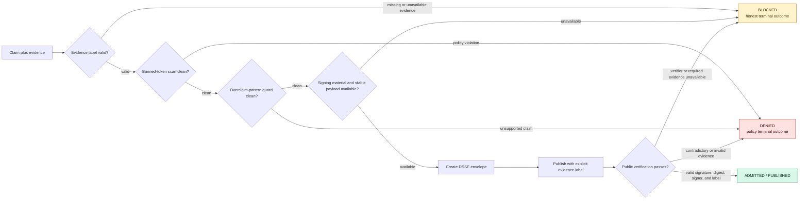

<!-- SPDX-License-Identifier: Apache-2.0 -->

# Governed admission flow

A11oy admits a claim only after its evidence label and copy survive the
repository's deterministic honesty gates. Signing happens **after** those checks.
Publication is not proof: the public verifier independently checks the DSSE
envelope, subject digest, signer identity, and published label.

The graph is the control-plane sequence used by the repository. Individual
products may call different adapters, but they may not reorder the gates or
turn an unavailable prerequisite into success.

## Outcome semantics

| Outcome | Meaning | May it be represented as success? |
|---|---|---|
| `ADMITTED / PUBLISHED` | Every required gate and the independent public verification passed for the recorded subject. | Yes, but only for that exact subject and observation. |
| `DENIED` | Available evidence contradicts policy, integrity, signer, digest, or claim requirements. | No. |
| `BLOCKED` | A required input, signer, provider, verifier, or evidence source is unavailable or incomplete. This is a first-class honest outcome, not an exception and not a soft pass. | No. |

## Source map

The diagram intentionally separates the stages that are often collapsed into a
single “green” claim:

| Stage | Current source authority |
|---|---|
| Evidence-label and quantitative-claim checks | `tools/page-claim-guard/check_page_claims.py`, reviewed `pages/claims/*.claims.json`, and measured result artifacts |
| Banned-token gate | `.github/workflows/doctrine-grep.yml` and `scripts/check_banned_tokens.py` |
| Overclaim-pattern gate | `.github/workflows/overclaim-guard.yml` plus the pinned organization reusable workflow |
| DSSE signing and envelope verification | `szl_dsse.py` (`sign_khipu_receipt` and `verify_envelope`) |
| Receipt and provenance binding | `szl_provenance.py` and the relevant governed publisher |
| Public verification | exact-subject readback, `szl_dsse.py` verification, and the independent proof surface at `a11oy.net` |

The page-claim guard rejects unsourced quantitative and comparative claims and
also rejects stale approvals whose approved text no longer exists. The doctrine
gates independently reject the fixed banned-token vocabulary and unsupported
Λ / Conjecture-1 overclaims. A passing publication step therefore cannot erase
a prior denial or substitute for a missing verification step.

## Non-negotiable ordering

1. **Classify the claim and evidence.** Missing or unavailable evidence yields
   `BLOCKED`.
2. **Run deterministic honesty gates.** Banned tokens or unsupported overclaims
   yield `DENIED`.
3. **Sign the stable admitted payload.** Missing required signing material yields
   `BLOCKED`; no replacement identity is fabricated.
4. **Publish with the explicit label.** Reachability alone does not upgrade the
   label.
5. **Verify from the public side.** Unknown signer, corrupted subject digest, or
   contradictory label yields `DENIED`; unavailable readback yields `BLOCKED`.

`BLOCKED` remains visible through the entire flow. It is never converted to
`ADMITTED`, represented as an infrastructure error, or hidden behind a green
publication check.
