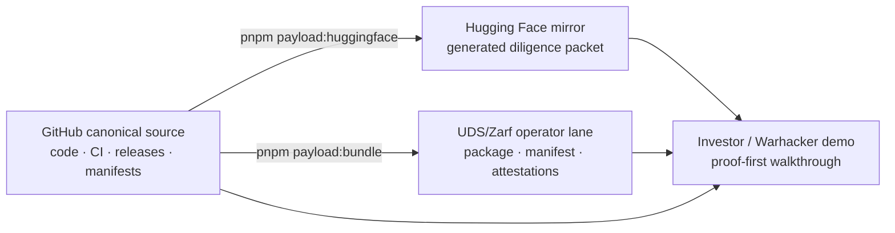
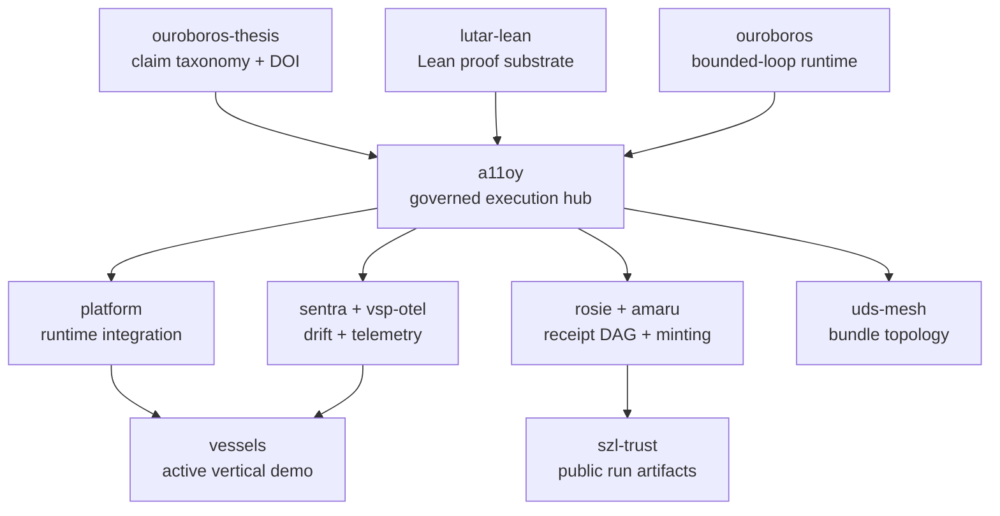
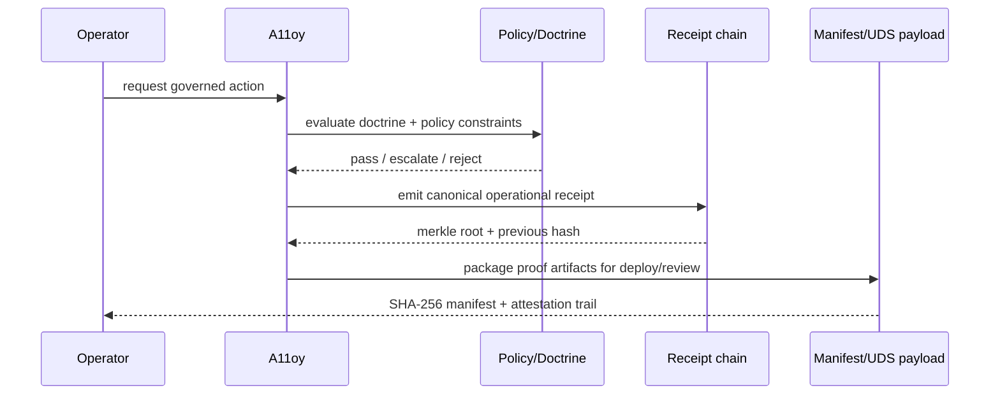

# A11oy investor demo packet

This is the five-minute path through the SZL Holdings governed-AI substrate.
It is written for investors, technical diligence reviewers, and UDS operators
who need to see what is real, what runs, what is packaged, and what remains
explicitly out of active-demo scope.

## Start here

| Step | What to open | What it proves |
| --- | --- | --- |
| 1 | [`README.md`](../README.md) | A11oy is the operational hub, not an LLM checkpoint. |
| 2 | [`docs/PROVENANCE.md`](PROVENANCE.md) | Public claims are status-gated before they reach GitHub or Hugging Face. |
| 3 | [`docs/ecosystem-readiness-report.json`](ecosystem-readiness-report.json) | Every visible SZL repo is classified by demo readiness and evidence. |
| 4 | [`artifacts/a11oy-uds/README.md`](../artifacts/a11oy-uds/README.md) | A11oy has a UDS/Zarf payload lane with manifests and attestation checks. |
| 5 | [`packages/receipt-substrate`](../packages/receipt-substrate) | Tool-envelope receipts can be emitted, chained, and verified locally. |
| 6 | [`deploy/MANIFEST.json`](../deploy/MANIFEST.json) | Deploy payload files are content-addressed with SHA-256. |
| 7 | [`huggingface/README.md`](../huggingface/README.md) | Hugging Face is a generated diligence mirror tied back to GitHub. |
| 8 | [`docs/UDS_FRONTIER_GAP_MAP.md`](UDS_FRONTIER_GAP_MAP.md) | UDS/Zarf fit and gaps are mapped against public Defense Unicorns docs. |
| 9 | [`docs/ANCIENT_TEXTS_FORMULA_LINEAGE.md`](ANCIENT_TEXTS_FORMULA_LINEAGE.md) | Ancient/pre-modern source lineage is mapped to formulas and runtime hooks with caveats. |
| 10 | [`docs/ECOSYSTEM_OPERATING_SYSTEM.md`](ECOSYSTEM_OPERATING_SYSTEM.md) | Repos, formulas, anatomy, UDS, HF, autonomy, and benchmarks are routed through one claim-status OS. |
| 11 | [`docs/AUTONOMOUS_LEARNING_DOCTRINE.md`](AUTONOMOUS_LEARNING_DOCTRINE.md) | “Dreaming” and learning are staged as receipt-backed proposals with human promotion, not self-deploying production mutation. |
| 12 | [`docs/benchmark-evolution-doctrine.md`](benchmark-evolution-doctrine.md) | Putnam and benchmark goals are raw-score, corpus-pinned, receipt-backed, and judge-audited. |
| 13 | [`docs/PUBLIC_PATTERN_SYNTHESIS.md`](PUBLIC_PATTERN_SYNTHESIS.md) | Public ecosystem inspiration is transformed into original SZL artifacts without private/unlicensed copying or implied endorsement. |
| 14 | [`docs/controls-evidence-map.json`](controls-evidence-map.json) | A11oy-native controls map binds claims to evidence paths, validators, receipts, HF exposure, and UDS boundaries. |
| 15 | [`docs/action-contract-manifest.json`](action-contract-manifest.json) | Original operator intent contract captures ingress, identity, policy, evidence, replay, and egress limits. |

## One-line thesis

A11oy turns agentic work into governed execution: every consequential action is
policy-checked, receipt-backed, payload-manifested, and traceable to a public
provenance contract.

## What is demo-ready now

| Surface | Demo status | Evidence |
| --- | --- | --- |
| A11oy doctrine package lane | Demo-ready | `pnpm test:doctrine`, `pnpm typecheck:doctrine`, `pnpm build:doctrine` |
| Operational receipt chain | Demo-ready | `npm test --prefix packages/receipt-substrate` and `npm run smoke --prefix packages/receipt-substrate` |
| Deploy manifest verification | Demo-ready | `pnpm payload:verify` |
| Hugging Face payload generation | Demo-ready | `pnpm payload:huggingface` |
| Operational tarball bundle | Demo-ready | `pnpm payload:bundle` and `pnpm payload:bundle:verify` |
| UDS/Zarf handoff | Demo-ready as package/operator proof point | `artifacts/a11oy-uds/README.md`, `artifacts/a11oy-uds/docs/*`, `deploy/zarf.yaml` |
| Vessels vertical | Active vertical demo wedge | `https://github.com/szl-holdings/vessels` and `uds-v0.2.0` release |
| Formula gates G36–G40 (DP, VCG, RDP, CertRadius, RS) | Demo-ready — 40 gates total (38 GREEN-discharged; G37 STAGED-ADVISORY) | `packages/policy/src/gates/` — Doctrine v6, lutar-lean#116 companion |

### Gate count: 35 → 40

This release extends the anchor formula gate set from 35 to 40 by adding five runtime gates:

| Gate | Name | Status | Lean theorem | Reference |
|------|------|--------|--------------|----------|
| G36 | GaussianMechanismDP | GREEN | `gaussianNoiseSufficiency` | Dwork & Roth 2014, DOI:10.1561/0400000042 |
| G37 | VCGTruthfulness | **STAGED-ADVISORY** (1 sorry in dominant-strategy proof; `vcgDominantStrategyTruth`) | `vcgDominantStrategyTruth` | Vickrey 1961, Clarke 1971, Groves 1973 |
| G38 | RDPSequentialComposition | GREEN | `rdpSequentialCompositionAdditivity` | Mironov 2017, arXiv:1702.07476 |
| G39 | CertifiedRobustnessRadius | GREEN | `certifiedRobustnessRadiusBound` | Cohen, Rosenfeld & Kolter 2019, arXiv:1902.02918 |
| G40 | ReedSolomonSingletonBound | GREEN | `reedSolomonMDSProperty` | Reed & Solomon 1960, Singleton 1964 |

> **G37 STAGED-ADVISORY:** The `vcgDominantStrategyTruth` Lean theorem carries 1 sorry in the argmax uniqueness sub-proof. The gate-level receipt validator (`vcgReceiptValid_iff`) has 0 sorries. G37 is non-blocking by default (`enforced: false`) and emits an advisory rather than a hard deny until the sorry is discharged. Lean discharge route is documented in `lutar-lean/Lutar/MechanismDesign/VCGTruthfulness.lean`.

Lean stubs for all five gates are tracked in [`szl-holdings/lutar-lean#116`](https://github.com/szl-holdings/lutar-lean/pull/116). Total sorry count increase: +7 (in formula-extension files under `Lutar/DP/`, `Lutar/Robustness/`, `Lutar/CodingTheory/`, `Lutar/MechanismDesign/` — not kernel sorries).

## What is intentionally not in the active demo

`counsel`, `terra`, and `carlota-jo` are funded-roadmap scaffolds. They remain
visible in the ecosystem registry for transparency, but the investor demo does
not present them as operational product surfaces.

The showcase also does **not** use the stale names `KORA`, `LUMINA`,
`PARAGON`, or active `Lyte` framing. The public story is anchored on the
repositories that actually exist in GitHub: `a11oy`, `amaru`, `sentra`,
`rosie`, `ouroboros`, `lutar-lean`, `ouroboros-thesis`, `uds-mesh`,
`vsp-otel`, `vessels`, `agi-forecast`, `szl-trust`, `szl-brand`,
`szl-cookbook`, `.github`, and `platform`.

## Architecture zoom-out







## Evidence matrix

| Claim | Status | Evidence |
| --- | --- | --- |
| A11oy doctrine runtime checks execute locally | `verified-runtime` | `web/packages/a11oy-core/src/**/__tests__`, `pnpm test:doctrine` |
| QEC lineage primitives have standalone tests | `verified-runtime` | `packages/qec-integrity/src/qec_lineage.test.ts` |
| Operational receipts are hash-chained and verifiable | `verified-runtime` | `packages/receipt-substrate/src/index.ts`, `receipt_substrate.test.ts` |
| Deploy payload files are checksummed | `release-payload` | `deploy/MANIFEST.json`, `scripts/payload_manifest.py` |
| Hugging Face payload is source-generated | `release-payload` | `scripts/prepare_huggingface_payload.py` |
| Operational tarball has checksum sidecar | `release-payload` | `scripts/build_operational_payload.py` |
| Thesis v18.0 is the current claim anchor | `thesis-anchor` | DOI `10.5281/zenodo.20434276` |
| Lean proofs exist as a public substrate | `lean-backed-needs-current-ci` | `szl-holdings/lutar-lean`, DOI `10.5281/zenodo.20434308` |

## UDS / Warhacker proof point

The UDS story should be shown as an operator proof point:

1. Pull or build the A11oy payload.
2. Verify `MANIFEST.json` and the attestation chain.
3. Inspect the Zarf package metadata.
4. Run the receipt-chain smoke test.
5. Tamper with one payload file and show verification failure.
6. Tie the result back to the ecosystem readiness report and Hugging Face mirror.

The package should be described as **UDS/Zarf-compatible** and operator-ready
for proof-point review. Do not imply Defense Unicorns endorsement, catalog
acceptance, or partnership unless those become explicit public facts.

## Verification block

```bash
pnpm install
pnpm test:doctrine
pnpm typecheck:doctrine
pnpm build:doctrine
pnpm ecosystem:audit
pnpm ecosystem:readiness
pnpm payload:verify
pnpm payload:huggingface
pnpm payload:bundle
pnpm payload:bundle:verify
npm test --prefix packages/receipt-substrate
```

## Investor FAQ

### Is A11oy a model?

No. It is a governed execution fabric and payload discipline around model- or
agent-driven work. Hugging Face is used as a public diligence mirror, not as the
canonical release source.

### What makes it investable?

The substrate compounds: one policy/receipt/provenance layer supports multiple
verticals. The immediate demo path is A11oy + Vessels + UDS/Zarf packaging; the
receipt/proof/telemetry layers are reusable across the rest of the ecosystem.

### Where is the audit trail?

At three levels:

1. operational receipts in `packages/receipt-substrate`;
2. deploy checksums and attestations in `deploy/` and `artifacts/a11oy-uds/`;
3. public provenance and readiness status in `docs/PROVENANCE.md` and
   `docs/ecosystem-readiness-report.json`.

### Are all proof claims closed?

No broad proof-completeness claim should be made without current upstream proof
reports. The strong, truthful claim is that A11oy has a public proof substrate,
runtime tests, UDS payload manifests, and a claim contract that prevents
unsupported marketing language from becoming the public story.

