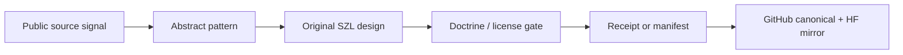

# Public pattern synthesis ledger

This ledger turns public ecosystem research into original SZL/A11oy work. It is
the safe version of “ingest it like fashion and make it our own”: study the
shape, taste, workflow, and operating patterns; do **not** copy private
material, upstream code, protected prose, schemas, trademarks, datasets, or
unlicensed assets.

The output of this lane is original A11oy doctrine-native implementation:
receipts, manifests, formula gates, UDS operator proof points, Hugging Face
diligence mirrors, benchmark maps, and public-claim guardrails.

## Clean-room rules

1. Use only public, licensed, permissioned, or user-owned material.
2. Treat public GitHub visibility as a research signal, not as permission to
   copy code or text.
3. Capture patterns as abstract operating ideas.
4. Rebuild as original A11oy/SZL artifacts with new names, new files, new
   schemas, and new validation.
5. Preserve attribution and license obligations if any upstream material is
   quoted or copied. Default to no copying.
6. Do not imply partnership, endorsement, employment, affiliation, or UDS
   catalog acceptance from public-profile or repo observation.
7. Every synthesized pattern must land behind a claim status:
   `verified-runtime`, `release-payload`, `thesis-anchor`, `historical`, or
   `roadmap`.

## Pattern synthesis matrix

| Pattern | Public source category | Copying boundary | Original SZL/A11oy transformation | Validation |
| --- | --- | --- | --- | --- |
| Disconnected proof bundle | Zarf / UDS public packaging ecosystems | Pattern only; no upstream templates or CRDs copied. | Offline A11oy proof bundle with `MANIFEST.json`, attestations, receipts, policy report, and tamper demo. | `pnpm payload:bundle`, `pnpm payload:bundle:verify` |
| Bundle topology manifest | UDS Core / bundle graph public docs | Do not copy AGPL/commercial templates or schemas. | A11oy-native topology map for `a11oy` + `amaru` + `sentra` + `rosie` + `vessels` readiness gates. | `pnpm ecosystem:readiness` |
| Operator intent contract | Public UDS Package / operator docs | Concepts only; no implied Defense Unicorns endorsement. | `ActionContract`: ingress, identity, evidence, policy, receipt sinks, replay bounds, egress limits. | `pnpm patterns:audit` |
| Typed policy exemption ledger | Public policy-engine / admission-control patterns | No upstream TypeScript copied. | Expiring `ExemptionReceipt` design: actor, scope, justification, policy hash, revalidation deadline. | `npm test --prefix packages/receipt-substrate` once runtime wired |
| Least-privilege capability envelope | Kubernetes/UDS security-context patterns | General security concept only. | Agent/tool envelope with allowed inputs, egress, identity context, observability endpoints, and forbidden capabilities. | `docs/AUTONOMOUS_LEARNING_DOCTRINE.md` |
| Compliance-as-code evidence map | Lula / controls-as-code public pattern | No control catalogs copied unless licensed. | A11oy `controls` concept linking claims to tests, receipts, docs, runtime hooks, and claim status. | `pnpm ecosystem:os:audit` |
| Generated diligence card | Hugging Face model/dataset card conventions | Do not copy card prose or third-party metadata. | A11oy HF mirror as non-model diligence packet generated from GitHub truth. | `pnpm payload:huggingface` |
| Receipted eval dataset | HF dataset cards, SWE-bench/HELM/simple-evals style traces | Publish only SZL-generated JSONL and licensed benchmark pointers. | Future `a11oy-test-results` dataset with receipt chains, judge IDs, corpus digests, raw scores, and tamper evidence. | `pnpm benchmark:audit` |
| Operator proof Space | Public HF Spaces demo pattern | No secrets; public Spaces expose source. | Original static/Gradio dashboard for manifest verification, receipt append, tamper failure, UDS caveats. | `pnpm payload:bundle:verify` |
| Claim-status scoreboard | GitHub badges, release notes, HF cards | No unsupported “all green”/endorsement language. | Matrix of `verified-runtime`, `release-payload`, `thesis-anchor`, `roadmap`, and `needs-upstream-ci`. | `pnpm theorem:runtime:audit` |
| Corpus card + digest gate | miniF2F, MATH/AIMO-style corpora | Respect dataset licenses; store pointers/digests where redistribution is not allowed. | Immutable benchmark corpus cards with source URI, license, canonicalization, digest, count, and sealed state. | `pnpm benchmark:audit` |
| Raw-point competition-math ledger | Public contest scoring norms | No “solved the benchmark” claim without sealed corpus and judges. | `earned / possible` raw-score ledger with failures, retries, tool use, and judge disagreement. | `pnpm benchmark:audit` |
| Three-judge result panel | Public eval reporting patterns | LLM judges are evidence, not truth. | `raw_grader`, `proof_judge`, and `provenance_judge`; unanimous agreement for headline claims. | `pnpm benchmark:audit` |
| Receiptized eval trace | Public eval run-log pattern | Do not copy scenario data or harness code. | Hash prompt/answer/judge/model/tool-policy into append-only receipts. | `npm test --prefix packages/receipt-substrate` |
| Formula gate matrix | Formal-methods + runtime-check patterns | Runtime gate is not a full theorem unless proof evidence is current. | Route problems through `FalsePosition`, `MadhavaBound`, `LiuHuiPi`, `SummationInvariant`, `AdversarialRobustness`, and `QECLineage`. | `pnpm theorem:runtime:audit` |

## Public source queue

The machine-readable queue is
[`public-pattern-source-manifest.json`](public-pattern-source-manifest.json).
It includes public orgs, repos, and profile seeds supplied by the user’s
screenshot and previous ecosystem audits. The queue is not a claim that every
source has been exhaustively audited or that any source endorses SZL.

## One-of-one transformation rule

Every public pattern must pass through the A11oy transformation chain:

If a pattern cannot reach a receipt, manifest, validation command, or explicit
roadmap label, it stays out of active-demo claims.
