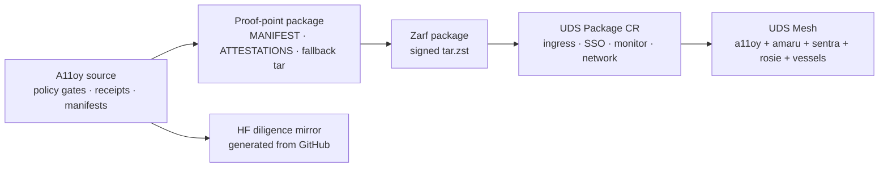

# UDS frontier gap map

This document maps A11oy and the SZL substrate against the public Defense
Unicorns UDS/Zarf model. It is intentionally evidence-first: it separates what
is implemented in this repository from what remains a release, cluster, or
cross-repo task.

## Public UDS model

Defense Unicorns describes UDS as an airgap-native delivery platform for secure
and disconnected environments. The public docs emphasize:

- Zarf packages that carry application dependencies for disconnected deploys.
- UDS bundles that compose multiple packages as one versioned deployable unit.
- A `Package` custom resource watched by the UDS Operator to configure ingress,
  SSO, monitoring, authorization, and network policy.
- Package inspection, SBOMs, signing, and registry workflows for operator trust.

References:

- <https://docs.defenseunicorns.com/>
- <https://docs.defenseunicorns.com/core/how-to-guides/packaging-applications/create-uds-package/>
- <https://docs.defenseunicorns.com/core/concepts/configuration--packaging/bundles/>
- <https://github.com/defenseunicorns/uds-common/blob/main/docs/uds-packages/guide.md>

## A11oy fit

| UDS need | A11oy evidence today | Status |
| --- | --- | --- |
| Airgap artifact | `artifacts/a11oy-uds/scripts/build.sh`, fallback tar verification | `release-payload` / proof-point |
| Manifested payload bytes | `deploy/MANIFEST.json`, `artifacts/a11oy-uds/build/MANIFEST.json` | `verified-runtime` |
| Attestation chain | `ATTESTATIONS.json` verifier under `artifacts/a11oy-uds/scripts/` | `verified-runtime` |
| Operator quickstart | `artifacts/a11oy-uds/docs/OPERATOR-QUICKSTART.md` | `release-payload` |
| UDS bundle story | `artifacts/a11oy-uds/docs/UDS-BUNDLE.md` | `release-payload` |
| Receipt audit trail | `packages/receipt-substrate` tests + CLI smoke | `verified-runtime` |
| Policy gates | `packages/policy/src/gates` + `npm run test:policy-gates` | `verified-runtime` |
| HF diligence mirror | `pnpm payload:huggingface` generated files | `release-payload` |

## Gaps to close before claiming catalog-grade UDS package

| Gap | Why it matters | Honest next action |
| --- | --- | --- |
| UDS `Package` CR | Public UDS package docs expect a `uds.dev/v1alpha1` `Package` resource for ingress/SSO/monitoring/network policy. | Add an optional `deploy/manifests/a11oy-uds-package.yaml` once a real in-cluster service/selector exists. |
| Container/Helm package | UDS examples assume Kubernetes app packaging with images/charts; A11oy currently stages runtime/provenance artifacts. | Keep “operator proof point” language until a runtime sidecar/Helm chart exists. |
| Signed binary assets for `uds-v0.3.0` | Release credibility requires tarball + signature + sha256 + public key assets. | Do not claim v0.3.0 signed payload complete until assets exist and verify. |
| Multi-repo mesh capstone | A full mesh needs A11oy, Amaru, Sentra, Rosie, Vessels, and UDS Mesh assets cut together. | Use `uds-mesh` pointer manifest only after all organ payloads exist. |
| External signer verification | `receipt-substrate` quorum labels are local labels, not external cryptographic signatures. | Wire COSE/DSSE/cosign verification before claiming signer identity proof. |

## A11oy frontier upgrade path

## Warhacker proof-point checklist

1. Build A11oy from GitHub source.
2. Verify deploy `MANIFEST.json`.
3. Run `npm run test:policy-gates`.
4. Run `npm test --prefix packages/receipt-substrate`.
5. Run `bash scripts/validate-operational.sh`.
6. Inspect the Zarf package when Zarf is available.
7. Demonstrate a tamper failure by modifying a staged file and rerunning the
   manifest verifier.
8. Show the Hugging Face mirror was generated from GitHub source, not hand
   edited.

## Doctrine boundaries

- Do not claim Defense Unicorns endorsement, product acceptance, or UDS catalog
  status without public evidence.
- Do not claim signed `uds-v0.3.0` assets exist unless the four release assets
  are present and verify.
- Do not claim every thesis statement is Lean-closed unless current proof CI
  reports that exact module.
- Keep GitHub canonical; Hugging Face is the generated review mirror.

