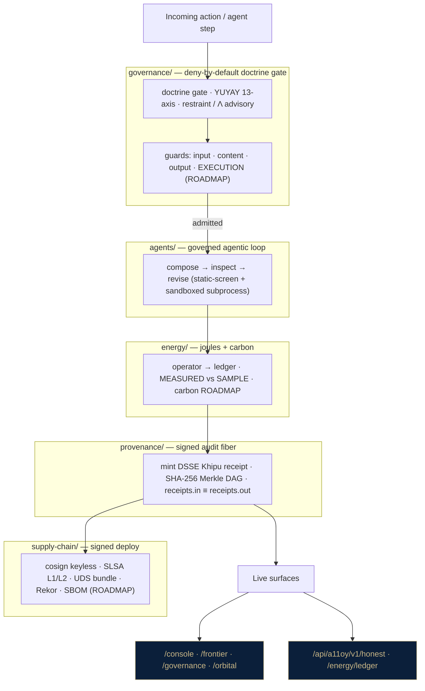

<!--
SPDX-License-Identifier: Apache-2.0
© Stephen P. Lutar Jr. (ORCID 0009-0001-0110-4173) · Doctrine v11 LOCKED
-->

# a11oy Architecture — the governed agentic substrate

> Companion to the [README](../README.md). This document is the deeper read for an
> engineer, defense buyer, or investor who wants the synthesis thesis, the honest
> capability map, the module-to-moat mapping, and the honest novelty boundary.
>
> **Doctrine v11 LOCKED · 749/14/163 · Λ = Conjecture 1 · HONESTY OVER CHECKLIST.**

---

## 1. The synthesis thesis — governed code-as-action

**One line:** an agent that **composes → inspects → revises** code, where every code
action is **doctrine-gated before it runs** and **emits a signed Khipu provenance receipt**
with MEASURED joules into the energy ledger.

The interesting space lives between two things we studied (and copied from neither):

- a clean production-AI repo layout gives you a tidy `agents/` `tools/` `services/` shell
  and a RAG cognition loop — but **no governance**: nothing gates an action before it runs,
  nothing signs it, nothing meters its energy.
- a code-as-action kernel gives you a persistent sandbox the agent writes code into — but
  again **no governance**, no provenance, no energy accounting.

a11oy's position is the inverse: we are **governance-complete and cognitively-partial**. We
already have the organs — energy operator + ledger, signed Khipu provenance, governance /
restraint gates, a UDS signed supply chain. The gap is the **closed cognitive loop** driving
them. Fusing the two — a governed, auditable, energy-metered code-as-action agent — is the
thesis. The novelty is the **governed loop**, not a benchmark score.

---

## 2. Honest capability map (HAVE / PARTIAL / MISSING)

Honesty is structural here: a defense buyer's first question is *what actually works today?*

### MOAT — a11oy HAS these; a clean RAG-app reference does not

| Capability | Status | Evidence |
|---|---|---|
| Signed provenance per action | **HAVE** | `szl_provenance`, `szl_dsse`, `szl_khipu*`; `POST /khipu/verify` |
| Energy / joule per job | **HAVE** | `szl_energy_operator` → `szl_energy_ledger`; `/api/a11oy/v1/energy/ledger` |
| Doctrine gate before act | **HAVE** | `a11oy_constitution`, `szl_governance_gateway`, `szl_lambda_tripwire` |
| Honest labels (MEASURED/SAMPLE/ROADMAP) | **HAVE** | `.doctrine-allowlist` + doctrine-grep CI gate; `szl_joules_truth` |
| Signed supply chain (cosign + UDS + SLSA L1 + L2 build-attested) | **HAVE** | Rekor 1710578865; UDS `uds-v0.2.0`; `szl_uds_fleet` |
| Governed static-screen + sandboxed code exec | **HAVE** | `a11oy_code_engine.governed_turn` / `_static_screen` / `_sandbox_exec` |

### COGNITION — references have these; a11oy is partial or missing

| Capability | Status | Note |
|---|---|---|
| Per-step signed cost receipt | **PARTIAL** | each `governed_turn` signs a receipt; full per-hop cost ledger is partial |
| Golden-dataset eval | **PARTIAL** | `szl_tau_eval`, `szl_calibration`, `szl_conformal`, `szl_readiness` exist; no single consolidated golden set with doctrine-violation negatives |
| Adaptive energy/carbon routing | **PARTIAL** | energy signal exists (`szl_budget_router`, energy modules); not fully wired into routing |
| Persistent code-as-action kernel (vars across steps) | **MISSING** | `_sandbox_exec` is single-shot; persistent kernel is the headline ROADMAP item |
| Named `execution_guard` 4th-layer wrapper | **MISSING** | the underlying guards exist; the named input→content→output→EXECUTION wrapper does not |
| Self-correcting retrieval / query-decomposition planner | **MISSING** | RAG exists (`szl_rag`, `a11oy_org_rag`); the self-grading planner loop is not built |
| Persistent agent memory / semantic cache | **MISSING** | roadmap |

**Read:** a clean RAG reference is *cognitively-complete and governance-blind*; a11oy is
*governance-complete and cognitively-partial*. The build is to close the cognitive loop on
top of the existing governance organs — a wiring problem, not a capability problem.

---

## 3. Modules → moat layers (the real mapping)

The four moat folders in the README are a **logical** grouping over the flat repo — the
modules already exist and run live. They are named, not invented.

### provenance/ — signed receipts (the audit fiber) `[EXISTS]`
`szl_provenance.py` · `szl_dsse.py` · `szl_khipu.py` · `szl_khipu_consensus.py` ·
`szl_receipt_substrate.py` · `szl_ietf_receipt.py` · `szl_functor_receipt.py` ·
`szl_trajectory_sign.py` · `pq_signing.py` · `a11oy_signing_key.py` · `szl_khipu_verify.py`.
Every action (agent step, route hit, eval run, deploy) mints a DSSE-enveloped,
ECDSA-P256-SHA256-signed receipt on a SHA-256 hash-linked Merkle DAG. Invariant
**`receipts.in ≡ receipts.out`**. Real signatures when `SZL_COSIGN_PRIVATE_PEM` is present;
**UNSIGNED + clearly labelled** when absent — never faked.

### governance/ — doctrine gate + restraint / Λ (deny-by-default) `[EXISTS]`
`a11oy_constitution.py` · `szl_governance_gateway.py` · `szl_restraint.py` /
`szl_restraint_energy.py` · `szl_lambda_tripwire.py` · `a11oy_grc*.py` ·
`szl_colang_policy.py` · `szl_codename_gate.py` · `forge_governance.py`.
The constitutional + doctrine gate every action clears before execution. Deny-by-default.
The restraint module is a **6-rung frugality ladder** whose ladder reasoning is **adopted from
the open-source Ponytail coding-agent skill (MIT, © DietrichGebert) and re-implemented on our
own stack — cited, not claimed as ours** (see the `szl_restraint.py` header). Gate soundness
is proven over the locked F-set; **Λ-uniqueness is Conjecture 1**, never a theorem.

### energy/ — joule accounting + carbon (the cost moat) `[EXISTS, env gap]`
`szl_energy_operator.py` · `szl_energy_ledger.py` · `szl_energy_projection.py` ·
`szl_energy_provenance.py` · `szl_energy_budget.py` · `joule_billing.py` · `szl_joules_truth.py`.
The operator probes lungs and runs jobs; the ledger is an append-only JobRecord chain;
billing turns joules into cost with an honest MEASURED-vs-SAMPLE split. **Honest gaps:** joules
are MEASURED only when a GPU lung is reachable (otherwise SAMPLE/DEGRADED); the ledger is
ephemeral unless `SZL_ENERGY_LEDGER_PATH` is on a persistent volume; **carbon = ROADMAP** (no
live grid-intensity feed).

### supply-chain/ — Sigstore / SBOM / UDS (the deploy moat) `[EXISTS, ceiling]`
`szl_uds_fleet.py` · `szl_uds_portability.py` · `runtime_attestation.py` · `szl_dsse.py` ·
`sign_cert_dsse.py`; configs `.gitleaks.toml`, `.doctrine-allowlist`,
`physical_bounds_certificate.dsse.json`. Container images are cosign keyless-signed
(Fulcio + Rekor index 1710578865) and build-provenance-attested; the UDS mesh bundle
`uds-v0.2.0` is deployable air-gapped. **Explicit ceiling: SBOM generation is ROADMAP; SLSA L3,
FedRAMP, CMMC, Iron Bank, ATO are ROADMAP — never claimed achieved.**

### agents/ — the governed agentic loop `[EXISTS, single-shot]`
`a11oy_agent_loop.py` · `a11oy_react_core.py` · `szl_agentic_loop.py` ·
`a11oy_code_engine.py` · `a11oy_code_orchestrator.py` · `a11oy_v4_agent.py`. The
`governed_turn(...)` path runs `_static_screen` (deny-by-default banned imports/calls) then
`_sandbox_exec` (separate subprocess; `RLIMIT_CPU`/`RLIMIT_AS`/`RLIMIT_CORE`/`RLIMIT_FSIZE=0`/
`RLIMIT_NPROC=0`) and signs a hash-chained receipt. **ROADMAP:** persistent kernel (vars across
cells), named execution-guard wrapper, container/microVM isolation.

---

## 4. Request lifecycle — one action, end to end

A single governed code action, traced through the real modules:

1. **Gate** — the action enters `governance/`. `a11oy_constitution` + `szl_governance_gateway`
   apply the YUYAY 13-axis conjunctive gate (deny-by-default). `szl_codename_gate` screens for
   banned tokens; `szl_colang_policy` applies policy. `szl_lambda_tripwire` contributes a Λ
   **advisory** score (Conjecture 1 — can only *tighten*, never override a hard DENY).
2. **Static screen** — `a11oy_code_engine._static_screen` rejects forbidden imports
   (`socket`, `urllib`, `requests`, …) and forbidden calls (`open(`, `eval(`, `exec(`,
   `__import__`, …) **before any execution**.
3. **Execute** — `a11oy_code_engine._sandbox_exec` runs the admitted code in a separate
   subprocess under rlimits: no file writes (`RLIMIT_FSIZE=0`), no forks (`RLIMIT_NPROC=0`,
   blocking network helpers), bounded CPU + address space.
4. **Meter** — the job's joules are recorded via `szl_energy_operator` → `szl_energy_ledger`
   (`joule_billing`). MEASURED if a GPU lung is reachable, else honest SAMPLE.
5. **Seal** — `governed_turn` mints a DSSE Khipu receipt (`szl_dsse` / `szl_khipu`) on the
   hash-linked Merkle DAG. `POST /khipu/verify` recomputes and re-verifies it; flip a byte and
   `chain_intact=false`.
6. **Surface** — the result appears on the live surfaces (`/console`, `/frontier`,
   `/governance`) and the receipt/ledger are queryable at `/api/a11oy/v1/honest` and
   `/api/a11oy/v1/energy/ledger`.

**The honest demo (governance, not theater):** a BLOCKED malicious action (socket exfil + key
theft → hard-gate DENY, no exec, signed deny-receipt) shown next to an ALLOWED benign compute
(runs in the sandbox, signed receipt, MEASURED/SAMPLE energy) — both through the *same*
`governed_turn` path.

---

## 5. MEASURED vs SAMPLE vs ROADMAP matrix

The honest-label discipline, made into a doc. Every claim links to a checkable artifact or
carries an explicit ROADMAP label.

| Claim | Label | Checkable artifact / honest caveat |
|---|---|---|
| Doctrine v11 LOCKED, Λ = Conjecture 1, locked=8 | **MEASURED** | `GET /api/a11oy/v1/honest` (live JSON) |
| Live surfaces return 200 | **MEASURED** | `curl` `/console` `/frontier` `/governance` `/orbital` `/api/a11oy/v1/honest` |
| DSSE Khipu receipt chain integrity | **MEASURED** | `POST /khipu/verify` recomputes the SHA3-256 hash-chain |
| cosign keyless image signature + build attestation | **MEASURED** | Rekor index 1710578865; `cosign verify-attestation` |
| UDS mesh bundle deployable | **MEASURED** | `uds-cli bundle deploy …:uds-v0.2.0` |
| Energy joules per job | **MEASURED** *when GPU lung reachable* | else honest **SAMPLE/DEGRADED**; needs `A11OY_OMEN_BASE_URL` + `A11OY_OMEN_STANDBY=0` |
| Energy ledger durability | **SAMPLE** *(ephemeral)* | durable only when `SZL_ENERGY_LEDGER_PATH` is on a persistent volume |
| Orbital tier (topology + projection) | **MODELED** | no on-orbit hardware; `modeled:true` / `reachable:false`, never a fabricated live reading |
| Carbon (joules × grid intensity) | **ROADMAP** | no live grid-intensity feed |
| Persistent code-as-action kernel | **ROADMAP** | `_sandbox_exec` is single-shot today |
| Named `execution_guard` wrapper | **ROADMAP** | underlying guards exist; named wrapper does not |
| Container / microVM isolation | **ROADMAP** | subprocess + rlimit tier today |
| SBOM (CycloneDX/SPDX) per build | **ROADMAP** | generation not yet wired |
| SLSA L3 / FedRAMP / CMMC / Iron Bank / ATO | **ROADMAP** | never claimed achieved |
| Λ-uniqueness | **CONJECTURE 1** | F23 open bounty — never a theorem |
| Khipu BFT safety | **CONJECTURE 2** | open |

---

## 6. Honest novelty boundary (what is ours, what we learned from)

We studied two public references **to learn the shape of a clean, governed agent**, and we
copy neither:

- **The "production-ai-app" clean-repo layout** taught us the value of a legible
  `agents/` / `tools/` / `services/` split and named cross-cutting concerns. We borrow the
  *shape of legibility* — but the reference is a clean **RAG** app with **no** provenance,
  governance, energy, or signed supply chain. Those four moat layers are **ours**.
- **The SpatialClaw code-as-action idea** (compose → inspect → revise on a persistent kernel)
  taught us the cognitive loop we were missing. We borrow the *idea of code-as-action* — but
  SpatialClaw has **no** doctrine gate, no signed receipt, no energy meter. Our contribution is
  to make code-as-action **governed**: doctrine-gated before exec, receipted, energy-metered.

**The honest boundary:** the genuine novelty is the *fusion* — a governed, auditable,
energy-metered code-as-action loop — **not** a benchmark score and **not** the persistent
kernel itself (which is still ROADMAP). External prior art (Ponytail restraint) is cited,
never claimed as ours. We do not overclaim: the persistent kernel, execution-guard wrapper,
carbon feed, SBOM, and SLSA L3 are all ROADMAP, and labelled as such everywhere.

---

*Doctrine v11 LOCKED · honest labels: MEASURED / SAMPLE / MODELED / ROADMAP · no banned tokens ·
HONESTY OVER CHECKLIST. Sources: live `/api/a11oy/v1/honest`, the repo's flat module set, and the
`a11oy_code_engine.py` / `szl_restraint.py` headers — not invented.*
</content>
