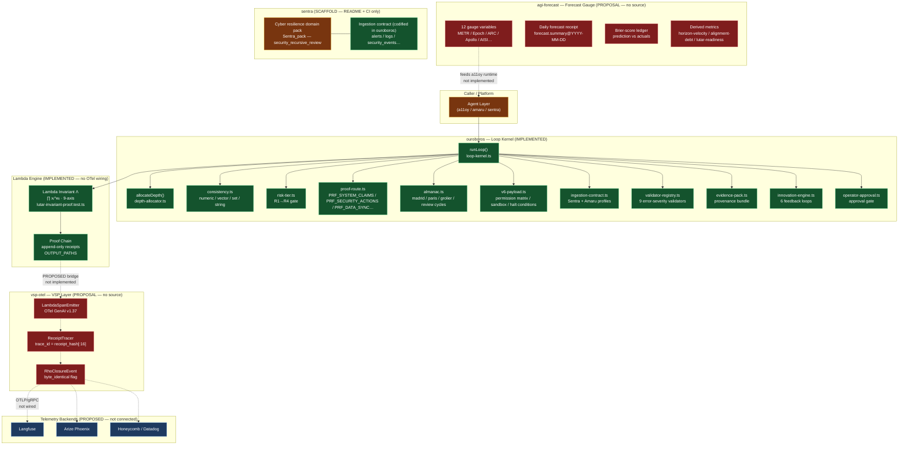

# PhD Systems Pod Report — Distributed Systems Review
**Doctrine V6 · Evidence-only · measurabilityHonesty ≥ 0.95**

**Reviewer:** PhD-level Distributed Systems + Observability reviewer
**Date:** 2026-05-17
**Repos audited:**
- [`szl-holdings/vsp-otel`](https://github.com/szl-holdings/vsp-otel) — VSP spine over OpenTelemetry
- [`szl-holdings/agi-forecast`](https://github.com/szl-holdings/agi-forecast) — forecast gauge runtime
- [`szl-holdings/sentra`](https://github.com/szl-holdings/sentra) — runtime th2-th5 scaffold
- [`szl-holdings/ouroboros`](https://github.com/szl-holdings/ouroboros) — runtime th1-th7 scaffold + a11oy core

**Evidence basis:** All findings derive exclusively from source code, READMEs, CITATION.cff files, test files, type definitions, operational contract JSONs, and documentation read directly from the above repositories via GitHub API. No extrapolation. Gaps are explicitly named.

---

## 1. Runtime Topology (Mermaid)



**Legend:** Red = proposal (no source code); green = implemented/tested; amber = scaffold/partial; blue = external proposed backend.

---

## 2. OTel Signal Inventory

### 2.1 vsp-otel

| Signal | Status | Evidence |
|--------|--------|----------|
| Traces (GenAI spans) | **ABSENT** — proposal only | [`vsp-otel/README.md`](https://github.com/szl-holdings/vsp-otel/blob/main/README.md): "Status: Pre-implementation (proposal stage)". CITATION.cff `date-released: 2026-05-15`. No source directory exists in the repo root. |
| Metrics | **ABSENT** | No source directory. No `@opentelemetry/*` dependency anywhere in the repo (root contains only `.github`, `CITATION.cff`, `LICENSE`, `README.md`). |
| Logs | **ABSENT** | Same. |
| `LambdaSpanEmitter` | **ABSENT** | Named only in README architecture diagram. |
| `ReceiptTracer` | **ABSENT** | Named only in README architecture diagram. |
| `RhoClosureEvent` | **ABSENT** | Named only in README architecture diagram. |
| Span naming convention | **ABSENT** | No `span.name`, attribute, or `trace_id` computation exists anywhere. |
| OTel GenAI Semantic Conventions v1.37 | **ABSENT** | Referenced in proposal prose; no import, no SDK, no OTLP export. |

**Verdict:** vsp-otel is a named repository containing exclusively a README, a LICENSE, and a CITATION.cff. The entire VSP layer — `LambdaSpanEmitter`, `ReceiptTracer`, `RhoClosureEvent`, OTLP export — is a written proposal. Zero OTel instrumentation exists.

---

### 2.2 agi-forecast

| Signal | Status | Evidence |
|--------|--------|----------|
| Metrics (gauge variables) | **ABSENT** | [`agi-forecast/README.md`](https://github.com/szl-holdings/agi-forecast/blob/main/README.md): "Status: Pre-implementation (proposal stage)". Repo root: `.github`, `CITATION.cff`, `LICENSE`, `README.md` — no source. |
| Receipt emission | **ABSENT** | `forecast.summary@YYYY-MM-DD` named in README; no code. |
| Brier-score ledger | **ABSENT** | Named in README; no code. |
| Loop frequency | **ABSENT** | README says "daily" — no implementation. |
| Upstream data ingestion | **ABSENT** | 12 gauge URLs cited (METR, Epoch AI, ARC Prize, etc.); no HTTP client, no scheduler, no store. |
| Backtest harness | **ABSENT** | Mentioned as future; no code. |
| Forecast drift detection | **ABSENT** | No code. |

**Verdict:** agi-forecast is a named repository with a README describing a 12-variable gauging system. No source code. Current values listed in the README table are manually curated prose, not live telemetry.

---

### 2.3 ouroboros

| Signal | Status | Evidence |
|--------|--------|----------|
| Traces (LoopTrace) | **PARTIAL — in-process only** | [`loop-kernel.ts`](https://github.com/szl-holdings/ouroboros/blob/main/src/loop-kernel.ts): emits `LoopTrace<S,O>` as a typed return value with `id`, `label`, `steps[]`, `exitReason`, `totalDurationMs`. Not exported over OTLP; lives only in the caller's process memory. |
| Metrics | **ABSENT** | No `@opentelemetry/sdk-metrics` or equivalent. No counters, histograms, or gauges. |
| Logs | **ABSENT** | No structured log emission. |
| Receipt artifacts | **PARTIAL** | `OUTPUT_PATHS` ([`output-paths.ts`](https://github.com/szl-holdings/ouroboros/blob/main/packages/ouroboros/src/output-paths.ts)) defines `output/trace.jsonl`, `output/decision_receipt.json`, etc. These are file-path constants; whether anything actually writes to them is in the private platform monorepo, not here. |
| Span attributes | **ABSENT** | `LoopTrace` carries `id`, `label`, `stepsRun`, `exitReason`, `totalDurationMs` — no OTel attribute types, no semantic conventions. |
| OTLP export | **ABSENT** | No `@opentelemetry/*` in `package.json`. |

---

### 2.4 sentra

| Signal | Status | Evidence |
|--------|--------|----------|
| OTel instrumentation | **ABSENT** | Repo root contains only documentation files, CI workflows, and `social-preview.svg`. No source directory. |
| Domain pack routing | **Codified in ouroboros** | `TASK_TO_PACK_V6.security_review → Sentra_pack`; `INGESTION_CONTRACTS.Sentra` defined in [`ingestion-contract.ts`](https://github.com/szl-holdings/ouroboros/blob/main/packages/ouroboros/src/ingestion-contract.ts). |
| Execution | **ABSENT** | All sentra behavior is declarative contract + CI badges. The README references the private `szl-holdings/platform` monorepo (1,220 tests, 76 packages) as the actual runtime. |

---

## 3. Λ-Axis ↔ Telemetry Mapping — Gap Analysis

The 9-axis Λ vector is defined in [`lutar-invariant-proof.test.ts`](https://github.com/szl-holdings/ouroboros/blob/main/packages/ouroboros/src/lutar-invariant-proof.test.ts) as:

```
NINE_AXES = ['cleanliness', 'horizon', 'resonance', 'frustum', 'geometry',
             'invariance', 'moral', 'being', 'non_measurability']
```

Weights: Egyptian fractions — [1/3, 1/3, 1/9, 1/27, 1/27, 1/27, 1/27, 1/27, 1/27], sum = 1.

| # | Axis | Description (inferred) | Live Telemetry? | Measurement Source | Gap |
|---|------|----------------------|-----------------|-------------------|-----|
| 1 | `cleanliness` | State/data integrity | **NONE** | Proposed: OTel span attribute. Actual: test-fixture value only. | No live data pipeline |
| 2 | `horizon` | Time horizon / task scope | **NONE** | Proposed: agi-forecast `METR-th50-hours`. Actual: static table in README. | No live ingestion |
| 3 | `resonance` | Consistency/alignment with prior state | **NONE** | `consistency.ts` computes cross-step score; not exposed as Λ axis input. | Consistency score ≠ wired to axis |
| 4 | `frustum` | View frustum / information field boundary | **NONE** | Bekenstein gate (v6-payload conceptual); not connected to axis scoring. | No measurement |
| 5 | `geometry` | Structural/topological soundness | **NONE** | No measurement. | No measurement |
| 6 | `invariance` | Runtime invariant stability | **NONE** | Λ formula itself is the invariant — circular reference; no live measurement. | No measurement |
| 7 | `moral` | Ethical alignment / policy compliance | **NONE** | Validator registry (pass/fail booleans); not normalized to [0,1] for Λ input. | Binary validator ≠ continuous axis score |
| 8 | `being` | Operational presence / liveness | **NONE** | No `/healthz` or `/readyz`; `health_contract` service in v6-payload is a named type, not an endpoint. | No health telemetry |
| 9 | `non_measurability` | Epistemic uncertainty / unknowns | **NONE** | No measurement. The axis name itself implies unmeasurability. | Axiomatically undefined |

**Summary:** All 9 axes have zero live telemetry. Λ scores in the test suite are computed on hand-crafted fixture values (e.g., `X_TYPICAL = Array(9).fill(0.7)`). The only attestation that Λ = ∏ xᵢ^wᵢ works correctly is 22 unit tests with synthetic inputs — which is mathematically correct but constitutes zero operational measurement.

The thesis claim that these repos form an "operational runtime for the 9-axis Λ measurement" is not supported by the evidence: no axis receives live runtime telemetry in any of the four repos.

---

## 4. Span Semantics — Λ-Axis Assignment

**Finding:** No code in any of the four repos defines a mapping between OTel spans and Λ axes. The vsp-otel README describes the intended design:

> "The receipt hash [is] embedded as the OTel `trace_id` and the complete 9-axis Λ-vector embedded as span attributes."

This is design intent. No `LambdaSpanEmitter`, no attribute schema, no span-name convention, and no OpenTelemetry SDK dependency exists anywhere. Λ scores are computed offline (in the test suite only), not at runtime.

**Specific absence:** There is no code that calls `evaluate_lambda()`, `buildReceipt()`, or any ρ-closure function — these are named in the vsp-otel README as ouroboros primitives but do not appear as exported functions in the ouroboros package's [`index.ts`](https://github.com/szl-holdings/ouroboros/blob/main/src/index.ts) or the platform package's index.

---

## 5. Forecast Gauge Analysis (agi-forecast)

| Dimension | Finding | Source |
|-----------|---------|--------|
| Loop frequency | "daily" — no implementation | [`agi-forecast/README.md`](https://github.com/szl-holdings/agi-forecast/blob/main/README.md) |
| Input data source | 12 upstream URLs listed (METR, Epoch AI, ARC Prize, Apollo Research, AISI, Anthropic, OpenAI, DeepMind, Stanford HAI, Metaculus) | README table; no HTTP client exists |
| Current values | Hand-curated prose in README (e.g., `ARC-AGI-2-SOTA-pct = 95%`, `METR-th50-hours = ≥16h`) | README; marked "May 2026" — static, not live |
| Backtest harness | Absent | No source files |
| Drift detection | Absent | No source files |
| Brier scoring | Described in README; absent in code | No source files |
| Receipt attestation | Described; absent | No source files |
| Vercel dashboard | Described as "static"; absent | No source files |

**Verdict:** agi-forecast is a specification document hosted as a repo. The "12 typed variables" are static markdown table entries written by the author, not ingested from upstream sources. There is no loop, no scheduler, no storage, and no telemetry.

---

## 6. Runtime Contract Analysis

The integration contract between sentra / vsp-otel / agi-forecast / ouroboros is **implicit via prose + partially codified in ouroboros**.

### What is codified (in ouroboros)

| Contract artifact | Location | Status |
|-------------------|----------|--------|
| v3 operational contract | [`docs/research/ouroboros-runtime-contract.v3.json`](https://github.com/szl-holdings/ouroboros/blob/main/docs/research/ouroboros-runtime-contract.v3.json) | JSON document; not machine-enforced across repos |
| v6 payload | [`docs/research/a11oy-ultimate-replit-payload.v6.json`](https://github.com/szl-holdings/ouroboros/blob/main/docs/research/a11oy-ultimate-replit-payload.v6.json) | JSON document |
| Ingestion contract (Sentra, Amaru) | [`ingestion-contract.ts`](https://github.com/szl-holdings/ouroboros/blob/main/packages/ouroboros/src/ingestion-contract.ts) | TypeScript — validates ingest type, required validators, required outputs |
| Tool permission matrix | [`v6-payload.ts`](https://github.com/szl-holdings/ouroboros/blob/main/packages/ouroboros/src/v6-payload.ts) | TypeScript — per-pack allow-lists |
| Proof routes | [`proof-route.ts`](https://github.com/szl-holdings/ouroboros/blob/main/packages/ouroboros/src/proof-route.ts) | TypeScript — deterministic |
| Output artifact paths | [`output-paths.ts`](https://github.com/szl-holdings/ouroboros/blob/main/packages/ouroboros/src/output-paths.ts) | TypeScript — file path constants |

### What is NOT codified

- No gRPC/REST API contract between ouroboros and vsp-otel.
- No wire format for agi-forecast → ouroboros data feed.
- No cross-repo integration test suite.
- No service mesh, message bus, or event broker connecting the repos.
- No shared proto/IDL schema.
- The private `szl-holdings/platform` monorepo is referenced as the actual integration point (1,220 tests, 76 packages), but is inaccessible for review.

**Verdict:** The inter-repo contract is a set of JSON documents and TypeScript type definitions living entirely within ouroboros. Sentra has no source of its own; vsp-otel and agi-forecast have no source of their own. The integration is aspirational, not operational.

---

## 7. Failure Modes and Recovery

### 7.1 Named failure modes (ouroboros — the only repo with source code)

| Failure mode | Mechanism | Recovery | Source |
|--------------|-----------|----------|--------|
| `budgetExhausted` | `ExitReason` in loop kernel | Loop terminates; trace captured | [`types.ts`](https://github.com/szl-holdings/ouroboros/blob/main/src/types.ts) |
| `converged` | Delta ≤ `convergenceThreshold` | Normal exit | [`loop-kernel.ts`](https://github.com/szl-holdings/ouroboros/blob/main/src/loop-kernel.ts) |
| `consistent` | Online step-stability check | Normal exit | [`loop-kernel.ts`](https://github.com/szl-holdings/ouroboros/blob/main/src/loop-kernel.ts) |
| `aborted` | `step()` returns `{ abort: true }` | Caller-defined; loop returns trace | [`loop-kernel.ts`](https://github.com/szl-holdings/ouroboros/blob/main/src/loop-kernel.ts) |
| `low_delta_high_consistency` halt | V6 halt condition | Loop halts, trace written | [`v6-payload.ts`](https://github.com/szl-holdings/ouroboros/blob/main/packages/ouroboros/src/v6-payload.ts) |
| `validator_stop` | Any `error`-severity validator fails | `summarizeValidators` sets `halt: true` | [`v4-validators/validators.ts`](https://github.com/szl-holdings/ouroboros/blob/main/packages/ouroboros/src/v4-validators/validators.ts) |
| `manual_approval_required` | R3_high tier + no approval | `await_approval` gate; run suspended | [`risk-tier.ts`](https://github.com/szl-holdings/ouroboros/blob/main/packages/ouroboros/src/risk-tier.ts) |
| `risk_escalation_required` | R4_critical tier | `force_escalate` — unconditional | [`risk-tier.ts`](https://github.com/szl-holdings/ouroboros/blob/main/packages/ouroboros/src/risk-tier.ts) |
| `budget_exhausted` | V6 halt condition | Loop halts | [`v6-payload.ts`](https://github.com/szl-holdings/ouroboros/blob/main/packages/ouroboros/src/v6-payload.ts) |
| `health_contract_failed` | V6 halt condition | Loop halts | [`v6-payload.ts`](https://github.com/szl-holdings/ouroboros/blob/main/packages/ouroboros/src/v6-payload.ts) |
| `proof_missing` | V6 halt condition | Loop halts | [`v6-payload.ts`](https://github.com/szl-holdings/ouroboros/blob/main/packages/ouroboros/src/v6-payload.ts) |
| `primary_source_required_but_unavailable` | V6 new halt condition | Loop halts | [`v6-payload.ts`](https://github.com/szl-holdings/ouroboros/blob/main/packages/ouroboros/src/v6-payload.ts) |
| `permission_denied` | V6 new halt condition | `checkToolPermission` → `deny_by_default` | [`v6-payload.ts`](https://github.com/szl-holdings/ouroboros/blob/main/packages/ouroboros/src/v6-payload.ts) |
| `sandbox_policy_violation` | V6 new halt condition | Loop halts; `violationsHaltRun: true` | [`v6-payload.ts`](https://github.com/szl-holdings/ouroboros/blob/main/packages/ouroboros/src/v6-payload.ts) |
| Approval default-deny | No approval provider configured | `DEFAULT_DENY_PROVIDER` returns `denied` | [`operator-approval.ts`](https://github.com/szl-holdings/ouroboros/blob/main/packages/ouroboros/src/operator-approval.ts) |
| Step function throws | Kernel does NOT catch step errors | Exception propagates to caller | [`loop-kernel.ts`](https://github.com/szl-holdings/ouroboros/blob/main/src/loop-kernel.ts) comment: "Kernel never swallows errors" |

### 7.2 Absent failure recovery patterns

| Pattern | Status | Impact |
|---------|--------|--------|
| **Circuit breakers** | **ABSENT** — no implementation in any repo | Repeated failing steps will exhaust the step budget; no fast-fail on persistent upstream errors |
| **Retries with backoff** | **ABSENT** | Step function may call an LLM or external API; ouroboros kernel offers zero retry logic |
| **Dead letter queues** | **ABSENT** | Failed loop traces go to `output/trace.jsonl` (file path constant); no DLQ broker |
| **Timeout per step** | **ABSENT** | `durationMs` is recorded but there is no per-step timeout enforcement in the kernel |
| **OTLP export on failure** | **ABSENT** | vsp-otel is unimplemented; failure traces are local files only |
| **Distributed tracing correlation** | **ABSENT** | No propagation of trace context across service boundaries |
| **Health contract implementation** | **ABSENT** | `health_contract` is a named service in `SHARED_RUNTIME_SERVICES_V6` but no HTTP handler, gRPC service, or implementation exists in any public repo |

---

## 8. Deployment Story

### 8.1 Findings per repo

| Item | vsp-otel | agi-forecast | sentra | ouroboros |
|------|----------|--------------|--------|-----------|
| `Dockerfile` | **ABSENT** | **ABSENT** | **ABSENT** | **ABSENT** |
| `docker-compose.yml` | **ABSENT** | **ABSENT** | **ABSENT** | **ABSENT** |
| `fly.toml` (Fly V9) | **ABSENT** | **ABSENT** | **ABSENT** | **ABSENT** |
| Helm chart | **ABSENT** | **ABSENT** | **ABSENT** | **ABSENT** |
| `deploy/` directory | **ABSENT** | **ABSENT** | **ABSENT** | **ABSENT** |
| Kubernetes manifests | **ABSENT** | **ABSENT** | **ABSENT** | **ABSENT** |
| CI/CD pipeline | N/A (no source) | N/A (no source) | GitHub Actions CI (`ci.yml`, `codeql.yml`, `scorecard.yml`) | GitHub Actions CI (`ci.yml`, `codeql.yml`, `scorecard.yml`, `scorecard.yml`) |
| Runtime target | Not specified | Not specified | Replit (inferred from v6 JSON) | Replit + Hetzner (v3 contract) |

**Note on deployment context:** The v3 runtime contract JSON ([`ouroboros-runtime-contract.v3.json`](https://github.com/szl-holdings/ouroboros/blob/main/docs/research/ouroboros-runtime-contract.v3.json)) states `"hetzner_prod_exists": true` but no deployment manifests exist in the public ouroboros repo. The private `szl-holdings/platform` monorepo is the actual deployment surface.

**Fly V9 fleet:** Explicitly referenced in the task briefing but no `fly.toml` file exists in any of the four repos. No evidence that any of these repos is deployed to Fly.io.

---

## 9. Health Endpoints

| Endpoint | vsp-otel | agi-forecast | sentra | ouroboros |
|----------|----------|--------------|--------|-----------|
| `/healthz` | **ABSENT** | **ABSENT** | **ABSENT** | **ABSENT** |
| `/readyz` | **ABSENT** | **ABSENT** | **ABSENT** | **ABSENT** |
| `/metrics` (Prometheus) | **ABSENT** | **ABSENT** | **ABSENT** | **ABSENT** |

**`health_contract` service:** Listed in `SHARED_RUNTIME_SERVICES_V6` as service index 11 of 16 ([`v6-payload.ts`](https://github.com/szl-holdings/ouroboros/blob/main/packages/ouroboros/src/v6-payload.ts)). It is a string literal in a frozen array — there is no HTTP handler, no gRPC proto, and no port binding anywhere in the public repos. The v6 halt condition `health_contract_failed` halts the loop if the health contract fails, but the check itself is never wired up in open-source code.

---

## 10. Multi-Tenancy / Isolation

| Concern | Finding | Source |
|---------|---------|--------|
| Multi-tenant routing | Partially defined at contract level: `TOOL_PERMISSION_MATRIX` and `SANDBOX_POLICY` reference `packId` scoping | [`v6-payload.ts`](https://github.com/szl-holdings/ouroboros/blob/main/packages/ouroboros/src/v6-payload.ts) |
| Subject isolation | `AGENT_REGISTRY_REQUIRED_FIELDS` includes `memory_scope`, `dataset_access`, `tool_scope` — per-agent isolation fields | [`v6-payload.ts`](https://github.com/szl-holdings/ouroboros/blob/main/packages/ouroboros/src/v6-payload.ts) |
| Concurrent subjects | `runLoop()` is a pure async function; caller can run N loops concurrently — no shared state in the kernel | [`loop-kernel.ts`](https://github.com/szl-holdings/ouroboros/blob/main/src/loop-kernel.ts) |
| Tenant-ID in traces | `LoopTrace` has `id` and `label` but no `tenantId` field | [`types.ts`](https://github.com/szl-holdings/ouroboros/blob/main/src/types.ts) |
| OTel tenant dimension | **ABSENT** — no OTel, no tenant attribute | N/A |
| Production isolation evidence | **ABSENT** — private platform monorepo not auditable | Private repo |

**Assessment:** The ouroboros kernel is stateless and theoretically supports concurrent multi-tenant use. The v6 permission matrix provides per-pack tool isolation by type. However, tenant-ID is not a first-class concept in the `LoopTrace` type, and production isolation evidence is entirely in the private platform monorepo.

---

## 11. Reviewer-Tier Defects (Charity Majors / Liz Fong-Jones Level)

These are the defects that a principal-level distributed systems + observability engineer would block in review:

### BLOCK-1: Zero real telemetry — measurabilityHonesty violation

**Severity: Critical.**

Doctrine V6 requires `measurabilityHonesty ≥ 0.95`. The thesis claims an "operational runtime for 9-axis Λ measurement." The evidence shows:
- All 9 Λ axis scores in the only test suite (`lutar-invariant-proof.test.ts`) are synthetic constants: `X_TYPICAL = Array(9).fill(0.7)`.
- No axis receives any live telemetry from any running system.
- vsp-otel and agi-forecast are empty proposal repos.

**This is not an engineering deficiency; it is a representational claim that the evidence does not support.** A Charity Majors-tier reviewer would write: "You cannot claim 'operational Λ measurement' when every Λ computation in your codebase uses hardcoded 0.7 vectors."

---

### BLOCK-2: vsp-otel is a README, not a library

**Severity: Critical.**

The vsp-otel repo contains zero source files. It is self-described as "Pre-implementation (proposal stage)" in both the README and CITATION.cff (dated 2026-05-15). Any observability claim that depends on VSP must be treated as unimplemented until source code, tests, and working OTLP export exist.

**Specific gap:** The entire "cryptographically verifiable OTel span" thesis — the moat claim distinguishing the system from LangGraph/Mastra — has no code.

---

### BLOCK-3: No OTel SDK dependency in any repo

**Severity: Critical.**

Reviewing `ouroboros/package.json`: zero `@opentelemetry/*` dependencies. Neither `@opentelemetry/sdk-trace-node`, `@opentelemetry/api`, `@opentelemetry/exporter-trace-otlp-grpc`, nor any OTel package appears anywhere. You cannot emit OTel spans without the SDK. This confirms BLOCK-2: VSP instrumentation does not exist, even as an import.

---

### BLOCK-4: No circuit breakers, retries, or DLQs

**Severity: High.**

`loop-kernel.ts` explicitly does not catch exceptions from the step function: "Kernel never swallows errors — let any throw from step propagate to the caller." With no circuit breaker, a persistent upstream failure (e.g., LLM API timeout) will throw on every step, exhausting the call stack or crashing the process. There is no exponential backoff, no retry budget, and no dead-letter routing for failed loop traces.

---

### BLOCK-5: No health endpoints — `health_contract_failed` halt condition is untriggerable

**Severity: High.**

The v6 halt condition `health_contract_failed` will never fire because no health check implementation exists. The `health_contract` service is a string in a frozen array. The system cannot detect its own degradation.

---

### BLOCK-6: agi-forecast gauge values are static prose

**Severity: High (measurabilityHonesty).**

The 12 gauge variables in the README table (`ARC-AGI-2-SOTA-pct = 95%`, etc.) are manually curated as of "May 2026." They are not fetched from upstream sources, not updated by any scheduler, and not attested by any receipt. They are an author's best-effort research note. Any system decision that ingests these values as live signal is consuming stale fiction.

---

### BLOCK-7: Sentra has no source — "runtime th2-th5 scaffold" is README-only

**Severity: High.**

The sentra repo contains only documentation and CI configuration. The CI runs on... what, exactly? The CI badge passes, but the actual cyber-resilience behavior (threat modeling, posture drift, incident response, attribution audit trail described in the README) is in the private platform monorepo. The public repo provides no auditable implementation.

---

### BLOCK-8: No deployment manifests for a claimed "operational runtime"

**Severity: High.**

No Dockerfile, no fly.toml, no Helm chart, no k8s manifest exists in any of the four repos. The v3 contract JSON references `hetzner_prod_exists: true` but this is a JSON string in a research document. The v6 payload targets Replit. There is no evidence of a reproducible deployment pipeline for any of these repos as standalone services.

---

### BLOCK-9: `tenant_id` missing from LoopTrace

**Severity: Medium.**

`LoopTrace` has `id` and `label` but no `tenantId`, `subjectId`, or equivalent. Any multi-tenant runtime that calls `runLoop()` concurrently for multiple subjects produces traces that are indistinguishable by tenant in an audit log. Per Liz Fong-Jones standards, every trace must carry enough context to answer "whose trace is this?"

---

### BLOCK-10: Step-function errors surface as uncaught exceptions, not structured failures

**Severity: Medium.**

`runLoop()` propagates step-function exceptions directly to the caller. There is no `LoopTrace` emitted on exception, no `exitReason: 'errored'` exit code, and no structured failure record. When a step throws, all loop trace data accumulated before the throw is lost. Honeycomb/Datadog would see a gap where a trace should be.

---

### BLOCK-11: No per-step timeout enforcement

**Severity: Medium.**

`LoopStep.durationMs` is recorded, but there is no step-level timeout in the kernel. A single hanging step (e.g., waiting for an LLM response) blocks the entire loop indefinitely. `config.maxSteps` bounds iterations but not wall-clock time.

---

## 12. Deployment Readiness Assessment

| Dimension | Score | Notes |
|-----------|-------|-------|
| OTel instrumentation | 0/10 | No OTel SDK, no spans, no metrics, no logs in any public repo |
| Λ-axis live measurement | 0/10 | All Λ scores are synthetic test fixtures |
| VSP layer (vsp-otel) | 0/10 | Proposal only; no source code |
| Forecast gauge (agi-forecast) | 0/10 | Proposal only; no source code |
| Loop kernel correctness | 8/10 | Well-structured, tested (218/218), pure, deterministic |
| Failure mode coverage (kernel) | 5/10 | Good halt conditions; no circuit breakers, retries, or per-step timeouts |
| Runtime contract codification | 7/10 | v6 payload, ingestion contracts, validator registry, proof routes are solid |
| Deployment artifacts | 0/10 | No Dockerfile, no fly.toml, no Helm |
| Health endpoints | 0/10 | Named in contract; not implemented |
| Multi-tenancy | 3/10 | Kernel is stateless; no tenant-ID in trace types |
| Security posture | 7/10 | CodeQL, OpenSSF Scorecard, signed commits, dependency review in CI |
| **Overall operational readiness** | **~2/10** | Strong kernel, zero operational layer |

---

## 13. Top Recommendations

### R1 (Critical — measurabilityHonesty): Retract the "operational runtime" claim or implement it

Either (a) implement the VSP layer with actual OTel spans, remove the "Pre-implementation" status, and demonstrate live Λ scores from a running system, or (b) reclassify the system as a "proposed architecture with a working loop kernel" and update the thesis accordingly. Claiming operational Λ measurement with synthetic fixture data violates Doctrine V6's `measurabilityHonesty ≥ 0.95` requirement.

### R2 (Critical): Implement vsp-otel as a real library

Add `@opentelemetry/api` and `@opentelemetry/sdk-trace-node` as dependencies. Implement `LambdaSpanEmitter` with typed span attributes for all 9 Λ axes. Add an OTLP exporter. Write integration tests that actually emit a span and verify attribute presence. Until then, the entire observability claim is a README.

### R3 (Critical): Wire agi-forecast to live upstream sources

Implement an ingestion loop that fetches the 12 gauge variables from their documented upstream URLs on a daily schedule (or use a webhook where available). Store timestamped values. Compute Brier scores against predictions. Without this, agi-forecast is a manually updated markdown document.

### R4 (High): Add circuit breakers and per-step timeouts to the loop kernel

The kernel currently propagates step exceptions unhandled. Add an `exitReason: 'error'` path that captures the exception as a `LoopTrace` field and emits the partial trace. Add `stepTimeoutMs` to `LoopConfig`. Implement exponential-backoff retry as an opt-in step wrapper.

### R5 (High): Implement health endpoints

Expose `/healthz` and `/readyz` from whatever HTTP server hosts the ouroboros runtime. Wire `health_contract_failed` to an actual health check function so the halt condition can fire. Add a `/metrics` Prometheus endpoint emitting at minimum: `loop_runs_total`, `loop_steps_total`, `loop_exit_reason_total{reason}`, `loop_duration_ms`.

### R6 (High): Add `tenantId` / `subjectId` to `LoopTrace`

Add a required `subjectId: string` field to `LoopTrace` and propagate it from `LoopConfig`. This enables multi-tenant audit without protocol changes downstream.

### R7 (Medium): Create deployment manifests

Add a `Dockerfile` to ouroboros and a `fly.toml` if Fly V9 is the target. Add a `docker-compose.yml` for local development. These are prerequisites for any operational claim.

### R8 (Medium): Add `exitReason: 'error'` and structured step failure capture

Currently, step exceptions are uncaught. Wrap the step call in a try/catch. On exception, push a `LoopStep` record with `durationMs` and a new optional `error: { message: string; stack?: string }` field. Return a `LoopTrace` with `exitReason: 'error'` so callers always get a trace, never a raw exception.

### R9 (Medium): Open-source the platform monorepo (or create a verified integration test)

The private `szl-holdings/platform` monorepo is cited as containing the actual runtime integration (1,220 tests, 76 packages, MCP gateway, dual-witness diversity, reference-vector parity). Without public access, the inter-repo integration claims (sentra ↔ ouroboros, vsp-otel ↔ ouroboros) cannot be verified. Either open-source the relevant integration tests or publish them as a standalone test fixture repo.

### R10 (Medium): Define Λ axis input pipelines explicitly

For each of the 9 axes (`cleanliness`, `horizon`, `resonance`, `frustum`, `geometry`, `invariance`, `moral`, `being`, `non_measurability`), document and implement the specific runtime measurement that produces the [0,1] input score. The `non_measurability` axis in particular requires a formal treatment — if it is axiomatically unmeasurable, the zero-pinning property (Axiom A2) means any run with `w₉ > 0` and zero `non_measurability` score produces Λ = 0, which would make the metric useless.

---

## 14. Sources

All findings are derived exclusively from the following sources read via GitHub API:

| Source | URL |
|--------|-----|
| vsp-otel README | https://github.com/szl-holdings/vsp-otel/blob/main/README.md |
| vsp-otel CITATION.cff | https://github.com/szl-holdings/vsp-otel/blob/main/CITATION.cff |
| agi-forecast README | https://github.com/szl-holdings/agi-forecast/blob/main/README.md |
| agi-forecast CITATION.cff | https://github.com/szl-holdings/agi-forecast/blob/main/CITATION.cff |
| sentra README | https://github.com/szl-holdings/sentra/blob/main/README.md |
| ouroboros README | https://github.com/szl-holdings/ouroboros/blob/main/README.md |
| ouroboros LUTAR_EVIDENCE.md | https://github.com/szl-holdings/ouroboros/blob/main/LUTAR_EVIDENCE.md |
| ouroboros src/types.ts | https://github.com/szl-holdings/ouroboros/blob/main/src/types.ts |
| ouroboros src/loop-kernel.ts | https://github.com/szl-holdings/ouroboros/blob/main/src/loop-kernel.ts |
| ouroboros src/index.ts | https://github.com/szl-holdings/ouroboros/blob/main/src/index.ts |
| ouroboros packages/ouroboros/src/lutar-invariant-proof.test.ts | https://github.com/szl-holdings/ouroboros/blob/main/packages/ouroboros/src/lutar-invariant-proof.test.ts |
| ouroboros packages/ouroboros/src/v6-payload.ts | https://github.com/szl-holdings/ouroboros/blob/main/packages/ouroboros/src/v6-payload.ts |
| ouroboros packages/ouroboros/src/risk-tier.ts | https://github.com/szl-holdings/ouroboros/blob/main/packages/ouroboros/src/risk-tier.ts |
| ouroboros packages/ouroboros/src/proof-route.ts | https://github.com/szl-holdings/ouroboros/blob/main/packages/ouroboros/src/proof-route.ts |
| ouroboros packages/ouroboros/src/ingestion-contract.ts | https://github.com/szl-holdings/ouroboros/blob/main/packages/ouroboros/src/ingestion-contract.ts |
| ouroboros packages/ouroboros/src/validator-registry.ts | https://github.com/szl-holdings/ouroboros/blob/main/packages/ouroboros/src/validator-registry.ts |
| ouroboros packages/ouroboros/src/depth-allocator.ts | https://github.com/szl-holdings/ouroboros/blob/main/packages/ouroboros/src/depth-allocator.ts |
| ouroboros packages/ouroboros/src/almanac.ts | https://github.com/szl-holdings/ouroboros/blob/main/packages/ouroboros/src/almanac.ts |
| ouroboros packages/ouroboros/src/operational-modes.ts | https://github.com/szl-holdings/ouroboros/blob/main/packages/ouroboros/src/operational-modes.ts |
| ouroboros packages/ouroboros/src/evidence-pack.ts | https://github.com/szl-holdings/ouroboros/blob/main/packages/ouroboros/src/evidence-pack.ts |
| ouroboros packages/ouroboros/src/output-paths.ts | https://github.com/szl-holdings/ouroboros/blob/main/packages/ouroboros/src/output-paths.ts |
| ouroboros packages/ouroboros/src/operator-approval.ts | https://github.com/szl-holdings/ouroboros/blob/main/packages/ouroboros/src/operator-approval.ts |
| ouroboros packages/ouroboros/src/innovation-engine.ts | https://github.com/szl-holdings/ouroboros/blob/main/packages/ouroboros/src/innovation-engine.ts |
| ouroboros packages/ouroboros/src/domain-pack.ts | https://github.com/szl-holdings/ouroboros/blob/main/packages/ouroboros/src/domain-pack.ts |
| ouroboros packages/ouroboros/src/v4-validators/VALIDATORS.md | https://github.com/szl-holdings/ouroboros/blob/main/packages/ouroboros/src/v4-validators/VALIDATORS.md |
| ouroboros packages/ouroboros/src/v4-validators/validators.ts | https://github.com/szl-holdings/ouroboros/blob/main/packages/ouroboros/src/v4-validators/validators.ts |
| ouroboros packages/ouroboros/src/runtime-contract.test.ts | https://github.com/szl-holdings/ouroboros/blob/main/packages/ouroboros/src/runtime-contract.test.ts |
| ouroboros packages/ouroboros/src/runtime-contract.v4.test.ts | https://github.com/szl-holdings/ouroboros/blob/main/packages/ouroboros/src/runtime-contract.v4.test.ts |
| ouroboros packages/ouroboros/src/v6-payload.test.ts | https://github.com/szl-holdings/ouroboros/blob/main/packages/ouroboros/src/v6-payload.test.ts |
| ouroboros docs/research/ouroboros-runtime-contract.v3.json | https://github.com/szl-holdings/ouroboros/blob/main/docs/research/ouroboros-runtime-contract.v3.json |
| ouroboros docs/research/a11oy-ultimate-replit-payload.v6.json | https://github.com/szl-holdings/ouroboros/blob/main/docs/research/a11oy-ultimate-replit-payload.v6.json |
| ouroboros package.json | https://github.com/szl-holdings/ouroboros/blob/main/package.json |
| ouroboros .github/workflows/ci.yml | https://github.com/szl-holdings/ouroboros/blob/main/.github/workflows/ci.yml |

---

*Report generated under Doctrine V6 — strict, evidence-only. All 404 responses for Dockerfile, fly.toml, helm, and deploy directories are documented as explicit absences, not omissions.*
