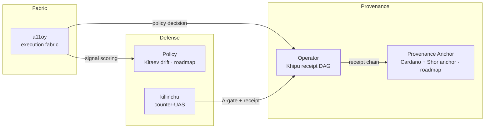

# Flagships

Two production products ship today — **a11oy** (governed execution fabric) and **killinchu**
(counter-UAS) — alongside three frontier/roadmap components surfaced under honest role names:
the **Provenance Anchor**, the **Operator** (receipt orchestration), and the **Policy** drift
detector. Each maps to one or more [anatomy organs](/anatomy/), is cross-referenced to the
Ouroboros Thesis ([DOI 10.5281/zenodo.20434276](https://doi.org/10.5281/zenodo.20434276)), and
is backed by the Lean kernel [`lutar-lean`](https://github.com/szl-holdings/lutar-lean).

> **Naming note.** The internal codenames *amaru*, *rosie*, and *sentra* are retired. The
> honest, user-facing names are **Provenance Anchor**, **Operator**, and **Policy**
> respectively. Only **a11oy** and **killinchu** are shipping products today; the other three
> are frontier/roadmap.

| Component | Role | Status | Source |
|----------|------|--------|--------|
| [a11oy](/flagships/a11oy) | Governed execution fabric (7 layers) | **Shipping** | [repo](https://github.com/szl-holdings/a11oy) |
| [killinchu](/flagships/killinchu) | Counter-UAS drone intelligence (Quechua *killinchu* = kestrel) | **Shipping** | [repo](https://github.com/szl-holdings/killinchu) |
| [Provenance Anchor](/flagships/amaru) | Cardano-anchored provenance | Roadmap | thesis |
| [Operator](/flagships/rosie) | Receipt-DAG orchestration | Frontier | thesis |
| [Policy](/flagships/sentra) | Kitaev-surface drift detection | Roadmap | thesis |

::: info Honesty note on SLSA
Some repo badges historically read "SLSA 3". The **doctrine-correct, honest level is
SLSA L1** — provenance is generated but not L3-verified, and cosign signing is **PENDING**
(see [Compliance & Security](/compliance)). SLSA L2 (verified provenance) is **roadmap**, not
claimed. Where this site and a badge disagree, this site is correct.
:::
