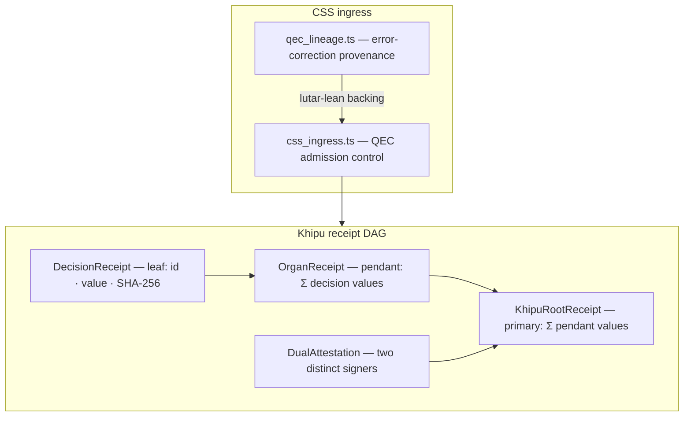

# Operator — Receipt Orchestration

> **Naming note.** This component was previously tracked under the internal codename *rosie*
> (an English acronym, **R**eceipt-**O**rchestrated **S**igned **I**ngress **E**nvironment —
> never a Quechua word). The honest, user-facing name is **Operator** (the receipt-orchestration
> control plane); the codename is retired and kept here only as historical context.

## Overview

The **Operator** is the **admission-control and receipt-DAG surface** of SZL. It ships the
**Khipu-indexed receipt DAG** — a three-tier pendant-cord tree that records every governance
decision under a **summation-cord invariant** and an optional dual-attestation field. It also
ships the **CSS (Calderbank-Shor-Steane) ingress** module: quantum-error-correcting admission
control for governed receipt streams.

> **Frontier capability.** A QEC-admission-controlled receipt DAG with CSS ingress and a
> kernel-verified sum invariant — `Lutar/Khipu/SummationInvariant`
> ([Ouroboros Thesis DOI 10.5281/zenodo.20434276](https://doi.org/10.5281/zenodo.20434276)).

**Anatomy mapping:** the Operator is the operational [Khipu](/anatomy/#khipu) organ, fed by
[Yawar](/anatomy/#yawar) and anchored externally by the [Provenance Anchor](/flagships/amaru).



## The summation invariant

The structural heart of the Operator mirrors the Inka khipu primary-cord arithmetic:

$$ \text{rootValue} \;=\; \sum \text{pendantValues} \;=\; \sum \sum \text{decisionValues}. $$

Tampering with any leaf changes the root boundary sum — integrity by additive arithmetic,
not hash-collision resistance alone. This is formally verified in
[`lutar-lean`](https://github.com/szl-holdings/lutar-lean) as
`Lutar/Khipu/SummationInvariant.lean`, and is the algebraic root of the PURIQ
[INV-3 invariant](/doctrine/puriq#sf-06).

## What's here

| File | Purpose |
|------|---------|
| `src/khipu-receipt.ts` | Three-tier pendant-cord receipt DAG with sum-of-sums invariant |
| `src/qec/css_ingress.ts` | CSS ingress: QEC-governed admission control |
| `src/qec/qec_lineage.ts` | QEC lineage tracking and provenance chain |
| `tests/khipu-receipt.test.ts` | Runtime tests: failure modes, dual-attestation, smoke |
| `src/qec/css_ingress.test.ts` | CSS ingress tests |

## Example — verify the invariant

```ts
import { KhipuRoot, verifySumInvariant, verifyDualAttestation } from './src/khipu-receipt'

const root = KhipuRoot.from(organReceipts)

verifySumInvariant(root)      // true ⇔ rootValue = Σ Σ decisionValues
verifyDualAttestation(root)   // two distinct signers required
```

## Source & evidence

- **Live 3D showcase:** [Operator-3D](/anatomy/3d-showcases#rosie-3d)
- **Proof:** `Lutar/Khipu/SummationInvariant.lean` in [`lutar-lean`](https://github.com/szl-holdings/lutar-lean)
- **DOI:** [10.5281/zenodo.20434276](https://doi.org/10.5281/zenodo.20434276)
- **License:** Apache-2.0
