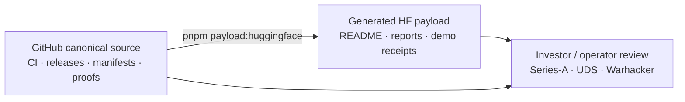

# A11oy — governed execution fabric

**A11oy is not a model checkpoint.** It is a governed execution substrate:
policy gates, signal measurement, knowledge routing, QEC-derived receipt
integrity, and an operational payload that can be verified from GitHub.

This Hugging Face mirror is the public showcase layer for the A11oy operational
packet. GitHub remains the canonical source of truth for code, CI, SBOM, SLSA,
DCO, deploy manifests, checksums, and release provenance.

## One-line thesis

A11oy turns agentic actions into governed, reviewable, receipt-backed decisions:
**every action passes through doctrine checks, every payload is checksummed, and
every public claim is tied back to a provenance contract.**



## What ships

| Surface | Contents |
| --- | --- |
| `SHOWCASE.md` | Exhaustive capability map, architecture diagrams, and active repo graph. |
| `INVESTOR_BRIEF.md` | Series-A narrative with proof/evidence links and scoped caveats. |
| `VERIFICATION.md` | Exact local verification commands and what each command proves. |
| `INNOVATIONS_DEEP_DIVE.md` | Evidence-backed implementation deep dive; no unsupported model/API claims. |
| `INTEGRATION_QUICKSTART.md` | Current TypeScript/package/payload quickstart. |
| `EVAL_TRACE_SAMPLE.jsonl` | Two-line receipt sample generated from the current `packages/receipt-substrate` schema and covered by receipt-substrate tests. |
| `source/` | README, roadmap, changelog, ecosystem map, investor demo, math lineage runtime map, provenance contract. |
| `payloads/deploy/` | `zarf.yaml`, Kubernetes manifests, `attestations.jsonl`, and per-file `MANIFEST.json`. |
| `build/` | Root workspace metadata and lockfile used by the doctrine lane. |
| `a11oy-metadata.json` | Source commit, branch, verification commands, and payload map. |

The GitHub Actions operational bundle additionally includes built doctrine
package outputs and a tarball-level manifest/checksum sidecar.

## Verification commands

```bash
pnpm install
pnpm test:doctrine
pnpm typecheck:doctrine
pnpm build:doctrine
pnpm ecosystem:audit
pnpm ecosystem:readiness
pnpm ecosystem:os:audit
pnpm patterns:audit
pnpm controls:audit
pnpm action-contract:audit
pnpm hf:test-results:audit
pnpm github:access:audit
npm run github:access:live:validate
pnpm cross-repo:handoff:audit
pnpm phase:completion:audit
npm run test:policy-contracts
npm run test:autonomy-contracts
pnpm payload:verify
pnpm payload:huggingface
pnpm payload:bundle
pnpm payload:bundle:verify
npm test --prefix packages/receipt-substrate
```

The current Doctrine Build workflow runs this lane and uploads
`a11oy-operational-payload.tar.gz` plus `a11oy-operational-payload.tar.gz.sha256`
as a GitHub Actions artifact.

## Series-A diligence packet

- **Operational hub:** `a11oy`
- **Runtime monorepo:** `platform`
- **Thesis anchor:** Ouroboros Thesis v18.0, DOI `10.5281/zenodo.20434276`
- **Proof substrate:** `lutar-lean`, DOI `10.5281/zenodo.20434308`
- **Org coverage:** 19 visible public `szl-holdings` repos in
  `source/docs/ecosystem-registry.json`, with demo readiness in
  `source/docs/ecosystem-readiness-report.json`
- **Payload discipline:** Python-native manifesting, deterministic tarball,
  SHA-256 sidecar, DCO, CodeQL, SBOM, Trivy, docs, and secret scan
- **UDS / Zarf lane:** package and operator proof point are documented in
  `source/docs/WARHACKER_UDS_PROOF_POINT.md`
- **Market evidence:** `source/docs/SERIES_A_MARKET_EVIDENCE.md` maps NIST AI
  RMF, EU AI Act, CISA SBOM, SLSA, and model-card expectations to A11oy
  artifacts and gaps.
- **Substrate reality:** `source/docs/SUBSTRATE_REALITY_MAP.md` separates
  verified public facts from PR-only, owner-API-needed, and narrative-only
  substrate claims.
- **Current caveats:** A11oy `uds-v0.3.0` carries SBOM assets only, Vessels
  `uds-v0.3.0` has zero release assets, and GHCR package availability requires
  owner-side push or visibility confirmation.

See `source/docs/PROVENANCE.md` and `source/docs/ECOSYSTEM.md` for the
claim-status contract and repository readiness map.

## Active showcase scope

This packet centers the public repos with active demo or supporting evidence:
`a11oy`, `amaru`, `sentra`, `rosie`, `ouroboros`, `lutar-lean`,
`ouroboros-thesis`, `uds-mesh`, `vsp-otel`, `vessels`, `agi-forecast`,
`szl-trust`, `szl-brand`, `szl-cookbook`, `.github`, and `platform`.

`counsel`, `terra`, and `carlota-jo` are intentionally marked
funded-roadmap/excluded in the readiness report. This mirror does not use stale
product-name framing such as KORA, LUMINA, PARAGON, or active Lyte copy.

## What this is not

- Not an LLM host.
- Not a training dataset.
- Not a replacement for GitHub Releases, SBOMs, SLSA attestations, GHCR package
  pushes, or signed UDS payloads.
- Not a claim that every thesis statement is fully closed in Lean; public claims
  are gated by the provenance contract.

## Publish hygiene

`pnpm payload:huggingface` rewrites the local upload folder from tracked source.
If a prior Hugging Face publish left stale files such as `EVAL_TRACE_SAMPLE.jsonl`
or speculative remote-only markdown, remove them with authenticated HF tooling
or overwrite them with the tracked files in this packet before sharing the mirror.

## Canonical source

- GitHub: <https://github.com/szl-holdings/a11oy>
- DOI: <https://doi.org/10.5281/zenodo.20434276>
- Ecosystem map: <https://github.com/szl-holdings/a11oy/blob/main/docs/ECOSYSTEM.md>
- Provenance contract: <https://github.com/szl-holdings/a11oy/blob/main/docs/PROVENANCE.md>
- Investor demo: <https://github.com/szl-holdings/a11oy/blob/main/docs/INVESTOR_DEMO.md>

## Operational status

The canonical release, CI, and provenance records remain in GitHub. Hugging Face
is used as a public discovery and distribution surface for the Series-A review
packet and operator payload metadata.
