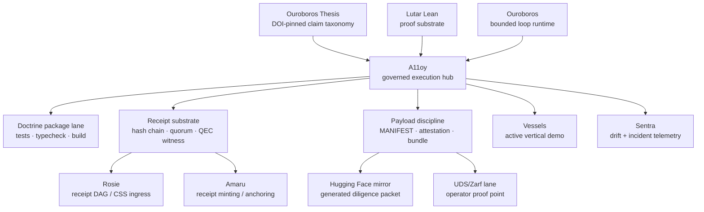
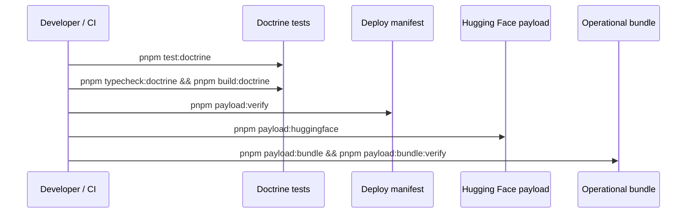

# A11oy showcase — proof-backed governed execution

A11oy is the governed execution hub for the SZL Holdings substrate. It is the
layer that turns AI or agent work into policy-checked, receipt-backed, replayable
operations with payload provenance.

## Capability graph

## What A11oy can demonstrate today

| Capability | Evidence in this payload |
| --- | --- |
| Doctrine runtime checks | `source/README.md`, `build/package.json`, `source/docs/PROVENANCE.md` |
| KS-18 / governance math test lane | `source/docs/PROVENANCE.md` and GitHub `web/packages/a11oy-core/src/**/__tests__` |
| Operational receipt chain | `EVAL_TRACE_SAMPLE.jsonl` and GitHub `packages/receipt-substrate` |
| Deploy manifest verification | `payloads/deploy/MANIFEST.json` |
| UDS/Zarf operator handoff | `payloads/deploy/zarf.yaml`, `source/docs/WARHACKER_UDS_PROOF_POINT.md` |
| Ecosystem readiness | `source/docs/ecosystem-readiness-report.json` |
| Ecosystem operating system | `source/docs/ECOSYSTEM_OPERATING_SYSTEM.md`, `source/docs/anatomy-formula-runtime-map.json` |
| Public pattern synthesis | `source/docs/PUBLIC_PATTERN_SYNTHESIS.md`, `source/docs/public-pattern-source-manifest.json` |
| Controls and action contracts | `source/docs/controls-evidence-map.json`, `source/docs/action-contract-manifest.json` |
| Autonomous learning doctrine | `source/docs/AUTONOMOUS_LEARNING_DOCTRINE.md` |
| Benchmark evolution | `source/docs/benchmark-evolution-doctrine.md`, `source/benchmarks/benchmark-map.json`, `test-results/MANIFEST.json` |
| Series-A diligence | `source/docs/SERIES_A_DILIGENCE.md`, `INVESTOR_BRIEF.md` |

## Verification lane

## Naming cleanup

This showcase uses real GitHub repo names and excludes stale product copy. Do
not use KORA, LUMINA, PARAGON, or active Lyte framing for this A11oy packet.
Counsel, Terra, and Carlota Jo remain funded-roadmap scaffolds, not active demo
surfaces.

## Claim discipline

The strongest story is the evidence trail:

1. GitHub is canonical.
2. CI validates runtime/package lanes.
3. Manifests bind payload bytes.
4. Receipts bind actions.
5. Hugging Face mirrors the packet for public review.
6. Proof and thesis claims are scoped by `source/docs/PROVENANCE.md`.

