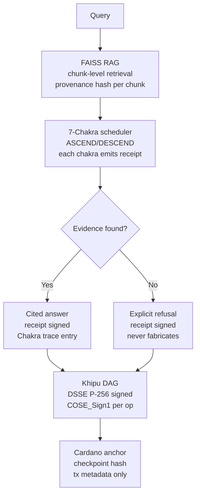

# amaru 🐍

> **Reasoning that refuses to fabricate. Every answer cites a real source or declines. Every memory op wrapped in a DSSE Khipu receipt.**

[-555?style=flat-square)](.compliance/SLSA_LEVEL.md)
[](https://search.sigstore.dev/?logIndex=1723784350)
[](https://github.com/szl-holdings/.github/tree/main/doctrine)

[](LICENSE)

**749 declarations · 14 axioms · 163 sorries · Doctrine v11 LOCKED · kernel `c7c0ba17`**

[Live demo](#live) · [What it does](#what-it-does) · [Verify](#verify-it-yourself) · [Architecture](#architecture) · [Parity vs. leaders](#parity-vs-leaders) · [Honest status](#honest-status)

---

## Live

**HF Space (one-click, no login):** [](https://huggingface.co/spaces/SZLHOLDINGS/amaru)

- Space URL: https://szlholdings-amaru.hf.space
- Health: `curl -s https://szlholdings-amaru.hf.space/api/amaru/v1/honest | jq '{doctrine,declarations}'` → `{"doctrine":"v11","declarations":749}`
- Docs: https://docs.szlholdings.com/flagships/amaru
- Release: v1.0.0

---

## What it does

**amaru is the reasoning cortex.** It answers questions with citations and refuses when evidence is absent — it never invents a justification. This is the trust layer for any commander-facing readiness or assessment dashboard: automation bias kills trust; amaru produces reasoning an operator can act on.

Key capabilities:
- **Cited reasoning** — every answer tied to a chunk-level source; refuses to fabricate when evidence is absent
- **FAISS RAG memory** — provenance receipts on every memory read/write; COSE_Sign1-wrapped (RFC 9052) per op
- **7-Chakra scheduler** — ASCEND/DESCEND pipeline; each chakra emits a receipt trace entry
- **Cardano L1 anchor** — checkpoint hashes as transaction metadata (hash anchoring only — not a token)
- **Competitive parity** — Splunk-style analytics, Credo AI-style bias detection (live, HTTP 200)

**NATO Explainability/Traceability fit:** amaru produces the cited rationale doctrine requires. When an operator asks *why* the system flagged a track, amaru produces a cited answer or refuses — it never invents a justification.

---

## Verify it yourself

```bash
# 1. Confirm live doctrine numbers
curl -s https://szlholdings-amaru.hf.space/api/amaru/v1/honest \
  | jq '{doctrine, declarations, axioms_unique, sorries_total}'
# => {"doctrine":"v11","declarations":749,"axioms_unique":14,"sorries_total":163}

# 2. Sign a Khipu receipt and verify the DSSE envelope
DSSE=$(curl -s -X POST https://szlholdings-amaru.hf.space/api/amaru/khipu/sign \
  -H 'content-type: application/json' \
  -d '{"receipt":{"action_id":"demo"}}' | jq .dsse)
curl -s -X POST https://szlholdings-amaru.hf.space/api/amaru/khipu/verify \
  -H 'content-type: application/json' -d "{\"dsse\":$DSSE}" | jq '{verified, signatures}'
# => {"verified": true, "signatures": [{"keyid":"szlholdings-cosign","verified":true}]}

# 3. Verify cosign keyless signature on the published image (SLSA L1 honest)
cosign verify ghcr.io/szl-holdings/amaru:uds-v0.2.0 \
  --certificate-identity-regexp="^https://github.com/szl-holdings/" \
  --certificate-oidc-issuer="https://token.actions.githubusercontent.com"
# => Verified OK (Rekor index 1723784350)

# 4. SLSA L2 provenance attestation is roadmap (Wire D), not yet earned.
#    Currently returns "no matching attestations":
# cosign verify-attestation --type slsaprovenance ghcr.io/szl-holdings/amaru:uds-v0.2.0 \
#   --certificate-identity-regexp="^https://github.com/szl-holdings/" \
#   --certificate-oidc-issuer="https://token.actions.githubusercontent.com"
```

**Full guide:** [developers/VERIFY.md](https://github.com/szl-holdings/developers/blob/main/VERIFY.md)

---

## Architecture



---

## Parity vs. leaders

| Capability | Palantir / Splunk | amaru | Differentiator |
|---|---|---|---|
| RAG / retrieval | ✅ | ✅ FAISS chunk-level | — |
| Citation of sources | partial | ✅ **chunk-level provenance** | Every claim tied to a verifiable source chunk |
| Refusal when no evidence | — | ✅ **explicit refusal** | Never fabricates; Palantir doesn't guarantee this |
| Receipt per reasoning op | — | ✅ **COSE_Sign1 per op** | — |
| Supply-chain provenance | — | ✅ **cosign-signed (SLSA L1 honest; L2 roadmap)** | Individually verifiable via `cosign verify` |
| Bias detection | ✅ (Credo AI) | ✅ parity endpoint | — |

---

## Quickstart

```bash
docker run --rm -p 7860:7860 ghcr.io/szl-holdings/amaru:uds-v0.2.0
```

> Note: in-Space Khipu DSSE receipts are signed with real ECDSA-P256 when `SZL_COSIGN_PRIVATE_PEM` runtime secret is present; otherwise receipts are emitted unsigned and labelled — never silently fabricated.

---

## Honest status

| Claim | Status |
|---|---|
| Live HF Space (HTTP 200) | ✅ |
| SLSA Build L1 honest (L2 roadmap via Wire D) | ✅ L1 — cosign-signed, Rekor [1723784350](https://search.sigstore.dev/?logIndex=1723784350). L2 attestation not yet earned (`cosign verify-attestation` returns "no matching attestations"). |
| cosign keyless signed | ✅ |
| DSSE Khipu receipts | ✅ — ECDSA P-256-SHA256 when secret present; labelled UNSIGNED otherwise |
| Cardano anchor | ⚠️ Demo-seeded; not on mainnet |
| Lean 749/14/163 @ `c7c0ba17` | ✅ |
| Λ-uniqueness | ⚠️ Conjecture 1 — not a theorem |
| SLSA L3 | ❌ Not claimed |

---

<sub>Doctrine v11 LOCKED · 749/14/163 · kernel `c7c0ba17` · SLSA L1 honest (L2 roadmap) · Λ = Conjecture 1 · Apache-2.0</sub>

Signed-off-by: stephenlutar2-hash <stephenlutar2@gmail.com>
