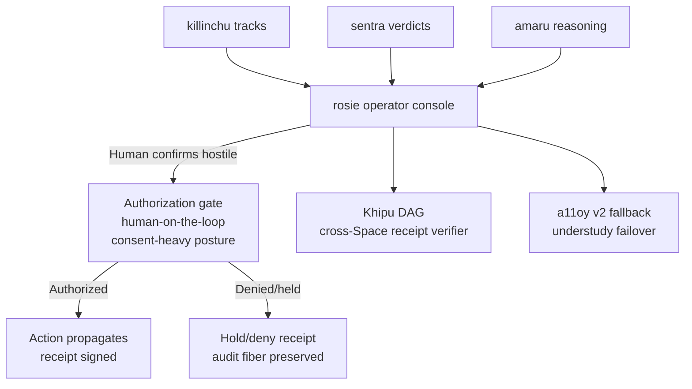

# rosie 🔄

> **Human-on-the-loop operator console. Surfaces verdicts across the mesh. Every action signed; every memory yours.**

[-2C5F2D?style=flat-square)](.compliance/SLSA_LEVEL.md)
[](https://search.sigstore.dev/?logIndex=1722745939)
[](https://github.com/szl-holdings/.github/tree/main/doctrine)
[](https://github.com/szl-holdings/rosie/actions)
[](LICENSE)

**749 declarations · 14 axioms · 163 sorries · Doctrine v11 LOCKED · kernel `c7c0ba17`**

[Live demo](#live) · [What it does](#what-it-does) · [Verify](#verify-it-yourself) · [Architecture](#architecture) · [Parity vs. leaders](#parity-vs-leaders) · [Honest status](#honest-status)

---

## Live

**HF Space (one-click, no login):** [](https://huggingface.co/spaces/SZLHOLDINGS/rosie)

- Space URL: https://szlholdings-rosie.hf.space
- Health: `curl -s https://szlholdings-rosie.hf.space/api/rosie/v1/honest | jq .doctrine` → `"v11"`
- Docs: https://docs.szlholdings.com/flagships/rosie
- Release: [v1.0.0](https://github.com/szl-holdings/rosie/releases/tag/v1.0.0)

---

## What it does

**rosie is where the human stays responsible.** It surfaces sentra verdicts, amaru reasoning, and killinchu tracks so an operator can confirm hostile and authorize — the exact C-UAS "human on the loop" workflow described in Army doctrine. No action propagates without the operator's gate.

Key capabilities:
- **Operator console** — span explorer, receipt verifier, mesh health, doctrine sweep, live formulas; mirrors every a11oy `/v1/*` endpoint
- **Cross-Space receipt verification** — verifies Khipu receipts across all five organs
- **KhipuReceipt DAG** — `buildDecision→buildOrgan→buildRoot`; `verifySumInvariant` is the runtime counterpart of the Lean summation theorem (a check, not a proof)
- **Understudy failover** — carries a11oy moat under `/api/rosie/v2/*` with consent-heavy gate posture

**DoD C-UAS doctrine fit:** In counter-UAS operations the model is "human on the loop" — AI identifies/evaluates at machine speed, but a human confirms hostile and authorizes before the system acts. rosie is that human-facing confirmation layer.

---

## Verify it yourself

```bash
# 1. Confirm live doctrine posture
curl -s https://szlholdings-rosie.hf.space/api/rosie/v1/honest | jq .doctrine
# => "v11"

# 2. SLSA L2 build-provenance attestation (roadmap via Wire D — NOT yet earned;
#    currently returns "no matching attestations"):
# cosign verify-attestation --type slsaprovenance ghcr.io/szl-holdings/rosie:uds-v0.2.0 \
#   --certificate-identity-regexp="^https://github.com/szl-holdings/" \
#   --certificate-oidc-issuer="https://token.actions.githubusercontent.com"

# 3. Verify cosign keyless signature (Rekor index 1722745939)
cosign verify ghcr.io/szl-holdings/rosie:uds-v0.2.0 \
  --certificate-identity-regexp="^https://github.com/szl-holdings/" \
  --certificate-oidc-issuer="https://token.actions.githubusercontent.com"
# Rekor: https://search.sigstore.dev/?logIndex=1722745939
```

**Full guide:** [developers/VERIFY.md](https://github.com/szl-holdings/developers/blob/main/VERIFY.md)

---

## Architecture



---

## Parity vs. leaders

| Capability | Anduril Lattice | rosie | Differentiator |
|---|---|---|---|
| Operator console | ✅ | ✅ span explorer + receipt verifier | — |
| Human-on-the-loop | ✅ | ✅ **explicit consent-heavy gate** | No action without operator confirmation |
| Cross-system receipt verification | — | ✅ **Khipu cross-Space verify** | — |
| Supply-chain provenance | — | ✅ **SLSA L1 honest** (cosign-signed; L2 roadmap) | — |
| Formal doctrine | — | ✅ Lean 4 substrate | — |

---

## Quickstart

```bash
docker run --rm -p 7860:7860 ghcr.io/szl-holdings/rosie:uds-v0.2.0
```

---

## Honest status

| Claim | Status |
|---|---|
| Live HF Space (HTTP 200) | ✅ |
| SLSA Build L1 honest (L2 roadmap) | ✅ L1 — cosign-signed, Rekor-logged. L2 attestation NOT yet earned (`cosign verify-attestation` returns "no matching attestations") |
| cosign keyless signed | ✅ |
| `verifySumInvariant` | ⚠️ Runtime check, not a formal proof |
| Lean 749/14/163 @ `c7c0ba17` | ✅ |
| Λ-uniqueness | ⚠️ Conjecture 1 — not a theorem |
| SLSA L3 | ❌ Not claimed |

---

<sub>Doctrine v11 LOCKED · 749/14/163 · kernel `c7c0ba17` · SLSA L1 honest (L2 roadmap) · Λ = Conjecture 1 · Apache-2.0</sub>

Signed-off-by: stephenlutar2-hash <stephenlutar2@gmail.com>
