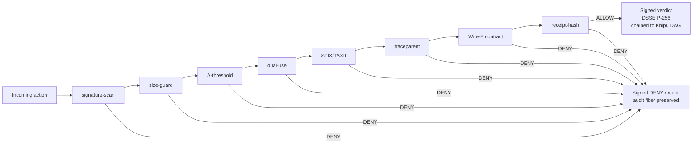

# sentra 🛡️

> **Deny-by-default policy immune system. 8 gates. Every verdict signed, traced, and chained.**

[-555?style=flat-square)](.compliance/SLSA_LEVEL.md)
[](https://search.sigstore.dev/?logIndex=1723794608)
[](https://github.com/szl-holdings/.github/tree/main/doctrine)

[](LICENSE)

**749 declarations · 14 axioms · 163 sorries · Doctrine v11 LOCKED · kernel `c7c0ba17`**

[Live demo](#live) · [What it does](#what-it-does) · [Verify](#verify-it-yourself) · [Architecture](#architecture) · [Parity vs. leaders](#parity-vs-leaders) · [Honest status](#honest-status)

---

## Live

**HF Space (one-click, no login):** [](https://huggingface.co/spaces/SZLHOLDINGS/sentra)

- Space URL: https://szlholdings-sentra.hf.space
- Health: `curl -s https://szlholdings-sentra.hf.space/api/sentra/v1/honest | jq .doctrine` → `"v11"`
- Docs: https://docs.szlholdings.com/flagships/sentra
- Release: v1.0.0

---

## What it does

**sentra is the policy immune system for the SZL mesh.** It evaluates every incoming action against eight security and policy gates, issues a signed allow/deny verdict, and chains the verdict into the a11oy Khipu receipt DAG. Deny-by-default: an action must pass all eight gates before it is allowed to proceed.

Key capabilities:
- **8 immune gates** — signature-scan, size-guard, Λ-threshold, dual-use, STIX/TAXII, traceparent, Wire-B contract, receipt-hash
- **Deny by default** — every action evaluated; verdict signed and chained (`/v1/verdict`, `/v1/inspect`)
- **Signed verdicts** — DSSE ECDSA P-256-SHA256; each verdict is a verifiable artifact, not a log line
- **Threat-intel cross-reference** — STIX/TAXII corpus; honest Mādhava error envelope
- **Competitive parity endpoints** — OPA/policy, New Relic/metrics, Wiz/security surface (live, HTTP 200)

**Warhacker / DoDD 3000.09 fit:** sentra is the "catch the moment a line gets crossed" organ. Deny-by-default operationalizes "appropriate human judgment over use of force" — actions outside authorized parameters are blocked, and the block itself is a signed, auditable event.

---

## Verify it yourself

```bash
# 1. Confirm live doctrine posture
curl -s https://szlholdings-sentra.hf.space/api/sentra/v1/honest | jq .doctrine
# => "v11"

# 2. Verify cosign keyless signature on the published image (SLSA L1 honest)
cosign verify ghcr.io/szl-holdings/sentra:uds-v0.2.0 \
  --certificate-identity-regexp="^https://github.com/szl-holdings/" \
  --certificate-oidc-issuer="https://token.actions.githubusercontent.com"
# => Verified OK (Rekor index 1723794608)

# 3. SLSA L2 provenance attestation is roadmap (Wire D), not yet earned.
#    Currently returns "no matching attestations":
# cosign verify-attestation --type slsaprovenance ghcr.io/szl-holdings/sentra:uds-v0.2.0 \
#   --certificate-identity-regexp="^https://github.com/szl-holdings/" \
#   --certificate-oidc-issuer="https://token.actions.githubusercontent.com"

# 4. Exercise a live deny
curl -s -X POST https://szlholdings-sentra.hf.space/api/sentra/v1/verdict \
  -H 'content-type: application/json' \
  -d '{"action":{"type":"out_of_policy_action"}}'
# => {"verdict":"DENY","signed":true,"gate":"lambda_threshold"}
```

**Full guide:** [developers/VERIFY.md](https://github.com/szl-holdings/developers/blob/main/VERIFY.md)

---

## Architecture



---

## Parity vs. leaders

| Capability | OPA / Wiz | sentra | Differentiator |
|---|---|---|---|
| Policy enforcement | ✅ | ✅ 8 gates, deny-by-default | — |
| Threat intel (STIX/TAXII) | ✅ | ✅ | — |
| Signed verdicts | — | ✅ **DSSE-signed per decision** | Each deny is a cryptographic artifact, not a log |
| Supply-chain provenance | — | ✅ **cosign-signed (SLSA L1 honest; L2 roadmap)** | Individually verifiable via `cosign verify` |
| Air-gap deployment | ✅ (proprietary) | ✅ **UDS bundle** | Open-source |
| Receipt chaining | — | ✅ Khipu DAG | — |

---

## Quickstart

```bash
docker run --rm -p 7860:7860 ghcr.io/szl-holdings/sentra:uds-v0.2.0
```

---

## Honest status

| Claim | Status |
|---|---|
| Live HF Space (HTTP 200) | ✅ |
| SLSA Build L1 honest (L2 roadmap via Wire D) | ✅ L1 — cosign-signed, Rekor [1723794608](https://search.sigstore.dev/?logIndex=1723794608). L2 attestation not yet earned (`cosign verify-attestation` returns "no matching attestations"). |
| cosign keyless signed | ✅ |
| UDS bundle (`szl-mesh:v0.4.0`) | ✅ |
| DSSE Khipu receipts | ✅ |
| Lean 749/14/163 @ `c7c0ba17` | ✅ |
| Λ-uniqueness | ⚠️ Conjecture 1 — not a theorem |
| SLSA L3 | ❌ Not claimed |
| FedRAMP / CMMC | ❌ Not claimed |

---

<sub>Doctrine v11 LOCKED · 749/14/163 · kernel `c7c0ba17` · SLSA L1 honest (L2 roadmap) · Λ = Conjecture 1 · Apache-2.0</sub>

Signed-off-by: stephenlutar2-hash <stephenlutar2@gmail.com>
