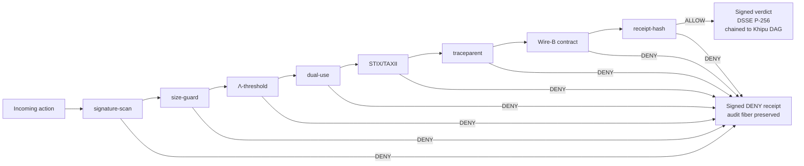

# sentra 🛡️

> **DECLARED current role — Sentra assurance command.** The [owner directive](../../governance/owner-directives/2026-09-04-sentra.yaml) keeps `SZLHOLDINGS/sentra` as the sole assurance flagship. The [public estate contract](../../governance/public-estate.v1.json) names A11oy as its deployment source. Its generated public surface comes from [the flagship renderer](../../scripts/hf_publish_vertical_flagships_v4_impl.py), rather than this preserved satellite module's `serve.py`. [Open the Sentra surface](https://szlholdings-sentra.hf.space/) and inspect `/api/build-info` and `/api/source` for the actual declared deployment revision.

> **Receipt workflow.** [Open the existing A11oy verifier](https://szlholdings-a11oy.hf.space/verify) to paste a receipt and a public key. Offline checks run in the browser; online checks require a separate explicit action. Runtime key trust is REPO_DECLARED until pinned out of band. Independent validation is UNKNOWN. Receipt integrity does not establish output truth, signer authority, authorization, admission, approval, or production readiness. Immune engine migration into Sentra remains UNKNOWN until its contracts and runtime parity are verified.

> **Historical reference below.** The retained module examples, image tags, endpoint commands and signing claims describe an older implementation. Their applicability to the generated public surface is UNKNOWN until separately verified. They are preserved source context, not instructions to deploy the current flagship or evidence of current production readiness. Use the canonical A11oy publisher; preserve its single-writer boundary.

## Historical satellite snapshot — current applicability UNKNOWN

> **Historical module claim:** deny-by-default policy immune system, eight gates, and signed verdicts. Current generated-surface implementation and receipt parity are UNKNOWN.

[-555?style=flat-square)](.compliance/SLSA_LEVEL.md)
[](https://search.sigstore.dev/?logIndex=1723794608)
[](https://github.com/szl-holdings/.github/tree/main/doctrine)

[](LICENSE)

**749 declarations · 14 axioms · 163 sorries · Doctrine v11 LOCKED · kernel `c7c0ba17`**

[Historical Space](#historical-deployment-reference) · [Historical design](#historical-design) · [Historical checks](#historical-verification-examples) · [Historical architecture](#historical-architecture-sketch) · [Historical comparison](#historical-comparison) · [Historical status](#historical-status-claims)

---

## Historical deployment reference

**HF Space link (inspect its current source before use):** [](https://huggingface.co/spaces/SZLHOLDINGS/sentra)

- Space URL: https://szlholdings-sentra.hf.space
- Former health path: `/api/sentra/v1/honest` returned 404 in the [PR audit](../../audit/sentra-verifier-handoff-20261003.md); the older `"v11"` example below is not current runtime evidence.
- Historical docs link: https://docs.szlholdings.com/flagships/sentra
- Historical module release label: v1.0.0 (current generated deployment source: `/api/build-info` and `/api/source`)

---

## Historical design

**The retained satellite module describes a policy immune system.** Its eight-gate, signed-verdict design is historical source context. Whether the generated public surface implements those contracts is UNKNOWN until its current runtime routes and receipts are verified.

Historical design claims (not current runtime evidence):
- **8 immune gates** — signature-scan, size-guard, Λ-threshold, dual-use, STIX/TAXII, traceparent, Wire-B contract, receipt-hash
- **Deny by default** — every action evaluated; verdict signed and chained (`/v1/verdict`, `/v1/inspect`)
- **Signed verdicts** — DSSE ECDSA P-256-SHA256; each verdict is a verifiable artifact, not a log line
- **Threat-intel cross-reference** — STIX/TAXII corpus; honest Mādhava error envelope
- **Competitive parity endpoints** — OPA/policy, New Relic/metrics, Wiz/security surface (current route parity UNKNOWN)

**Historical Warhacker / DoDD 3000.09 framing:** the module described deny-by-default and signed blocks. Current policy enforcement and signed verdicts require separate runtime evidence.

---

## Historical verification examples

These examples came from the retained satellite module. They were not rerun for the generated public surface and do not establish current endpoint, image, or signing status.

```bash
# 1. Former doctrine path; the PR audit observed HTTP 404 on the generated surface.
# curl -s https://szlholdings-sentra.hf.space/api/sentra/v1/honest | jq .doctrine
# Historical example output: "v11"; current output is UNKNOWN here.

# 2. Historical image-signature command; verify the exact image before any current claim.
cosign verify ghcr.io/szl-holdings/sentra:uds-v0.2.0 \
  --certificate-identity-regexp="^https://github.com/szl-holdings/" \
  --certificate-oidc-issuer="https://token.actions.githubusercontent.com"
# Historical recorded result: Verified OK (Rekor index 1723794608); NOT RUN for this handoff.

# 3. Historical SLSA L2 note; current attestation status is UNKNOWN here.
# cosign verify-attestation --type slsaprovenance ghcr.io/szl-holdings/sentra:uds-v0.2.0 \
#   --certificate-identity-regexp="^https://github.com/szl-holdings/" \
#   --certificate-oidc-issuer="https://token.actions.githubusercontent.com"

# 4. Former deny example; DO NOT use as proof of a current signed verdict.
# curl -s -X POST https://szlholdings-sentra.hf.space/api/sentra/v1/verdict \
#   -H 'content-type: application/json' \
#   -d '{"action":{"type":"out_of_policy_action"}}'
# Historical example output only: {"verdict":"DENY","signed":true,"gate":"lambda_threshold"}
```

**Full guide:** [developers/VERIFY.md](https://github.com/szl-holdings/developers/blob/main/VERIFY.md)

---

## Historical architecture sketch


```mermaid
graph LR
    A[Incoming action] --> G1[signature-scan]
    G1 --> G2[size-guard]
    G2 --> G3[Λ-threshold]
    G3 --> G4[dual-use]
    G4 --> G5[STIX/TAXII]
    G5 --> G6[traceparent]
    G6 --> G7[Wire-B contract]
    G7 --> G8[receipt-hash]
    G8 --> |ALLOW| OUT[Signed verdict\nDSSE P-256\nchained to Khipu DAG]
    G1 & G2 & G3 & G4 & G5 & G6 & G7 & G8 --> |DENY| DENY[Signed DENY receipt\naudit fiber preserved]
```

---

## Historical comparison

The checkmarks below record the older module's claims; current generated-surface parity is UNKNOWN.

| Capability | OPA / Wiz | sentra | Differentiator |
|---|---|---|---|
| Policy enforcement | ✅ | ✅ 8 gates, deny-by-default | — |
| Threat intel (STIX/TAXII) | ✅ | ✅ | — |
| Signed verdicts | — | ✅ **DSSE-signed per decision** | Each deny is a cryptographic artifact, not a log |
| Supply-chain provenance | — | ✅ **cosign-signed (SLSA L1 honest; L2 roadmap)** | Individually verifiable via `cosign verify` |
| Air-gap deployment | ✅ (proprietary) | ✅ **UDS bundle** | Open-source |
| Receipt chaining | — | ✅ Khipu DAG | — |

---

## Historical quickstart

This retained image command is not the publisher or deployment path for the current generated flagship.

```bash
docker run --rm -p 7860:7860 ghcr.io/szl-holdings/sentra:uds-v0.2.0
```

---

## Historical status claims

These rows preserve older module claims. Current generated-surface runtime, image, receipts and qualifications are UNKNOWN without fresh, source-bound readbacks.

| Historical claim | Historical record; current generated surface UNKNOWN |
|---|---|
| Former HF Space reachability (HTTP 200) | Historical ✅; current source-bound runtime state UNKNOWN. |
| SLSA Build L1 claim (L2 roadmap via Wire D) | Historical ✅ L1 — cosign-signed, Rekor [1723794608](https://search.sigstore.dev/?logIndex=1723794608). Current image provenance UNKNOWN. |
| cosign keyless signature | Historical ✅; current image signature UNKNOWN. |
| UDS bundle (`szl-mesh:v0.4.0`) | Historical ✅; current generated-surface deployment UNKNOWN. |
| DSSE Khipu receipts | Historical ✅; current generated-surface receipt parity UNKNOWN. |
| Lean 749/14/163 @ `c7c0ba17` | Historical ✅; current generated-surface kernel revision UNKNOWN. |
| Λ-uniqueness | ⚠️ Conjecture 1 — not a theorem |
| SLSA L3 | ❌ Not claimed |
| FedRAMP / CMMC | ❌ Not claimed |

---

<sub>Historical module source record: Doctrine v11 LOCKED · 749/14/163 · kernel `c7c0ba17` · SLSA L1 honest (L2 roadmap) · Λ = Conjecture 1 · Apache-2.0. Current generated-surface status: UNKNOWN.</sub>

Signed-off-by: stephenlutar2-hash <stephenlutar2@gmail.com>
