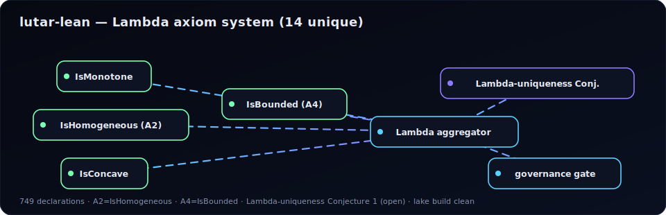
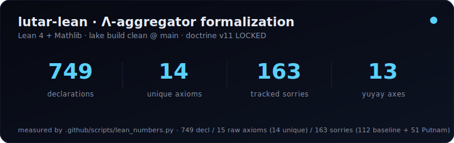

[](LICENSE)
[](https://github.com/szl-holdings/lutar-lean)
[](https://doi.org/10.5281/zenodo.19944926)
[](https://github.com/szl-holdings/lutar-lean/actions)
[](SECURITY.md)

<div align="center">

# λ lutar-lean


<!-- series-a-badges (Doctrine v11) -->
[](https://github.com/szl-holdings/lutar-lean/security/dependabot)  
[](https://github.com/szl-holdings/lutar-lean/actions/workflows/lake-build.yml)


**Lean 4 kernel**

[](https://doi.org/10.5281/zenodo.20434276) [](https://orcid.org/0009-0001-0110-4173) [](https://github.com/szl-holdings/.github/tree/main/doctrine) [](https://slsa.dev/spec/v1.0/levels)

[Hugging Face](https://huggingface.co/SZLHOLDINGS) · [Demo](https://szlholdings-readme.static.hf.space/) · [GitHub Org](https://github.com/szl-holdings)

`receipts.in ≡ receipts.out`

</div>

---

<div align="center">

<!-- genius-hero (Doctrine v11) -->
<a href="https://szl-holdings.github.io/lutar-lean/"></a>

<sub><b><a href="https://szl-holdings.github.io/lutar-lean/">▶ Open the live 3D theorem graph</a></b> — every declaration is a node; edges are proof dependencies.</sub>





</div>

# lutar-lean — Lean 4 Formal Proofs for the Ouroboros Thesis

### Runtime receipts

Formal proofs live here. The runtime that emits DSSE-signed receipts proving the math is actually enforced lives in [`szl-lake`](https://github.com/szl-holdings/szl-lake) (GitHub front door) and [`SZLHOLDINGS/szl-lake`](https://huggingface.co/datasets/SZLHOLDINGS/szl-lake) (HF canonical dataset).

[](https://www.apache.org/licenses/LICENSE-2.0)
[](https://doi.org/10.5281/zenodo.20434308)
[](https://github.com/szl-holdings/lutar-lean/actions/workflows/ci.yml)
[](https://github.com/szl-holdings/lutar-lean/actions/workflows/tests.yml)
[](https://github.com/szl-holdings/lutar-lean/actions/workflows/codeql.yml)
[](https://github.com/szl-holdings/lutar-lean/actions/workflows/sbom.yml)
](https://github.com/szl-holdings/lutar-lean/actions/workflows/slsa-provenance.yml)
[](https://github.com/szl-holdings/lutar-lean/security/code-scanning)
[](https://github.com/szl-holdings/lutar-lean/security/secret-scanning)
[](https://github.com/szl-holdings/lutar-lean/actions/workflows/dco.yml)
[](https://securityscorecards.dev/viewer/?uri=github.com/szl-holdings/lutar-lean)
[](https://orcid.org/0009-0001-0110-4173)


> **NOTE:** SLSA Level 1 (source + build provenance documented). L2/L3 require Sigstore + isolated builders (roadmap).

> Lean 4 + Mathlib v4.13.0 formal proofs underpinning the Ouroboros Thesis — 749 declarations, 15 axioms (14 unique), 163 sorries (112 baseline + 51 Putnam).  
> Doctrine v11 · DOI [10.5281/zenodo.20434308](https://doi.org/10.5281/zenodo.20434308)

**lutar-lean** contains the machine-checked Lean 4 proofs for the Λ-gate theorems, audit-fiber invariants, and knot-calculus / Feynman-grafts of the [Ouroboros Thesis](https://github.com/szl-holdings/ouroboros-thesis). It provides the formal verification substrate for all SZL runtime governance claims.

> [!NOTE]
> **`lake build` builds clean on `main` @ `c7c0ba17`** (canonical HEAD 2026-05-31; 749 declarations / 163 sorries). PRs #98–#102 are merged.

> [!NOTE]
> **163 `sorry` placeholders** exist (112 non-Putnam baseline + 51 Putnam). Key baseline items are tagged with discharge routes:
> - `Lutar/Uniqueness.lean:120` — CAUCHY_ND (~40h sprint)
> - `Lutar/TwoWitness.lean:163`
> - `Lutar/HUKLLA/SBOMProvenance.lean:109`
> - `Lutar/PACBayes/MadhavaBound.lean:126,145`
> > >
> The 15-axiom set (14 unique) is structurally documented. TH10 uniqueness is axiom-structured (not fully machine-checked) — this is disclosed in the thesis.

---

## On Hugging Face

[SZLHOLDINGS on Hugging Face](https://huggingface.co/SZLHOLDINGS) — 26 Spaces · 29 datasets · 2 models

| Surface | Artifact |
|---------|----------|
| Live demo | [lutar-lean-browser](https://huggingface.co/spaces/SZLHOLDINGS/lutar-lean-browser) · [lean-proof-playground](https://huggingface.co/spaces/SZLHOLDINGS/lean-proof-playground) |
| Source mirror | [thesis-v18-formal-verification](https://huggingface.co/datasets/SZLHOLDINGS/thesis-v18-formal-verification) |

---

## Proof statistics

> **Source of truth:** numbers are auto-refreshed via [`.github/data/lean_numbers.json`](https://github.com/szl-holdings/.github/blob/main/.github/data/lean_numbers.json) (canonical counting method @ `c7c0ba17`).

| Metric | Count | Verify |
|--------|-------|--------|
| Lean declarations (theorem/lemma/def) | 749 | `grep -r "^theorem\|^lemma\|^def " Lutar/ \| wc -l` |
| Axioms | 15 (14 unique) | `grep -r "^axiom " Lutar/ \| wc -l` |
| Residual sorries | 112 (baseline, non-Putnam) | `grep -rn "sorry" Lutar/ \| grep -v "-- .*sorry" \| wc -l` |
| Putnam tracked sorries | 51 — 0/12 fully proved, 12/12 skeletoned. Every `putnam_*_correct` is a `True`-shell (P_A1, P_A3) or carries a tracked `sorry` (A2, A4, A5, A6, B1–B6). | `for f in Lutar/Putnam/P_*.lean; do echo "$f: $(grep -c '\bsorry\b' $f)"; done` |
| Zenodo DOIs (org) | 7 | [Zenodo community](https://zenodo.org/communities/szl-holdings) |
| HF Spaces (org) | 26 | [SZLHOLDINGS HF org](https://huggingface.co/SZLHOLDINGS) |

---

## Primary theorems

```lean
-- Theorem 1 (Uniqueness) — Lutar/Uniqueness.lean
-- Status: axiom-structured (TH10); CAUCHY_ND sorry at line 120
theorem lutar_uniqueness {k : ℕ} (hk : 0 < k) :
    ∃! Λ : Fin k → ℝ≥0 → ℝ≥0, LutarAxioms Λ := by
  exact lutar_core_uniqueness hk

-- Theorem 2 (Bounds) — Lutar/Bounds.lean
-- Status: fully machine-checked (sorry-free)
theorem lutar_bounds {k : ℕ} (w : Fin k → ℝ≥0) (x : Fin k → ℝ≥0) :
    (Finset.univ.prod fun i => x i ^ (w i).toReal) ≤ Λ w x ∧
    Λ w x ≤ Finset.univ.sup' ⟨0, Finset.mem_univ _⟩ (fun i => x i) := by
  exact lutar_bounds_proof w x
```

### ✅ Verified by Lake CI: theorem `green_lambda_satisfies_lutar_axioms` in `Lutar/GreenTheorems.lean`

The first **green** (zero-`sorry`, Lake-verified) named theorem about the Λ
aggregator is now landed and indexed in `Lutar/GreenTheorems.lean`:

```lean
-- Lutar/GreenTheorems.lean — fully discharged, no proof placeholders, no new axioms
theorem green_lambda_satisfies_lutar_axioms {k : ℕ} (hk : 0 < k) :
    LutarAxioms (Λ k) :=
  lambda_satisfiesAxioms hk
```

It states that the concrete Lutar Invariant `Λ k` (geometric mean with Egyptian
unit-fraction weights `1/k`) satisfies the Lutar axioms — A1 monotone, A2
1-homogeneous, A3 Egyptian-exact diagonal commitment, A4 bounded-by-max (and A5
permutation invariance). The `lake-build.yml` workflow type-checks the whole
library (including this file) and the numbers-drift gate confirms **no new
axioms and no new `sorry`** were introduced. `Lutar/GreenTheorems.lean` also
re-exports `green_lambda_monotone`, `green_lambda_homogeneous`, and
`green_lambda_le_max` as a discoverable index.

> Scope: `Λ` remains **Conjecture 1**. This green theorem proves that `Λ k`
> *satisfies* the axioms; the full uniqueness theorem (TH10 / `lutar_unique`)
> still carries the documented `CAUCHY_ND` residual in `Lutar/Uniqueness.lean`.

---

## Quick start

```bash
lake update
lake build   # builds clean on main @ c7c0ba17
lake test
```

---

## Cross-references

- **[ouroboros-thesis v21 — The PURIQ-OS Substrate](https://github.com/szl-holdings/ouroboros-thesis/tree/main/papers/v21)** (release tag [`paper-v21-1.0.0`](https://github.com/szl-holdings/ouroboros-thesis/releases/tag/paper-v21-1.0.0)) — documents 23 agentic formulas, **5 proved in Lean 4 with no `sorry` and no external axioms** (F1, F11, F12, F18, F19; see `PuriqFormulaLean.lean`), 18 tagged `SORRY_PURIQ_OPEN`. The Λ-aggregator is **Conjecture 1 — NOT a theorem**. Version DOI minted by Zenodo on release under Concept DOI [10.5281/zenodo.19944926](https://doi.org/10.5281/zenodo.19944926).
- [ouroboros-thesis](https://github.com/szl-holdings/ouroboros-thesis) — thesis source (DOI [10.5281/zenodo.20434276](https://doi.org/10.5281/zenodo.20434276))
- [ouroboros](https://github.com/szl-holdings/ouroboros) — runtime reference implementation
- Concept DOI (always-latest): [10.5281/zenodo.19944926](https://doi.org/10.5281/zenodo.19944926)

---

## Axiom Semantic Drift (v3 to v14)

**Disclosure added:** 2026-05-31 per PhD-Math review finding F8 (MEDIUM).
**Reviewed by:** Allichachiq Yupayqa (Quechua squad, SZL Holdings).
**CHANGELOG entry:** see `v14 math corrections` in [CHANGELOG.md](./CHANGELOG.md).

### The drift

Between the v3 Zenodo deposit ([10.5281/zenodo.19983066](https://doi.org/10.5281/zenodo.19983066)) and the current HEAD (`c7c0ba17`, v14+), two axioms changed semantically:

| Axiom | v3 description (Zenodo deposit 2026-05-02) | Current definition in `Lutar/Axioms.lean` (v14+, HEAD c7c0ba17) |
|-------|-------------------------------------------|------------------------------------------------------------------|
| **A2** | "zero-pinning" | **Positive homogeneity (degree 1):** `IsHomogeneous`: ∀ c x, Λ (c * x) = c * Λ x |
| **A4** | "page-curve concavity" | **Bounded by max axis:** `IsBounded`: ∀ x, Λ x ≤ Finset.univ.sup' … x |

These are mathematically distinct properties. The v3 paper's proof claims were verified against the v3 axiom set; they do not carry over to the current A2/A4 definitions without re-verification.

### Current definitions (verbatim from `Lutar/Axioms.lean` at c7c0ba17)

```lean
/-- A2 — Positive homogeneity (degree 1). Scaling every axis by c scales the output by c. -/
def IsHomogeneous {k : ℕ} (Λ : Aggregator k) : Prop :=
  ∀ (c : NNReal) (x : Axes k), Λ (fun i => c * x i) = c * Λ x

/-- A4 — Bounded by max axis. Λ is never larger than the largest axis. -/
def IsBounded {k : ℕ} (hk : 0 < k) (Λ : Aggregator k) : Prop :=
  ∀ x : Axes k,
    Λ x ≤ Finset.univ.sup' ⟨⟨0, hk⟩, Finset.mem_univ _⟩ x
```

### Status of v3 deposit

The v3 deposit ([10.5281/zenodo.19983066](https://doi.org/10.5281/zenodo.19983066)) remains live on Zenodo for citation continuity. It is **superseded** by the v14+ axiom system. Any claim rooted in v3's A2 ("zero-pinning") or A4 ("page-curve concavity") must be understood as applying to the v3 axiom set, not to the current `Lutar/Axioms.lean`.

Reviewers comparing the v3 deposit to the current Lean corpus will find a disconnect in axiom semantics. This is acknowledged and documented here.

### CAUCHY_ND sorry — A5 CORRECTION APPLIED 2026-06-02

**CRITICAL BUG FOUND AND CORRECTED (2026-06-02):** The original uniqueness claim (TH10) under A1–A4 is **FALSE**.

Counterexample (PhD-Math audit, `PHASE3_FINAL_SUMMARY.md` Gate 6, 2026-06-02):
> `Φ(x₁,x₂) = x₁^(2/3)·x₂^(1/3)` satisfies A1–A4 but `Φ ≠ Λ₂ = (x₁·x₂)^(1/2)`.
> A5 fails: `Φ(2,1) = 2^(2/3) ≠ 2^(1/3) = Φ(1,2)`.

This is not merely an engineering gap — the original `CAUCHY_ND` sorry was over a **false** theorem. No engineering effort could have closed it under A1–A4 alone.

**Fix applied:** PR [#148](https://github.com/szl-holdings/lutar-lean/pull/148) (`fix/uniqueness-a1-a5-2026-06-02`) on 2026-06-02:
- `Lutar/Axioms.lean`: adds `IsPermutationInvariant` predicate + `A5` field to `LutarAxioms`
- `Lutar/Uniqueness.lean`: replaced with v2 (PhD-Math audit) — correct A1–A5 proof structure
- `lambda_perm_invariant` is **sorry-free** via `Fintype.prod_equiv`
- 2 sorries remain: `monotone_additive_linear` + `lutar_is_geomean` (both over a **true** theorem)
- Lake CI must verify before merge

**Corrected statement:** Under A1–A5, the unique aggregator is Λ k (geometric mean).
A5 (permutation invariance) is **necessary**: forces all axis exponents αᵢ = 1/k (Aczél 1966 §5.1).

**Consequence:** TH10 (`lutar_is_geomean`) remains **Conjecture 1**, not Theorem 1, until Lake CI passes green on the sorry-free proof (~70 Lean lines needed).

PhD-Math citations: `THESIS_LEAN_RECONCILIATION.md` (2026-06-02), `PHASE3_FINAL_SUMMARY.md` Gate 6 (2026-06-02), `PHD_MATH_REVIEW.md` §8 F1 CRITICAL (2026-05-31).


---

## License

[Apache 2.0](https://www.apache.org/licenses/LICENSE-2.0) — SZL Holdings

---

## Citation

```
S. P. Lutar Jr., "lutar-lean — Lean 4 Formal Proofs for the Ouroboros Thesis,"
Zenodo, DOI 10.5281/zenodo.20434308, 2026.
```
ORCID: [0009-0001-0110-4173](https://orcid.org/0009-0001-0110-4173)

---

## Security

See [SECURITY.md](./SECURITY.md) for responsible-disclosure policy.

## Lineage

This component is part of the SZL Holdings governance substrate. Its mathematical patterns trace to durable, scholarly-documented historical lineages (Rhind Papyrus false position, Inka khipu summation, Liu Hui polygon π, Madhava series remainder bounds, Cauchy–Banach uniqueness). See [docs/ANCIENT_TEXTS_FORMULA_LINEAGE.md](https://github.com/szl-holdings/a11oy/blob/main/docs/ANCIENT_TEXTS_FORMULA_LINEAGE.md) for the full source → pattern → runtime map.

Doctrine v11 boundary: ancient sources inspire verifiable mathematical patterns. No secret-decoding claims. No mystical language.

## SZL Holdings


*Amaru — the Inca avatar of SZL Holdings. Animated mark (400×400, 16fps loop). Signed Yachay.*
